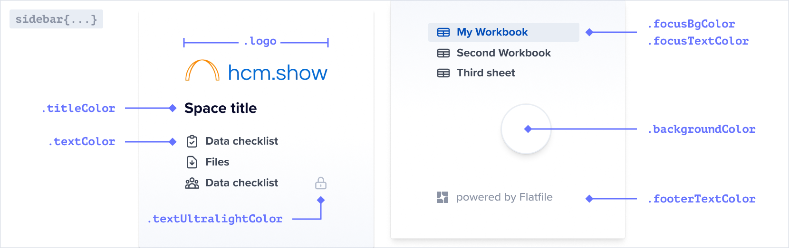

Flatfile supports modifying most UI elements, including colors, fonts, borders, padding, and
more via the <Tooltip tip="Learn more about Spaces">[Space](hello.com)</Tooltip> component.

1. Start by simply updating the primary color and your logo.
2. If needed, customize the theme further with css variables.

<RequestExample>
```ts  spaces.update
const updateSpace = await flatfile.spaces.update(spaceId, {
    environmentId: environmentId,
     "metadata": {
       "theme": {
        "root": {
          "primaryColor": "red",
        },
        "sidebar": {
          "logo": "https://image.png",
        },
        //See reference for all possible variables
      }
    }
  });
```
</RequestExample>



### Commonly used variables

  | Prop                  | Required | Type | Description |
  | --------------------- | ------------   | ------------   | ------------   |
  | `table.hello`       |      `optional` | **boolean** | The Collaborators link in the sidebar allows anyone to add another Guest to the Space.     |
  | `sidebar.hello`     |      `optional` | **boolean** | The data checklist shows all of the data needed for uploading to the primary Workbook.    |
  | `sidebar.hello`           |      `optional` | **boolean** | The sidebar as a whole can be hidden.     |

### Less commonly used variables

  | Prop                  | Required | Type | Description |
  | --------------------- | ------------   | ------------   | ------------   |
  | `showGuestInvite`       |      `optional` | **boolean** | The Collaborators link in the sidebar allows anyone to add another Guest to the Space.     |
  | `showDataChecklist`     |      `optional` | **boolean** | The data checklist shows all of the data needed for uploading to the primary Workbook.    |
  | `showSidebar`           |      `optional` | **boolean** | The sidebar as a whole can be hidden.     |


# All Theming Options

### `root`

<ParamField path="primaryColor" type="string">The primary color used throughout the application.</ParamField>
<ParamField path="dangerColor" type="string">The color used for error messages.</ParamField>
<ParamField path="warningColor" type="string">The color used for warning messages.</ParamField>

### `sidebar`

<ParamField path="logo" type="string">The logo displayed in the sidebar.</ParamField>
<ParamField path="textColor" type="string">The color of the text in the sidebar.</ParamField>
<ParamField path="titleColor" type="string">The color of the title in the sidebar.</ParamField>
<ParamField path="focusBgColor" type="string">The background color of the sidebar when it is focused.</ParamField>
<ParamField path="focusTextColor" type="string">The text color of the sidebar when it is focused.</ParamField>
<ParamField path="backgroundColor" type="string">The background color of the sidebar.</ParamField>
<ParamField path="footerTextColor" type="string">The text color of the footer in the sidebar.</ParamField>
<ParamField path="textUltralightColor" type="string">The color of the text in the sidebar when it is in an ultralight state.</ParamField>

### `table`

<ParamField path="inputs.radio.color" type="string">The color of the radio buttons in the table.</ParamField>
<ParamField path="inputs.checkbox.color" type="string">The color of the checkboxes in the table.</ParamField>
<ParamField path="filters.color" type="string">The color of the filter buttons in the table.</ParamField>
<ParamField path="filters.active.backgroundColor" type="string">The background color of the active filter buttons in the table.</ParamField>
<ParamField path="filters.error.activeBackgroundColor" type="string">The background color of the active filter buttons in the table when there is an error.</ParamField>
<ParamField path="column.header.fontSize" type="string">The font size of the column headers in the table.</ParamField>
<ParamField path="column.header.backgroundColor" type="string">The background color of the column headers in the table.</ParamField>
<ParamField path="column.header.color" type="string">The color of the column headers in the table.</ParamField>
<ParamField path="column.header.dragHandle.idle" type="string">The color of the drag handle when it is idle.</ParamField>
<ParamField path="column.header.dragHandle.dragging" type="string">The color of the drag handle when it is being dragged.</ParamField>
<ParamField path="fontFamily" type="string">The font family used throughout the table.</ParamField>
<ParamField path="indexColumn.backgroundColor" type="string">The background color of the index column in the table.</ParamField>
<ParamField path="indexColumn.selected.color" type="string">The color of the selected index column in the table.</ParamField>
<ParamField path="indexColumn.selected.backgroundColor" type="string">The background color of the selected index column in the table.</ParamField>
<ParamField path="cell.selected.backgroundColor" type="string">The background color of the selected cells in the table.</ParamField>
<ParamField path="cell.active.borderColor" type="string">The border color of the active cells in the table.</ParamField>
<ParamField path="cell.active.spinnerColor" type="string">The spinner color of the active cells in the table.</ParamField>
<ParamField path="boolean.toggleChecked" type="string">The color of the toggle when it is checked.</ParamField>
<ParamField path="loading.color" type="string">The color of the toggle when it is checked.</ParamField>
