<Update label="02-04-2025" description="dataxp">
Records with readonly configurations are now handled differently in the
replaceRecords operation. A new option called excludeReadOnly has been
introduced to control whether readonly records or fields should be skipped or
replaced. If excludeReadOnly is set to true, records with a readonly config or
fields marked as readonly will not be replaced during the replaceRecords
operation. If excludeReadOnly is false or not provided, readonly records and
fields will be replaced as before.

The findAndReplaceRecords method in the WorkbooksService now checks if the field
being replaced is readonly and throws an error if excludeReadOnly is set to
true, preventing modification of readonly fields.

Several new tests have been added to validate the behavior of the replaceRecords
operation with readonly records and fields, covering scenarios with
excludeReadOnly set to true and false.

<<<<<<< HEAD
The SearchRecordsOptions and GetCellValuesOptions interfaces have been updated
to include the new excludeReadOnly option.
=======
<div style={{ display: "table", width: "auto" }}>
  <div style={{ display: "table-row", width: "auto" }}>
    <Snippet file="chips/dataxp.mdx" />
    <div style={{ float: "left", display: "table-column", paddingLeft: "30px", width: "calc(80% - 30px)" }}>
      
      api@e3e7fa7
      We added the ability to sort enum fields by label, value, or ordinal within the enum field config. This will ensure that enums will be displayed in the chosen order in mapping and review table. The default sortBy is label.
      
      
    </div>
  </div>
</div>

### January 06, 2025
>>>>>>> 2a58cbd (Update changelog)

Example usage:

```typescript
// Replace non-readonly records or fields
const records = await wb.op.replaceRecords({
  sheetId: wb.contacts.id,
  options: {},
  find: "John",
  replace: "Jonathan",
  field: { key: "firstName" },
  legacyReplace: false,
  actorId: UserId.make(),
});

// Skip readonly records or fields
const records = await wb.op.replaceRecords({
  sheetId: wb.contacts.id,
  options: { excludeReadOnly: true },
  find: "John",
  replace: "Jonathan",
  field: { key: "firstName" },
  legacyReplace: false,
  actorId: UserId.make(),
});
```
</Update>

<Update label="01-31-2025" description="spaces">
Added language support for: 
- Spanish (es-419) 
- Malay (ms) 
- Dutch (nl) 
- Polish (pl) 
- Swedish (sv) 
- Thai (th) 
- Chinese Traditional (zh-hant) 
- Chinese Traditional Hong Kong (zh-hant-HK)
</Update>

<Update label="01-30-2025" description="dataxp">
Namespace modification is now supported via API only. Other app fields remain
editable via the UI but the ability to edit a namespace has been removed
post-creation.
</Update>

<Update label="01-30-2025" description="spaces">
Fixes bug where long document titles would overlap the page header.
</Update>

<Update label="01-27-2025" description="dataxp">
The order of imports from the `@flatfile/api` module has been updated. The `RecordUpdates` and `Success` types are now imported in a different order.

The implementation of the `clearColumn` method has been refactored. Instead of using the `map` and `filter` array methods, it now uses the `reduce` method to generate the `recordsUpdates` array. The new implementation checks if the field value exists and if the field is not read-only before clearing it. This change likely improves performance and readability.

The wording of the `info` and `outcome.message` properties in the `transitionJob` call has been updated from "Column was removed" to "Column was cleared". This change provides more accurate messaging about the action performed.

Additionally, the code now handles read-only fields correctly. If a field is marked as read-only in the `RecordConfig`, its value will not be cleared.

These changes improve the functionality, performance, and messaging of the `clearColumn` logic without introducing any breaking changes to the external interface.
</Update>

<Update label="01-23-2025" description="dataxp">
When clearing a column in a job operation, a snapshot of the sheet will be taken
before the column is cleared. This snapshot will be labeled with the specific
column key that is being cleared, providing a record of the sheet state before
the column clearing operation. The snapshot is taken by calling a new utility
function `takeSnapshotForJob`, which handles creating and labeling the snapshot
based on the job, sheet, and column details. This allows developers to review
the sheet state prior to the column clearing if needed.
</Update>

<Update label="01-22-2025" description="dataxp">
The release adds the ability to mark a space as an app template and filter
spaces based on whether they are app templates or not.

This can be used with the new space-configure-from-template plugin to create new
spaces using an existing space as a template.

When using Autobuild for a new App, the space generated during Autobuild will
automatically be tagged as the template for that App.
</Update>

<Update label="01-22-2025" description="dataxp">
The release introduces the ability to filter spaces by the associated app ID
when retrieving a list of spaces. A new query parameter `appId` has been added
to the `/v1/spaces` endpoint. Developers can now pass the `appId` query
parameter to retrieve only the spaces associated with the specified app. For
example, `?appId=us_app_123` will return only spaces linked to the app with ID
`us_app_123`. If an invalid or non-existent app ID is provided, an empty list
will be returned.
</Update>

<Update label="01-17-2025" description="dataxp">
An error is now thrown if attempting to clear a readonly column in a sheet. This
prevents modifying data in readonly columns.

Example:

```
const field = {
  key: 'ReadonlyColumn',
  label: 'Readonly Column',
  type: 'string',
  readonly: true
}
```

Attempting to clear this column will throw an error: 'Column is readonly and
cannot be cleared'.

An error is also thrown if attempting to clear any column in a readonly sheet.
This prevents modifying data in readonly sheets.

Example:

```
const sheet = {
  config: {
    readonly: true,
    fields: [...]
  }
}
```

Attempting to clear a column in this sheet will throw an error: 'Sheet is
readonly. Column cannot be cleared'.

These changes ensure data integrity by preventing unintended modification of
readonly data.
</Update>

<Update label="01-13-2025" description="dataxp">
The `clearColumnAction` now has a constraint added that checks if the column is enabled before allowing the action to be executed. This ensures that the action can only be performed on columns that are currently enabled, preventing any potential issues or errors that could arise from attempting to clear a disabled column.
</Update>

<Update label="01-06-2025" description="spaces">
The manual entry and file upload button shown when the workbook is empty have
has their max width updated so they can support more text.
</Update>

<Update label="12-30-2024" description="dataxp">
Trailing empty records in CSV files will now be trimmed during file extraction.
Empty records in-between records with values will continue to be kept.
</Update>

<Update label="12-20-2024" description="dataxp">
- Record order is now maintained when inserting records
- When using the Flatfile API to add records, the order of those records will
  now be preserved keeping the original sequence as provided
</Update>

<Update label="12-10-2024" description="spaces">
Fixes a bug where AI assist would crash when ‘config’ object or the ‘options’
array is undefined.
</Update>

<Update label="12-09-2024" description="dataxp">
Fixes a bug where an error would be thrown when config options was undefined
during sheet upsert operations.
</Update>

<Update label="12-06-2024" description="dataxp">
There was a bug causing the name of environment secrets not to update when
edited. This fixes the bug ensuring environment secret names are updated.
</Update>

<Update label="12-04-2024" description="spaces">
The `viewMapped` functionality has been updated to include new text strings for
messaging related to updating a table to only view mapped fields. The messages
include "Updating the table to only view mapped fields", "Halfway there, hang
tight...", "Almost done...", "Table update complete. Please audit the data", and
"An error occurred while updating the workbook. See Event Logs." These strings
will be displayed to the user during the process of updating a table to show
only mapped fields, providing status updates and handling potential errors. This
change enhances the user experience by providing clear communication during this
operation.
</Update>

<Update label="12-02-2024" description="dataxp">
A bug fix was made to the handling of enum field options when updating a sheet.
Previously, if the `config.options` property was undefined, an error would
occur. Now, if `config.options` is undefined, it defaults to an empty array.
This ensures that the code can safely handle cases where `config.options` is not
present or is undefined. For example, if a developer was updating a sheet with
an enum field that did not previously have any options defined, the update can
now proceed without errors.
</Update>

<Update label="12-02-2024" description="spaces">
Added three keys: `addColumn`, `clearColumn`, and `removeColumn` with their
respective translations for adding, clearing, and removing columns.

In the English translation file, the title of the “mapValues” section has been
updated from “Map values” to “Map Fields”.
</Update>

<Update label="11-13-2024" description="spaces">
Updates to the mapping flow to prevent a user from accidentally navigating
"back" into a mapping flow after it has already been completed.
</Update>

<Update label="10-28-2024" description="dataxp">
**Bug Fixes in Edit and Create App Forms**

We've resolved several issues affecting the Edit and Create App forms:

- Fixed form validation issues
- Improved error handling
- Enhanced user feedback
</Update>

<Update label="10-17-2024" description="dataxp">
Updated the AutoBuild flow to allow editing the working space name during the
build process. The name can now be edited by clicking an icon next to the space
name, which reveals an input field to enter a new name. The name change is saved
when the input field loses focus or the Enter key is pressed. Added a badge
indicating "Dev Mode" when not in the production environment.

Simplified the loading step by removing the detailed progress indicators and
showing only a centered loader component.

Updated the BlueprintTab component to display a bottom border and align the
blueprint view action icons to the right.
</Update>

<Update label="10-03-2024" description="spaces">
Implemented sheet ordering functionality in the sidebar. Sheets are now
displayed in the order specified by the `sheetSidebarOrder` setting in the
workbook. Any sheets not included in the order are appended to the end.
</Update>

<Update label="10-01-2024" description="dataxp">
The getDataDiff function has been updated to handle array values correctly when
comparing proposed changes with existing source (src) and artifact data.

If the proposed array value is the same as the existing array value in either
the source or artifacts, it will not be included in the changeset returned by
getDataDiff.

The function now uses the lodash isEqual utility to compare array values,
instead of strict equality (===), to account for differences in order or
reference of array elements.

For example, if the proposed tags array is ['jedi', 'sith'], it will not be
included in the changeset if the existing source tags are ['JEDI', 'SITH'] or if
the existing artifact tags are ['jedi', 'sith'], because the values are
considered equal despite differences in capitalization or array order.

This change ensures that unnecessary changes are not included in the changeset
when working with array values, reducing noise and improving the accuracy of the
changeset calculation.
</Update>

<Update label="09-27-2024" description="dataxp">
`@flatfile/api@1.9.17`

Secrets have been updated to introduce new optional fields for filtering.

A new optional `actorId` field of type `ActorId` has been added to the
`ListSecrets` request type and `WriteSecret` type for secrets. This allows
filtering secrets by the associated actor (user, guest, agent, or api key).
</Update>

<Update label="09-25-2024" description="dataxp">
`@flatfile/api@1.9.16`

Added new methods to for managing stored sheet constraints: `getConstraints`,
`createConstraint`, `getConstraintById`, `updateConstraint`, and
`deleteConstraint`.
</Update>

<Update label="09-20-2024" description="dataxp">
`@flatfile/api@1.9.15`

With the addition of archived spaces there is now an ability to `unarchiveSpace`
method and `space:unarchived` event.

Deprecated use of metadata field at the cell value level, recommending use of
record level metadata instead.
</Update>

<Update label="09-11-2024" description="spaces-ui">
`spaces-ui`

Updates to Snapshots resource to track changes to a sheet's schema (i.e. added
and removed columns). A more robust Snapshot will enable more complex features
when comparing 2 different snapshots.
</Update>

<Update label="09-10-2024" description="dataxp">
`@flatfile/api@1.9.14`

#### Actions Resource

Actions are now a first class resource. Developers may now create, retrieve,
update, and delete actions via the api. New action events ActionCreated,
ActionUpdated, and ActionDeleted are now being published and an actionId field
has been added to the Context of events.

#### Agent Versioning

Agents versioning has been introduced. You may now retreieve agent versions via
the api and revert to a previous version via the api and the dashboard.

#### Token Refresh

Guests actively using their space will have their token's automatically renewed.

#### Sheet & Cell Updates

Support for array values in cell values has also been added.

#### Job Metadata

Metadta is now available on the `JobConfig` type, allowing additional data to be
associated with jobs.
</Update>

<Update label="09-06-2024" description="dashboard">
Session name validation has been introduced to the dashboard, preventing the
creation of new sessions with the same name.

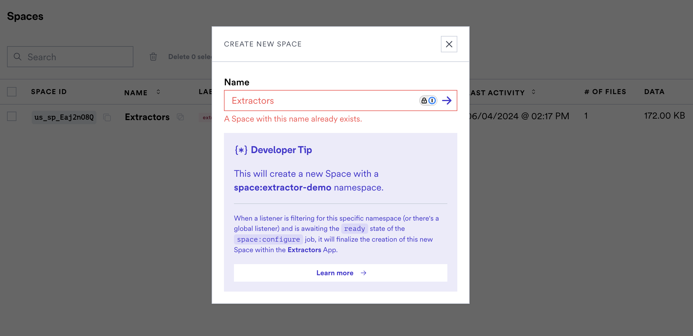

Note that sessions created via embedded or the api will not be constrained, this
is a dashboard only validation.
</Update>

<Update label="08-20-2024" description="spaces-ui">
`@flatfile/api@1.9.13` `spaces-ui`

New fields 'guide' and 'guardrail' have been added to Actions. These options
enable providing markdown guidance and warnings to your users.

```typescript
actions: [
  {
    operation: 'submitActionFg',
    mode: 'foreground',
    label: 'Submit For Approval',
    type: 'string',
    description: 'Submit this data to a webhook.',
    primary: true,
    guide: {
        content: "### Personalized Guide \n\n Before performing..."
    },
    guardrail: {
        content: "### Warning! \n\n This Submit ..."
    }
  },
  {...}
],
```

The markdown content of guide will become accessible to the end user via a
tooltip on the action element.

The `guardrail` component will render as a modal warning before the action event
is triggered. This can be useful for actions that have critical consequences or
require user acknowledgment before proceeding.

This can be useful for actions that have critical consequences or require user
acknowledgment before proceeding.
</Update>

<Update label="08-15-2024" description="spaces-ui">
`spaces-ui`

The "requireAllValidTotal" option has been added for custom actions in the Sheet
toolbar. This new option requires all rows in the Sheet to be valid for the
action to be enabled, regardless of selection. If "requireAllValidTotal" is set
and there are any validation errors in the entire Sheet, the custom action will
be disabled with the corresponding tooltip message.

The existing "requireAllValid" option has been updated to only apply to the
selected rows, rather than all rows. If "requireAllValid" is set and there are
validation errors in the selected rows, the custom action will be disabled with
the corresponding tooltip message.
</Update>

<Update label="08-14-2024" description="spaces-ui">
`spaces-ui`

Introduces support for handling locked sheets (indicated by the locked icon),
and improves the handling of import files.
</Update>

<Update label="08-09-2024" description="dataxp">
`@flatfile/api@1.9.8`

A new `reference-list` property type has been added to allow defining an array
of values referenced from another sheet. Links will be established automatically
by the matching engine or similar upon an evaluation of unique or similar
columns between datasets.

The `ReferencePropertyConfig` has been updated to make the `relationship`
property optional, allowing it to be omitted.
</Update>

<Update label="07-23-2024" description="dataxp">
`@flatfile/api@1.9.7`

New options have been added to the ListWorkbooksRequest to allow filtering
workbooks by name, namespace, label, and treatment, as well as controlling
whether to include sheets. For example, you can now pass a `name` parameter to
filter workbooks by name, or a `treatment` parameter to filter by treatment. The
`includeSheets` boolean parameter controls whether sheet data is included in the
response.
</Update>

<Update label="07-17-2024" description="dataxp">
`@flatfile/api@1.9.6`

In AgentConfig type, a new optional property `sourceMap` of type string has been
added. This allows including a source map for the agent code.
</Update>

<Update label="07-16-2024" description="dataxp">
`@flatfile/api@1.9.5`

A new property `treatments` of type `Flatfile.WorkbookTreatments[]` has been
added to the `Workbook` and `CreateWorkbookConfig` types. This array allows
specifying treatments for a workbook, with the currently available treatment
being `ExtractedFromSource`. This change introduces a new external interface
that developers using the package should be aware of when creating or updating
workbooks.

Example usage:

```typescript
import { Flatfile } from "@flatfile/api";

const workbookConfig: Flatfile.CreateWorkbookConfig = {
  // ...other properties
  treatments: [Flatfile.WorkbookTreatments.ExtractedFromSource],
};
```
</Update>

<Update label="07-13-2024" description="dataxp">
`@flatfile/api@1.9.3`

A new `JobOutcomeTrigger` type has been introduced to specify whether a job
outcome's effect should be triggered automatically or manually.
</Update>

<Update label="06-18-2024" description="spaces">
**Auto-Expanding Cell Input in Editor Component**

We have enhanced the cell editing experience with an auto-expanding cell input
that dynamically adjusts to fit the content. This improvement ensures that users
can view and edit their data without constraints, enhancing the overall editing
experience.
</Update>

<Update label="06-10-2024" description="spaces-ui">
`spaces-ui`

Improvements have been made to error handling and user feedback in the file
import and mapping process. If an error occurs, a popover is displayed to the
user with the error message, providing clearer feedback on failures during the
import process.
</Update>

<Update label="06-07-2024" description="dataxp">
**Select Header Row**

We've added a new feature that allows users to select the header row in the data
preview. This feature is particularly useful when the first row of your data
contains column headers, as it enables you to specify the header row for
accurate data mapping.
</Update>

<Update label="06-07-2024" description="dataxp">
**Search for Users**

You can now search for users in the manager users page. This feature allows you
to quickly find users by name, email, or role, making it easier to manage your
user base.

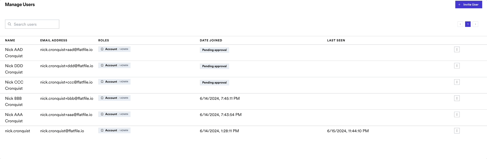
</Update>

<Update label="06-06-2024" description="dataxp">
**Resend User Invite**

There is now a `/users/:userId/resend-invite` endpoint enabling admins to resend
an invitation to a user who has not yet accepted it.
</Update>

<Update label="05-30-2024" description="dataxp">
**Bulk Deletion of Mapping Rules**

We added a method to delete multiple mapping rules from a program. This new
`deleteMultipleRules` method simplifies the management of mapping rules by
allowing bulk deletions. The `DeleteMultipleRulesRequest` type represents the
request payload, detailing the array of rule IDs to be deleted.
</Update>

<Update label="05-30-2024" description="dataxp">
**New Method to Delete Apps**

We have introduced a new `delete` method that allows you to delete an app.
</Update>

<Update label="05-30-2024" description="spaces">
**Enhanced Validation Messages for Records**

The `ValidationMessage` type has been enhanced with two new optional properties:
`field` and `path`. The `field` property specifies which field the validation
message pertains to, while the `path` property, of type `JsonPathString`,
specifies the JSONPath for the validation message. These enhancements provide
more context and precision in validation feedback.
</Update>

<Update label="05-30-2024" description="dataxp">
**Enhanced Job Outcomes with Custom Views**

The `JobOutcomeNext` type now includes a new `view` option, allowing jobs to
specify a custom view that should be displayed upon completion. To support this,
we introduced the `JobOutcomeNextView` type, which provides details for the
custom view, including the sheet ID, hidden columns, and an optional label.
</Update>

<Update label="05-30-2024" description="dataxp">
**New Method to Update Sheets**

We introduced a new `updateSheet` method that allows you to update a sheet's
name, slug, and metadata. The `SheetUpdateRequest` type represents the update
request payload, including the name, slug, and metadata of the sheet.
Additionally, an optional `metadata` property has been added to the `Sheet` and
`SheetUpdate` types, allowing for the storage of contextual metadata related to
the sheet.
</Update>

<Update label="05-29-2024" description="spaces-ui">
`spaces-ui`

A new "Update View" button can now be found in the job outcome modal for jobs
that modify the visibility of columns in a workbook sheet. This button triggers
updating the column visibility based on the job outcome.

There are 2 new capabilities to the next property of Job Outcomes:

- `view` gives developers the ability to manipulate the Sheet's view on
  completion of a Job - Giving control over things like applying a filter or
  hiding a column
- `download` gives developers the ability to include file details (such as a
  fileName and URL), which are then used to trigger a download to the user's
  browser on completion of the job
</Update>

<Update label="05-14-2024" description="dataxp">
**New Environment Lifecycle Events**

We've added new domain `Environment` events expanding the scope of domains our
system recognizes. To leverage these events, you can listen on to the following
topics: The corresponding event topics are `environment:created`,
`environment:updated`, and `environment:deleted`.
</Update>

<Update label="05-14-2024" description="dataxp">
**Enhanced Job Configuration Descriptions**

We have added descriptions for the DeleteRecordsJobConfig properties to provide
better clarity: An optional `filter` param allows allows you to provide options
to filter records, with the default set to none while the `filterField` param
enables narrowing the valid/error filter results to a specific field, but it
requires the filter to be set.

We corrected a typo in the `JobOutcomeNextFiles` type by renaming the file
property to files to accurately represent an array of file objects.
</Update>

<Update label="05-07-2024" description="spaces-ui">
`spaces-ui`

#### Saving and Sharing Custom Views

Users can now apply filters, sorting, and search queries to the Sheet data and
save those settings as a reusable view. Key changes include:

- Added a "Views" dropdown in the Sheet toolbar to manage and apply saved views.
- Added a "Save View" modal that allows users to name and save the current Sheet
  filters/sorting as a view.
- Users can copy a sharable link with the view settings applied.
- Saved views are grouped into "My Views" and "All Views" sections.
- Added backend APIs to create, update, and delete saved views.
- Added new React hooks and components to support the saved views functionality.
- Updated translations for the new UI elements related to saved views.
</Update>

<Update label="05-03-2024" description="dataxp">
**Updated `ListDocumentsResponse`**

The `data` property now returns an array of `Document` objects instead of the
previous `DocumentResponse`. This change standardizes the format and improves
consistency in how document data is handled.
</Update>

<Update label="05-03-2024" description="dataxp">
**Enhanced Job Configuration**

We added a new `predecessorIds` property to `JobConfig`. This property allows
you to specify job dependencies, meaning you can list the IDs of jobs that must
be completed before the current job can start. This helps in managing and
sequencing job execution more effectively.

We added a new feature to handle job outcomes more effectively with a new type
called `JobOutcomeNext` and its variant files. This includes:

- `JobOutcomeNextFileObject` Stores individual file information with an ID and
  optional label.
- `JobOutcomeNextFiles` Handles multiple files, including an array of
  JobOutcomeNextFileObject instances and an optional label.

We also added a waiting value to the JobStatus enum to indicate when a job is
paused or pending, improving job processing workflows.
</Update>

<Update label="05-03-2024" description="spaces">
**Enhanced Views Request and Response**

We updated `ListViewsRequest` to include optional `pageSize` and `pageNumber`
properties, allowing for pagination when retrieving views. We've also added a
`createdBy` property to `View` and `ViewResponse` to track the creator of each
view.
</Update>

<Update label="05-01-2024" description="spaces">
**Improved event emission logic for workbook creation and update**

Previously, the `workbook:created` event was emitted even when the workbook was
only being updated. Now, the logic emits a `workbook:updated` event when
necessary. Additionally, the `POST /:workbookId/rebuild` endpoint now handles
eventing properly.
</Update>

<Update label="05-01-2024" description="spaces">
**Enhanced Date Parsing Capabilities**

**Expanded Support for Date Formats**:

We've broadened our parsing algorithms to accurately recognize and sort a wider
variety of date formats. This update ensures that when users upload files
containing date fields, the system robustly handles various international date
formats and styles.

**Improved Sorting Accuracy**:

Dates are now correctly sorted based on their actual chronological order,
regardless of the format input. This enhancement reduces errors and
inconsistencies previously encountered with date sorting, ensuring data
integrity and reliability during file uploads.

**User Experience Improvement**:

Users no longer need to modify or standardize date formats in their files before
uploading. Flatfile automatically interprets and processes diverse date inputs,
simplifying workflows and reducing manual data preprocessing.
</Update>

<Update label="04-25-2024" description="spaces">
**Sorted Workbooks in Mapping**

Selecting a Sheet in the mapping flow has been updated to apply the same sort
order consideration as the sidebar. This enhancement ensures consistency in
workbook sorting for improved user navigation.
</Update>

<Update label="04-23-2024" description="spaces">
**Origin info now exists in Files table**

Now, origin tracking is available for file uploads, supporting sources like
Google Drive, File System, Box, and OneDrive.
</Update>

<Update label="04-22-2024" description="spaces">
**Improved Duplicate Field Key Validation in Workbook Sheets**

**Case-Insensitive Checking**:

Our latest update enhances the validation process by identifying duplicate field
keys in workbook sheets, including case-insensitive comparisons. This ensures
that field keys are unique regardless of character casing, maintaining data
integrity and consistency across your datasets.

**Data Integrity Assurance**:

By preventing the entry of duplicate keys, even when differences are only in
letter casing, we enhance the accuracy and reliability of data processing within
our application.
</Update>

<Update label="04-22-2024" description="spaces">
When uploading a file, you'll now see upload speeds in a user-friendly format
(KB/s, MB/s, GB/s).
</Update>

<Update label="04-18-2024" description="spaces">
**Introducing customizable column sizes in the Flatfile Blueprint**

A new new sizing options has been added for string fields to enhance visual
customization and user interface consistency.

See the new
[property](https://reference.flatfile.com/api-reference/workbooks/create#request.body.sheets.fields.string.appearance).
</Update>

<Update label="04-17-2024" description="spaces">
**Enhanced Workbook Build Process and Diagnostic Logging**

**Extended Wait Time for Workbook Readiness**:

To accommodate more complex data processing needs, we have extended the maximum
wait time for workbook readiness from 30 to 120 seconds. This adjustment ensures
that larger or more complex workbooks have sufficient time to complete their
build process without interruption.

**Added Timeout Functionality**:

We've introduced a new timeout feature that automatically stops the workbook
building process if it exceeds the allotted time. This prevents prolonged waits
and potential system overloads, improving overall system reliability.

**Improved Logging Capabilities**:

To aid in troubleshooting and optimize workbook build performance, we have
enhanced our logging system. Logs now include additional context information,
offering deeper insights into the workbook building process and helping identify
and resolve issues more efficiently.
</Update>

<Update label="04-12-2024" description="spaces">
**Enhanced Cell-Level Control in Records**

We've introduced a new configuration property that allows users to set
individual cells within a record to read-only. This enhancement extends our
previous functionality where only entire columns or sheets could be designated
as read-only. Now, you can apply more granular control over data manipulation by
restricting editing at the cell level, improving data integrity and compliance.

See the
[reference](https://reference.flatfile.com/api-reference/records/update#request.body.config.readonly).
</Update>

<Update label="04-09-2024" description="spaces">
**Support continuing to the next row on enter key press**

Users can now seamlessly move to the next row in the cell by hitting the enter
key. This enhancement improves the user experience and streamlines data entry in
the Flatfile platform.
</Update>

<Update label="04-09-2024" description="spaces">
**Multiline cell editing**

Users can now edit text in multi-line mode, enhancing the editing experience
within the platform.
</Update>

<Update label="03-26-2024" description="spaces">
**Introducing: Box Integration**

You can now upload a file from Box. Once you've connected your Box account, you
can select a file to upload directly into Flatfile.
</Update>

<Update label="03-21-2024" description="spaces">
**Introducing: Default Apps**

You can now set the default App for your Account. This App will be your default
landing page. Additionally, any unlinked Spaces will appear here.
</Update>

<Update label="03-17-2024" description="spaces">
**Refined AI Mapping Precision**

We’ve fine-tuned the interplay between AI-generated mapping suggestions and
user-defined mapping history to enhance accuracy and user trust in our system.
Previously, AI recommendations marked as “very confident” could override
mappings with a user history score greater than 0.99. To address this, we’ve now
implemented a cap on AI mapping scores, ensuring they do not exceed 0.99. This
change guarantees that high-confidence user history takes precedence, fostering
a more reliable and user-centric mapping experience.
</Update>

<Update label="03-15-2024" description="spaces">
**Streamlined User Invitation Process**

We've enhanced our user invitation system for improved clarity and data
integrity. Each user can now hold only one active invitation at any given time.
Any new invitation issued to a user will automatically replace the previous one.
This measure is designed to maintain data accuracy and eliminate user confusion.
</Update>

<Update label="03-13-2024" description="spaces">
**Intuitive Column Management in Real-Time**

We've refined our column management experience to align with your expectations
for immediate, responsive interactions. Key updates include:

Instant Feedback: Adjustments made within the column management panel now
reflect instantly on the table. This immediate update ensures you can
dynamically manage your view without waiting for panel closure.

Enhanced User Experience: This change addresses feedback regarding the previous
UX, where updates only occurred post-panel closure, leading to confusion. Now,
you can see the impact of your selections or deselections in real-time, making
for a more intuitive and satisfying user experience.

These improvements are designed to make your data management processes more
efficient and user-friendly, allowing for seamless adjustments to your viewing
preferences on the fly.
</Update>

<Update label="03-08-2024" description="spaces">
**Introducing `lastActivityAt` - Your Insight into Space Dynamics**

`lastActivityAt` is designed to provide you with comprehensive insights into the
activity within your Spaces. Here's what you need to know:

**What is lastActivityAt?**

An optional datetime attribute that marks the date of the last significant
activity within a Space. Activities considered include, but are not limited to,
adding records to a sheet, uploading files, or altering the configuration of a
workbook.

**Precision and Insight:**

Tracked with second-by-second-level precision, `lastActivityAt` offers a
valuable overview of your Space's engagement and operational dynamics, helping
you understand user behavior and space utilization better.

Reach out with feedback as we continue to enhance the utility of this feature to
support your needs better.

[Learn more](https://reference.flatfile.com/api-reference/spaces/get#response.body.data.lastActivityAt)
</Update>

<Update label="03-07-2024" description="spaces">
**Resolved Document Auto-Update Issue**

We fixed an issue where Documents weren't automatically updating in response to
event stream activities (such as document creation, updates, or deletions). This
fix ensures that document changes are now promptly reflected in the UI, keeping
your Space synchronized with all recent activities.
</Update>

<Update label="03-05-2024" description="spaces">
**Enhanced Metadata Management in `@flatfile/plugin-record-hook`**

We've resolved a critical bug in the RecordHook functionality, where `metadata`
wasn't correctly assigned during record updates. By overhaulubg the workflow for
setting and clearing metadata across various scenarios, we've can ensure
accurate and consistent metadata management.
</Update>

<Update label="02-29-2024" description="spaces">
**Introducing Email Theming for Pro Plan Customers**

Users can now update their space metadata object with a theme configuration to
customize the look of their emails. When this feature is flagged on, users can
enjoy custom theming in their email communications.

```js
{"theme":
        {"email":
        {"logo":"https://i.imgur.com/xuzxTAU.png",
        "textColor":"#FDEBF7",
        "titleColor":"#FFC0CB",
        "buttonBgColor":"#A7C7E7",
        "backgroundColor":"#34495E",
        "buttonTextColor":"#FFFFFF",
        "footerTextColor":"#F4D1D1"}
        }
}
```

Learn more about [Theming](../guides/theming.mdx).
</Update>

<Update label="02-29-2024" description="spaces">
**Enhanced Enum Mapping Logic for Datasets with No Values**

We’ve addressed a nuanced issue concerning enum mapping and rule application in
datasets with no values. Previously, the system saved enum mapping rules with a
logic in place to reuse these rules if every value in a new dataset matched the
rule. This approach inadvertently included scenarios where datasets had no
values, considering them as matching all rules due to the absence of values.

Now, the system filters and applies enum mapping rules based solely on the
values present in the new dataset. This change ensures that rules are applied
more accurately, enhancing the system’s logic in handling datasets, especially
those without any values. This update aims to provide a more reliable and
logical framework for data processing and rule application.
</Update>

<Update label="02-29-2024" description="spaces">
**Dashboard authentication now lasts 24 hours**

Enjoy longer, uninterrupted sessions when working with your Flatfile Dashboard.
</Update>

<Update label="02-29-2024" description="spaces">
**Enhanced File Upload Experience: Multi-Selection and Drag-and-Drop Support**

We've upgraded the Files View with new capabilities to improve your file
management workflow. Now, you can select and upload multiple files
simultaneously through the File Uploader, streamlining the process.

While the upload progress is displayed for the initial file to maintain clarity,
rest assured that all selected files are being uploaded.

Additionally, the drag-and-drop feature has been enhanced to support multiple
files, making it easier than ever to upload documents directly into the Files
View. This update is designed to enhance productivity and simplify your data
management tasks.
</Update>

<Update label="02-27-2024" description="spaces">
**Optimized Space Loading Series: Reduced Requests for Translations**

We've streamlined the loading process for Spaces by eliminating an unnecessary
request for translations that previously triggered an additional getSpaceById
call. This refinement reduces the load time, ensuring Spaces are displayed more
promptly for a smoother user experience.
</Update>

<Update label="02-27-2024" description="spaces">
**Enhanced Filtering on `GET /spaces` Endpoint with Namespace Parameter
Support**

We've upgraded the `GET /spaces` endpoint to support an empty value for the
`namespace` query parameter. This update allows for more nuanced filtering,
specifically enabling the identification of spaces without a namespace. When the
namespace parameter is omitted entirely, the endpoint now returns spaces across
all namespaces, providing greater flexibility in data retrieval and management.
</Update>

<Update label="02-27-2024" description="spaces">
**Optimized Space Loading Performance Series: Deferring Blocking Requests**

By strategically eliminating or deferring five key blocking requests, we've
streamlined the data fetching process. Key improvements include the removal of
non-essential data fetches, optimizing the placement of the i18n context for
more efficient rendering, and introducing a new utility for pre-processing date
formats.

These updates collectively result in a smoother, faster user experience,
reinforcing our commitment to efficiency and performance.
</Update>

<Update label="02-23-2024" description="spaces">
**Optimized Space Loading Series: Reduced Requests for Translations**

We've streamlined the loading process for Spaces by eliminating an unnecessary
request for translations that previously triggered an additional getSpaceById
call. This refinement reduces the load time, ensuring Spaces are displayed more
promptly for a smoother user experience.
</Update>

<Update label="02-23-2024" description="spaces">
**New: Advanced Column Filtering Feature**

Beyond the existing functionalities of sorting, replacing empty values, and
conducting searches within fields, we’ve now integrated a precise value
filtering option for columns. This new feature includes a convenient search
mechanism to effortlessly pinpoint and filter by the specific value you’re
seeking. Streamline your data analysis and management with this robust filtering
capability.
</Update>

<Update label="02-23-2024" description="spaces">
**Enhanced Data Mapping Consistency with user created custom fields**

In our continuous efforts to streamline data import processes, we've implemented
an improvement targeting the scenario where mapping rules from previous imports
include destination fields no longer present in the current schema. This
situation can arise if a custom field was added during a past import session and
the data being imported is from a completely new sheet, often observed in
embedded imports. With this update, we ensure a smoother data mapping experience
by automatically filtering out rules that do not match the current destination
blueprint, maintaining consistency and accuracy in your data integration
efforts.
</Update>

<Update label="01-24-2024" description="spaces">
**Introducing the Flatfile Dedicated Mapping APIs**

We’re excited to announce the launch of the Flatfile Dedicated Mapping API, a
significant enhancement to our suite of tools. This new API, encapsulated within
a user-friendly Python library, is designed to fully harness Flatfile’s mapping
capabilities. It provides a robust solution for mapping schemas directly within
your systems, ensuring that your data remains secure in your database. This API
is ideal for a range of applications, from data pipelines and API integrations
to complex data conversion workflows.

The essence of mapping with this API is the transformation of source records
into target records. This process ranges from straightforward tasks like
renaming fields (for example, changing “first_name” to “firstName”) to more
complex operations such as extracting substrings from fields or concatenating
multiple fields.

Our Mapping API and accompanying Python library bring forth new opportunities
for efficient and precise data mapping, offering customization to meet your
unique needs and workflow requirements.

To get started, refer to the
[README](https://github.com/FlatFilers/flatfile-mapping).
</Update>

<Update label="01-22-2024" description="spaces">
**Expanding Global Reach with Additional Languages**

We've added an expansion of our language support to include a variety of new
translations. This update builds upon our existing capabilities, which
previously covered French, German, Indonesian, Portuguese, and Spanish.

**What's New?**

- Italian (it)
- Japanese (jp)
- Korean (kr)
- Brazilian Portuguese (pt-BR)
- Turkish (tr)
- Vietnamese (vi)
- Chinese (zh)

Our goal is to continuously add languages that resonate with our diverse user
base. If there's a language you need that we haven't yet included, let us know!
</Update>

<Update label="01-22-2024" description="dataxp">
**New Feature Added: Disabling Actions for Empty Records in Workbook &
Sheet-Mounted Actions**

Developers can now add an optional flag to Actions, preventing users from
initiating Actions when Sheets or Workbooks don’t yet have any records. This
helps avoid unnecessary job failures and ensures Actions are performed only once
data is present.

```json
actions: [{
        "constraints": [{ "type": "hasData" }]
}]
```

[Learn more](../orchestration/actions) about all the constraints available for
Sheet and Workbook Actions. or
[See the Guide](../guides/actions#workbook-and-sheet-mounted) to see it in use.
</Update>

<Update label="01-22-2024" description="dataxp">
**Introducing Composite Uniqueness for Enhanced Data Integrity**

We’re delighted to introduce a new constraint in Sheets aimed at bolstering data
integrity. This constraint guarantees that a designated combination of two or
more fields maintains uniqueness throughout the entire Sheet.

To activate this feature, it’s as simple as adding certain parameters to the
constraints property in your Sheet configuration.
[See a breakdown](../blueprint/constraints#composite-uniqueness) of the
necessary parameters to effectively implement composite uniqueness.
</Update>

<Update label="01-18-2024" description="theming">
**Powered by Flatfile looks a little different now**

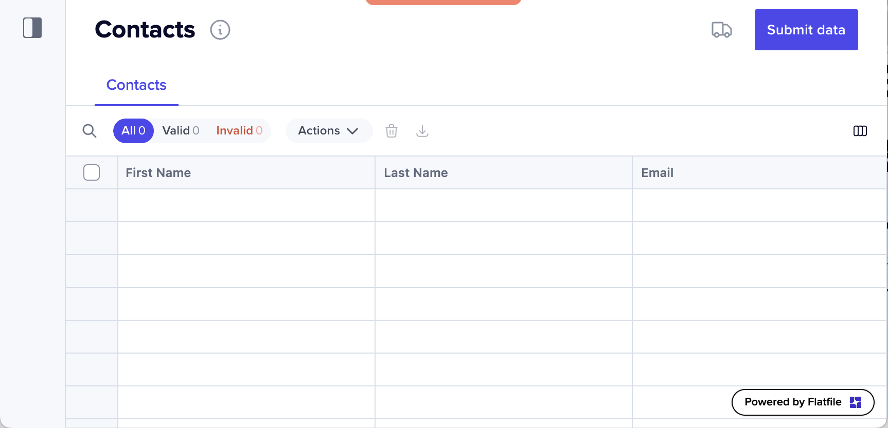

Based on user feedback, we've updated the visual design of the "Powered by
Flatfile" chip to distinguish it from actionable buttons, enhancing the user
interface for clarity.

<Note>
  For those interested in a fully branded experience, we offer the option to
  remove this chip entirely through our [Professional
  package](https://flatfile.com/pricing/).
</Note>
</Update>

<Update label="01-18-2024" description="dataxp">
**Improvements for `trackChanges` functionality**

For users utilizing the `trackChanges` on their Workbooks (disables your actions
until all commits are complete), we’ve addressed a critical workflow concern.

Changes in a Reference field result in the creation of a new commit event, which
was leaving the original commit incomplete. Furthermore, this new commit wasn’t
triggering an event emission, leading to a chain of incomplete commits.

We’ve refined the commit completion process: now, commits will be marked as
complete whenever the user explicitly references a commit in an update request.

This adjustment is handled out of the box with `@flatfile/plugin-record-hook`
and ensures a more streamlined and reliable change tracking experience.
</Update>

<Update label="01-17-2024" description="spaces">
**New: At-a-glance Insights are now available in the Sidebar**

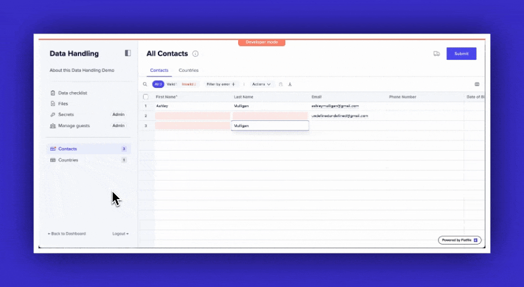

Enhancements to the Spaces sidebar now offer at-a-glance insights for greater
efficiency: each workbook's entry displays a count of contained Sheets,
alongside a tally of records within each Sheet. Additionally, the validity of
records is intuitively indicated with color-coded dots—green for valid and red
for invalid—directly within the Sheet summary. This allows for quick
identification and management of data accuracy.
</Update>

<Update label="01-17-2024" description="dataxp">
#

We've optimized the file deletion process for large files. The next time you
remove a sizable file, expect to experience a noticeably faster removal speed.
</Update>

<Update label="01-12-2024" description="dataxp">
**Toolbar blocking jobs Extended to Workbook-Mounted Actions**

We've extended the functionality of the `toolbarBlocking` job mode beyond
individual Sheets. Now, when it's applied to Workbook-mounted actions, this mode
also disables workbook actions (including all of the Sheets actions/toolbars)
during a job's progress. By its nature, it also still allows interaction with
the actual data tables.

This enhancement provides more consistent control throughout your entire
Workbook, ensuring tasks are completed efficiently and without accidental
interference or unintended navigation.

[Learn more](../orchestration/actions#optional-parameters)
</Update>

<Update label="01-12-2024" description="dataxp">
**State-Based Messaging on Actions via Tooltips**

We've introduced an exciting new capability to enhance user interaction and
feedback in our application. You can now add custom messages to actions,
tailored according to their state:

- Error
- Info

These messages will be displayed as tooltips when users hover over an action,
providing context-specific text that corresponds to the action's current state.

[Follow the guide](../guides/actions#usage-7)
</Update>

<Update label="01-12-2024" description="dataxp">
**Decoupling Actions Updates from the Workbook's Schema**

Previously, using workbook update endpoint necessitated submitting all the
fields, even for minor adjustments to an action. Now, with our improved `PATCH`
endpoint, you can update actions without needing to include the `fields`
property in your payload.

This refinement simplifies the update process, focusing solely on the changes
you intend to make.

[See the endpoint](https://reference.flatfile.com/api-reference/workbooks/update-a-workbook)
</Update>

<Update label="01-12-2024" description="dataxp">
Previously, users experienced difficulties in adjusting column sizes correctly
when other columns were either hidden or pinned. This fix ensures seamless and
accurate resizing of columns, regardless of the visibility or status of adjacent
columns, enhancing the overall usability and functionality of the data table.
</Update>

<Update label="01-03-2024" description="dataxp">
**Enhanced Visibility with Status Updates During File Extraction**

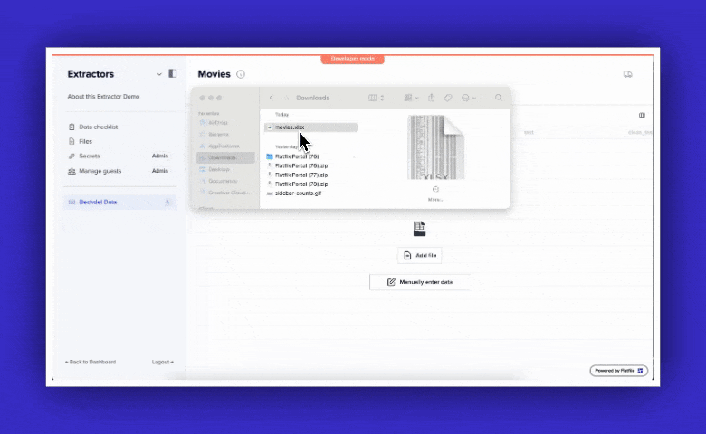

A Toast now displays intermediate states to keep you informed every step of the
way during file extraction.

When uploading a file directly to the table, you’ll see statuses like “Waiting
for Extraction”, “Extracting”, and “Unsupported File”, along with detailed
information about the outcome of extraction jobs.

When uploading on the Files page, the error message is toned down to an info
message, as uploading files without an extractor is a legitimate scenario.

These updates are aimed at enhancing transparency and efficiency, ensuring
you’re well-informed throughout the file extraction process.

[See extractor plugins](https://flatfile.com/plugins/category/extractors/)
</Update>

<Update label="01-03-2024" description="dataxp">
**Improved Search Functionality for Null Values in GET Records Endpoint**

We've refined the search mechanism for empty cells in the GET records endpoint.
In the past, users would specify `null` in the `searchValue` parameter to locate
empty cells. However, this method posed ambiguity as it didn't clearly
distinguish between an exact search for null values and a partial search for the
string "null".

Now, to accurately search for cells with null values, you should use empty
double quotes `""` in the `searchValue` parameter.

[See the endpoint](https://reference.flatfile.com/api-reference/records/get-records)
</Update>

<Update label="12-21-2023" description="theming">
**Enhanced Theming Tabs, Tooltips, and Popovers**

We're excited to announce a broad range of new theming capabilities that enhance
the visual appeal and customization of our platform:

**Usage**

```jsx
{
  "theme": {
    "root": {
      "borderColor": "pink",
      "modalBorderRadius": "10px",
      "popoverBorderRadius": "8px",
      "tabstripActiveColor": "deepskyblue",
      "tabstripInactiveColor": "orange",
      "popoverBackgroundColor": "limegreen",
      "tabstripHoverTextColor": "gold",
      "tooltipBackgroundColor": "hotpink",
      "tabstripHoverBorderColor": "purple"
    }
  }
}
```

1. Theming for Tabs: Customize the look and feel of tabs to better match your
   application's design and user experience.

2. Enhanced Tooltip Styling: Gain more control over tooltip aesthetics with
   expanded theming options, ensuring they align seamlessly with your interface.

3. Refined Borders Across Components: Apply custom themes to borders, providing
   a sharper and more cohesive visual distinction for various elements.
4. Popover Customization: Tailor the appearance of popovers with new theming
   capabilities, enhancing their integration within your application's layout.

5. Modal Window Styling: Elevate the design of modal windows with customizable
   theming options, contributing to a more engaging and harmonious user
   experience.

These updates offer a greater degree of flexibility in customizing the
appearance of key UI components, allowing for a more integrated and visually
consistent application design.

[Learn more](../guides/theming).
</Update>

<Update label="12-15-2023" description="dataxp">
**Field Descriptions now have Markdown Support**

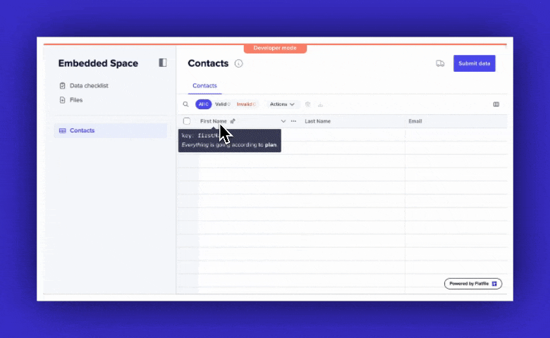

We're delighted to announce that field descriptions now support Markdown
formatting. This enhancement enables you to create more informative and engaging
field descriptions, complete with formatted text and hyperlinks.

**Usage**

```jsx
"fields": [
  {
    "key": "code",
    "label": "Product Code",
    "description": "This can be **markdown**."
    "type": "string"
  },
]
```

- Rich Formatting Capabilities: Leverage the power of Markdown to format your
  field descriptions, making them more readable and useful.

- Incorporate Links: Easily include links in your field descriptions, providing
  direct access to additional resources or related information.

- Versatile Display Across Interfaces: These enriched descriptions are displayed
  as tooltips within the data table and in mapping. Additionally, the full text
  of the descriptions is available in the data checklist for comprehensive
  insights.

This update is designed to improve the clarity and effectiveness of field
descriptions, enhancing the overall user experience in data interaction and
comprehension.

Learn more about [Blueprint](../blueprint) and Fields.
</Update>

<Update label="12-15-2023" description="dataxp">
**Default Value Added to `inputForm` fields**

We've enhanced the `inputForm` feature in Actions by supporting `defaultValue`
settings for enums, strings, and textarea field types.

**Usage**

```jsx
"inputForm": {
  "type": 'simple',
  "fields": [
    {
      "key": 'planName',
      "label": 'Plan Name',
      "type": 'string',
      "description": 'The name of the plan',
      "defaultValue": 'Default plan'
    },
  ]
}
```

This update allows for more intuitive and efficient data entry, as default
values can be pre-filled in these fields, streamlining the user experience.

Learn more about [Actions and Input Forms](../orchestration/actions#inputForm).
</Update>

<Update label="12-15-2023" description="theming">
**Enhanced Theming Interactive options**

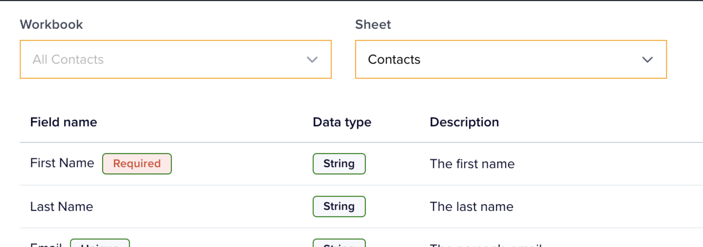

The latest updates in our theming capabilities bring a fresh look and enhanced
customization to various UI elements:

**Usage**

```jsx
{
  "theme": {
    "root": {
      "badgeBorderColor": "green",
      "interactiveBorderColor": "orange",
      "interactiveBorderRadius": "0px"
    },
    "table": {
      "cell": {
        "active": {
          "borderWidth": "2px",
          "boxShadow": "3px 3px 0px 0px #000000"
        }
      },
      "tooltip": {
        "borderRadius": "0px"
      },
      "lookupEditor": {
        "option": {
          "borderRadius": {
            "hover": "0px",
            "active": "8px"
          },
          "backgroundColor": {
            "hover": "yellow",
            "active": "lavender"
          }
        }
      }
    }
  }
}
```

1. Enhanced Dropdown, Text Input, and Context Menu Theming: Users can now apply
   customized themes to dropdowns, text inputs, and context menus, offering a
   more cohesive and personalized interface design.

2. Refined Active Cell Styling in Tables: The active cell in the table now
   features themable border width and box shadow, adding depth and focus to the
   selected cell.

3. Upgraded Tooltips in Tables: Tooltips in the table now support theming for
   border radius and box shadow, allowing for smoother integration with the
   overall design aesthetic.

4. New Optional Border for Badges: An optional border can now be added to badges
   within the app. This update extends to TT badges in enum columns, providing a
   consistent and visually appealing element across the platform.

These theming enhancements are part of our ongoing commitment to provide a
versatile and visually engaging user experience, allowing for greater
consistency and branding alignment across our platform.

[Learn more](../guides/theming).
</Update>

<Update label="12-14-2023" description="theming">
**Enhanced Theming options for Checkboxes**

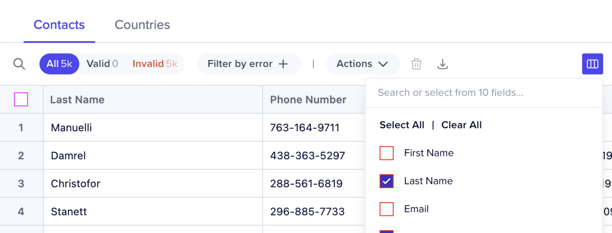

We're pleased to announce the expansion of our theming capabilities with new
customization options for checkboxes:

**Usage**

```jsx
{
  "theme": {
    "root": {
      "checkboxBorderRadius": "0px",
      "checkboxBorderColor": "red"
    },
    "table": {
      "inputs": {
        "checkbox": {
          "borderColor": "magenta"
        }
      }
    }
  }
}
```

1. Customizable Checkbox Border Radius: Users now have the flexibility to theme
   the border radius of checkboxes, allowing for a more personalized and
   visually cohesive interface.

2. Theming for Checkbox Border Color: Alongside border radius customization,
   users can also theme the border color of checkboxes, adding another layer of
   visual customization to match your application's aesthetic.

3. Override Options in Table View: In table contexts, users have the added
   ability to override the default checkbox border color, offering even more
   control over the table's appearance and consistency with your overall design
   theme.

These enhancements aim to provide greater flexibility and control over the UI,
enabling users to tailor the look and feel of checkboxes to better align with
their unique branding and design preferences.

[Learn more](../guides/theming).
</Update>

<Update label="12-08-2023" description="theming">
**Enhanced Theming options for Badges+**

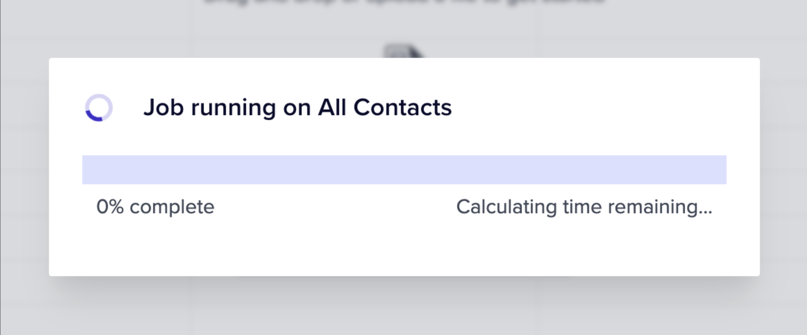

We're excited to announce new additions to our theming capabilities, allowing
for even more customization and a refined user experience.

**Usage**

```jsx
"theme": {
  "root": {
    "pillBorderRadius": "0px",
    "badgeBorderRadius":"10em"
  },
  "table": {
    "buttons": {
      "pill": {
        "color": "white",
        "backgroundColor": "magenta"
      },
      "iconColor": "magenta"
    }
  }
}
```

**What's New:**

1. Pill and Badge Border Radius Customization: You can now tailor the border
   radius of pills and badges within space theming. This update enables you to
   define and apply a consistent look across all pills and badges in the space
   according to your design preferences.

2. Toolbar Button Color Theming: We've also introduced the option to customize
   the color of toolbar buttons, giving you more control over the visual style
   of your toolbar.

3. Inherited and Customizable Toolbar Filters: Toolbar filters will
   automatically inherit the pill border radius settings for a unified
   appearance. However, this can be overridden to suit specific design needs,
   offering both convenience and flexibility.

These enhancements are part of our ongoing commitment to providing a versatile
and user-friendly platform that caters to your unique theming requirements.

[Learn more](../guides/theming).
</Update>

<Update label="12-01-2023" description="dataxp">
**Revamped UI for Foreground Jobs**

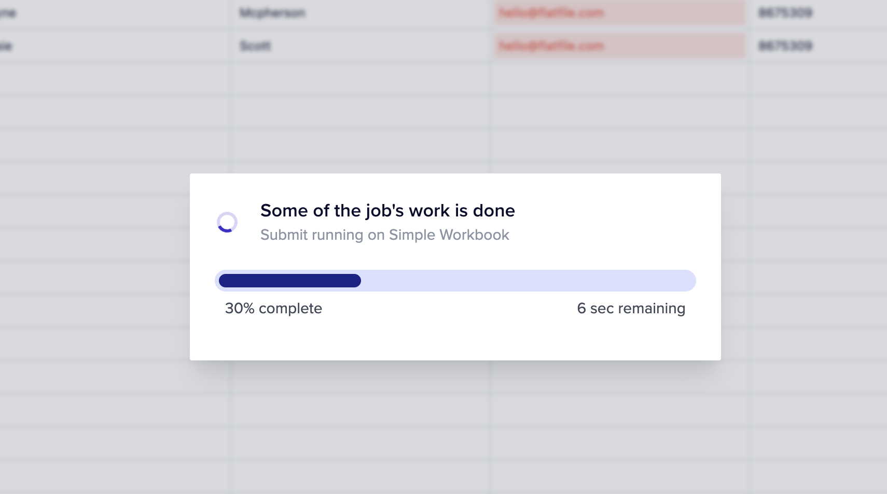

We've given our foreground jobs a fresh, new look:

1. Enhanced Job Modal Header: The job modal header now prominently displays job
   information, making it instantly visible and accessible.
2. Refined Display Details: Information that was previously in the header is now
   elegantly presented as an ultralight subline for improved readability.
3. Optimized Layout: We've repositioned the display of the percentage and
   remaining time for better clarity and focus.
4. Improved Time Estimation: For estimated completion time, we've introduced a
   fallback mechanism based on simple linear extrapolation, ensuring more
   accurate and reliable predictions.

These updates are designed to offer a more intuitive and streamlined user
experience in tracking and managing foreground jobs.
</Update>

<Update label="12-01-2023" description="dataxp">
**Next Action Links in Job Outcome Dialogs Now Support Linking to internal
resources**

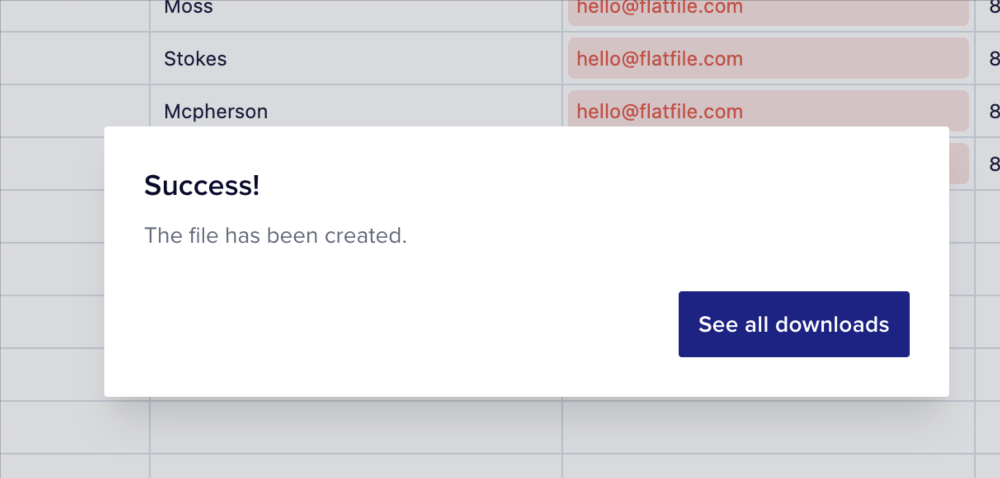

In addition to the existing ability to link to external URLs and trigger
downloads, you can now also display links to internal resources upon job
completion. This enhancement broadens the scope of actions you can perform,
offering more versatility in directing users to relevant resources or actions
post-job completion.

In this code below, we will create a button that says “See all downloads” with
this path: `/space/us_sp_1234/files?mode=export`

**Usage**

```jsx listener
await api.jobs.complete(jobId, {
  outcome: {
    message: `The file has been created`,
    acknowledge: true,
    //Reference: https://platform.flatfile.com/s/space/{$id}/{path}?{$query}
    next: {
      type: "id",
      id: "dev_sp_1234",
      path: "files",
      query: "mode=export",
      label: "See all downloads",
    },
  },
});
```

This improvement adds versatility and flexibility to your job outcomes,
enhancing user interaction and experience.

[Learn more](../orchestration/jobs#next-links).
</Update>

<Update label="12-01-2023" description="dataxp">
**Next Action Links in Job Outcome Dialogs Now Support Retrying**

You can now also display links to retry a job upon job completion or failure.
This enhancement broadens the scope of actions you can perform, offering more
versatility in directing users to relevant resources or actions post-job
completion.

**Usage**

```jsx listener
await api.jobs.complete(jobId, {
  outcome: {
    message: `The file has been created`,
    acknowledge: true,
    next: {
      type: "retry",
      label: "Try again",
    },
  },
});
```

This improvement adds versatility and flexibility to your job outcomes,
enhancing user interaction and experience.

[Learn more](../orchestration/jobs#next-links).
</Update>

<Update label="12-01-2023" description="theming">
**Enhanced Theming options for Filters**

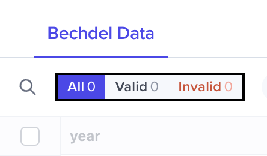

We've expanded the theming capabilities for filters, providing a more
customizable and visually appealing interface:

**Usage**

```jsx
"theme": {
    "table": {
      "filters": {
        "outerBorder": "2px red solid",
        "innerBorderRadius": "0px",
        "outerBorderRadius": "0px"
      }
  }
}
```

1. New Styling Features for Filters: We've introduced the option to customize
   filters with borders and border radius as part of the table theme.

2. Flexible Border Radius Design: To accommodate the varying sizes of elements
   and the potential difference in calculated border radius, we now use both
   inner and outer border radius settings. This enhancement not only ensures a
   cohesive look but also adds an extra layer of styling flexibility to the
   filters.

These improvements are designed to offer more control over the aesthetics of
filters, enabling a seamless and integrated visual experience.

[Learn more](../guides/theming).
</Update>

<Update label="11-28-2023" description="dataxp">
**Introducing New Endpoint for Workbook Commit Retrieval**

We're excited to announce the addition of the new GET
`/workbooks/{workbookId}/commits` endpoint. This improvement streamlines the
process of retrieving all commits associated with a specific workbook, offering
a more efficient way to determine the completion status of all processing
activities on that workbook.

While this enhancement primarily benefits the Flatfile UI, the endpoint is fully
exposed, making it a valuable tool for developers looking to optimize commit
retrieval and processing status checks in their own applications.

[See the endpoint](https://reference.flatfile.com/api-reference/workbooks/get-commits-for-a-workbook)
</Update>

<Update label="11-28-2023" description="dataxp">
We've successfully addressed and fixed the issue related to extracting/uploading
files with special characters in their names. If you previously encountered
difficulties with such files, this update resolves those challenges, ensuring
smoother and more reliable file handling going forward.
</Update>

<Update label="11-28-2023" description="dataxp">
**Improved Handling of Long-Running Jobs with New Timeout Feature**

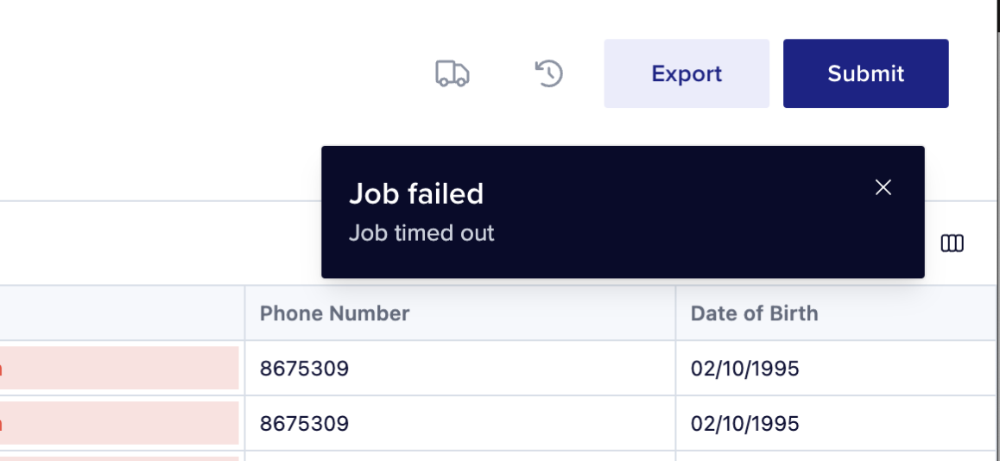

To enhance clarity and efficiency in job processing, we’ve implemented an update
for managing long-running jobs. Previously, jobs that weren’t acknowledged
within 5 minutes would silently fail due to a timeout by the agent, leading to
confusion as these jobs never reached completion (They were left in an executing
state).

To address this, we’ve now added a routine check that occurs every 5 minutes.
This check will automatically fail jobs that are still executing but haven’t
been
[acknowledged](https://reference.flatfile.com/api-reference/jobs/acknowledge-a-job)
(ack’d) within this timeframe. This update ensures better transparency and
control in the job execution process, reducing confusion and streamlining
operations.
</Update>

<Update label="11-20-2023" description="dataxp">
**You can now disable Actions when there are invalid records**


Previously, developers faced challenges in determining when all rows were valid,
essential for preventing unintended data egress.

Now, developers can now add an optional flag to Actions, preventing users from
initiating Actions when Sheets or Workbooks contain invalid records.

```jsx
actions: [{
  ...
  constraints: [{ type: 'hasAllValid' }]
  ...
}]
```

Add a `constraints` parameter in your Action that includes `type: hasAllValid,`
to disable actions when there are invalid records.

[Learn more](../guides/actions#usage)
</Update>

<Update label="11-20-2023" description="spaces">
We made an enhancement to bulk cell pasting. Previously, locking the cell
occurred prematurely, causing values to flash after pasting. Now, locking is
effectively executed later, resulting in a smoother and more stable pasting
experience.
</Update>

<Update label="11-20-2023" description="spaces">
**Space ID Search is now available in the Spaces Table**

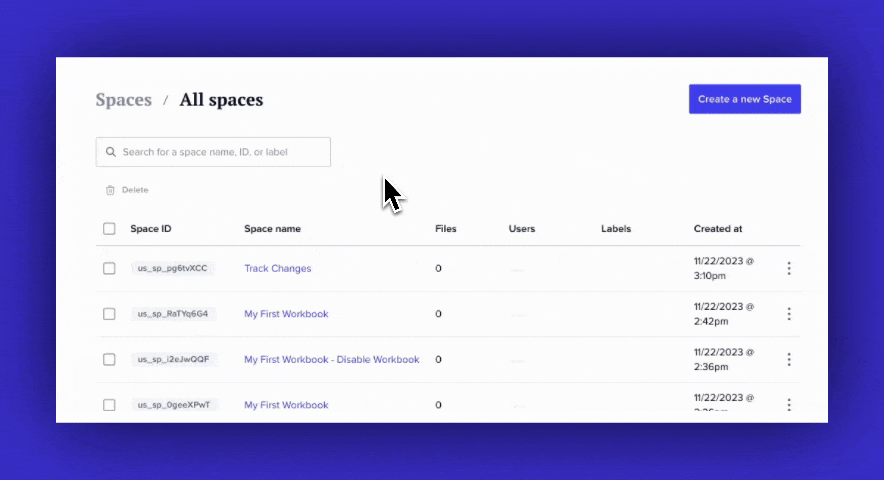

We've added a new feature that allows you to search for spaces using their Space
ID in the Spaces table. This enhancement simplifies the process of locating
specific spaces quickly and efficiently.
</Update>

<Update label="11-17-2023" description="files">
**Enhanced Weighting Mechanism for User History in Enum Mapping**

We assign an 80% value to other users' history compared to the current user's
history. Previously, this was only applied to field mapping, Now, this approach
has been extended to enum mapping as well.

This update addresses an issue where conflicting histories between two users
could result in one user being unable to edit due to the other's history taking
precedence.

With this enhancement, the system now more effectively balances historical
inputs from different users, ensuring smoother and more equitable enum mapping
automation.
</Update>

<Update label="11-17-2023" description="spaces">
_It's the little things_: Bulk delete in Spaces is now available\*\*\*


We’ve added a new feature that allows for the selection and bulk deletion of
Spaces from your list. This enhancement is particularly beneficial for customers
managing numerous Spaces, as it eliminates the need to delete each Space
individually, streamlining the process and saving time. Enjoy!
</Update>

<Update label="11-17-2023" description="spaces">
**New: Column Visibility Control with Local Storage Memory**

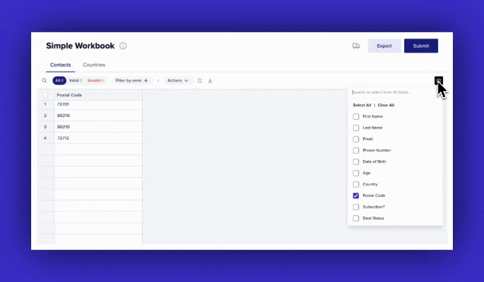

We've introduced a new feature that allows for selective hiding or showing of
columns, enabling users to customize their view for more focused work.
Additionally, your column visibility preferences will now be automatically saved
to local storage, ensuring that your personalized settings are remembered for
future sessions. This update aims to enhance user efficiency by allowing you to
tailor the interface to your specific needs and workflow.
</Update>

<Update label="11-17-2023" description="spaces">
**Guests can now be named in a Spaces URL**

Previously, accessing Flatfile either directly through a URL or via an iframe
with an `accessToken` would categorize all user activities under an anonymous
guest. Now, if you know the `guestId`, interactions in Flatfile can be tied back
to that person.

This is made possible with a new endpoint, **/guests/:guestId/token**, which
generates an accessToken, and can be used to load the Flatfile space at
**http://platform.flatfile.com/space/:spaceId?token=:accessToken**.

With this method, Guests are now accurately named and identifiable, enhancing
user recognition and auditing.

[See the endpoint](https://reference.flatfile.com/api-reference/guests/get-guest-token).
</Update>

<Update label="11-17-2023" description="files">
**Speed Optimization for Large Enum Lists**

When either the source (file) or destination (Blueprint) list contains more than
100 enums, our mapping AI will now utilize a simplified algorithm. This change
addresses scenarios where customers have extensive enum lists, such as 5,000
different Shopify products, which previously slowed down our assignment
algorithm. With this update, the execution speed for such extensive lists will
be faster, ensuring a more efficient and responsive experience for clients with
large datasets.
</Update>

<Update label="11-17-2023" description="files">
**Fixed File Extraction for Workbook-Only Guests**

We’ve fixed an issue where guests with
[workbook-only access](../developer-tools/security/roles-and-permissions#workbook-grant)
could upload files but couldn’t extract them due to access restrictions. Guests
can now upload and extract files smoothly in workbooks they have access to.
</Update>

<Update label="11-13-2023" description="spaces">
**Full Whitelabeling now available in Pro+**

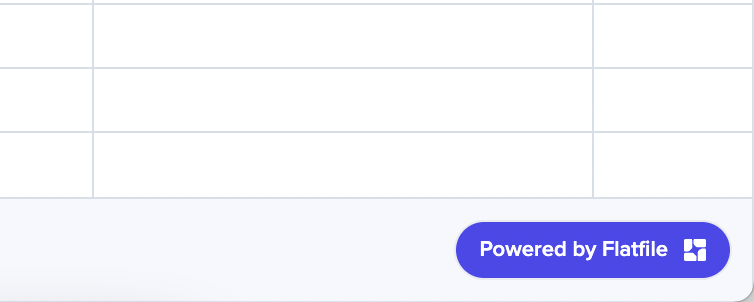

There are a few places where the Flatfile logo appears to your end customers.

1. The **Powered By Flatfile** logo appears in the bottom right of Workbooks.
2. When sending invitations to Users or Guests, the Flatfile logo is included at
   the top of the emails.

For those seeking a complete white-labeling experience, we offer a fully
customizable solution as part of our Pro plans and above. Feel free to get in
touch with us at [support@flatfile.com](mailto:support@flatfile.com) to discuss
the possibilities of a fully whitelabeled experience tailored to your needs.
</Update>

<Update label="11-13-2023" description="spaces">
**Hide the info Tooltip**

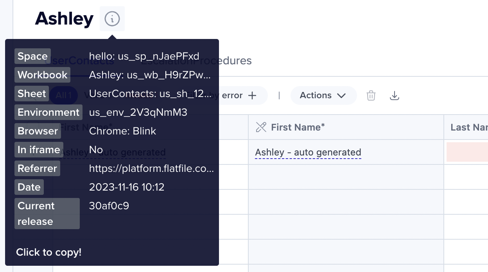

Within each Space, we've implemented an informative tooltip providing essential
details about the Space. This tooltip serves as valuable support for addressing
customer inquiries and issues. However, we understand that there are scenarios
where you may prefer to hide this information from your customers.

To accommodate your preferences, we've introduced the option to hide this Space
tooltip. To make this adjustment, you can utilize the "Update Environment" patch
available in our
[API Reference](https://reference.flatfile.com/api-reference/environments/update-an-environment).

```jsx
metadata: {
  showSpaceInfo: false;
}
```
</Update>

<Update label="11-13-2023" description="core">
In this update, we've implemented a crucial enhancement by unifying the casing
in our API. We've resolved issues where certain properties were inconsistently
cased, which had previously hindered their proper setting and retrieval.

With this unification, you can now seamlessly interact with our API, ensuring a
smoother and more reliable experience.
</Update>

<Update label="11-13-2023" description="dataxp">
Previously, if an existing value was present in the enum field, you couldn't
select a different value from the dropdown. Additionally, when a dropdown field
was empty, you were unable to use the dropdown to select a valid option, and
typing out an option wasn't possible either. Both of these limitations have now
been resolved.
</Update>

<Update label="11-07-2023" description="dataxp">
**Control your mapping accuracy**

We're excited to announce a new parameter within Sheet configuration, aptly
named `mappingConfidenceThreshold`. This parameter empowers you to fine-tune
your experience when working with automatically suggested fields during mapping
jobs.

With `mappingConfidenceThreshold`, you have the flexibility to configure the
minimum required confidence level. Think of it as a precision control, offering
you the choice between conservative (exact match) or liberal (fuzzy matching)
settings.

**How it works**

Set the value greater than 0 and up to a maximum of 1, for a more precise
control over the mapping process:

```jsx workbook.js
  sheets: [
    mappingConfidenceThreshold: .6,
    {...}
  ]
```

[Learn more](../blueprint/sheet-options#mappingConfidenceThreshold)
</Update>

<Update label="11-07-2023" description="dataxp">
**More Precise Filtering is now Available**

Now, FFQL queries made via filter: in the the search bar can be seamlessly
combined with other filters. Whether you prefer using tabbed filters like
“valid” and “error,” or you rely on the “Filter By Value” menu, you can now
harness the power of FFQL alongside these filters.

With this update, you’ll experience precise narrowing of row results every time
you apply FFQL queries in conjunction with other filters. No more guesswork—your
filtered results will be spot on, making it easier than ever to find the
information you need with pinpoint accuracy.
</Update>

<Update label="11-07-2023" description="theming">
**Theming Column Headers**

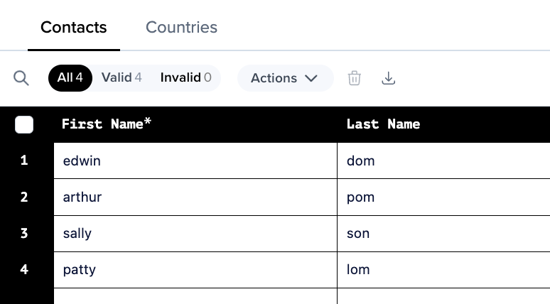

You can now control the font of the headers in a table using the
`column.header.fontFamily` property.

[Learn more](../guides/theming#theme-table)
</Update>

<Update label="11-01-2023" description="dataxp">
**Enhanced Cell Copying with Multi-line Preservation**

We've improved the functionality for copying cells from external spreadsheets
into our system. Now, when you copy cells containing more than one line, these
new lines are preserved in the cell value upon pasting.

While these additional lines may not be visually apparent in the table, you can
verify their presence by inspecting the data through the API, or by copying and
pasting the cell content into another application.

This update ensures better data integrity and consistency when transferring
content with complex formatting.
</Update>

<Update label="10-30-2023" description="spaces">
**Removed Character Limit on Mappings, Jobs, and Enum Mappings**

We have lifted the previous 255-character limit for mappings, jobs, and enum
mappings. This update allows for greater flexibility and more detailed entries
in these areas.
</Update>

<Update label="10-30-2023" description="spaces">
**New API Feature to Restore Archived Spaces**

API users now have the capability to restore an archived space. This can be done
by setting the `archivedAt` property of the space to null via the
`PATCH /spaces/:spaceId` endpoint.
</Update>

<Update label="10-30-2023" description="spaces">
**Improved Cascade Deletion for Spaces, Workbooks, and Sheets**

We've enhanced the deletion process for Spaces. In the past, deleting a Space
did not automatically cascade to its Workbooks and Sheets. Now, with the latest
update, soft deleting a Space will also soft delete its associated Workbooks and
Sheets.

Furthermore, we've refined the `GET /workbooks` query. It now filters out
workbooks linked to previously deleted Spaces, ensuring that only relevant and
active workbooks are displayed. This update is helpful for Spaces deleted before
this improvement was implemented.
</Update>

<Update label="10-30-2023" description="spaces">
**Enhanced Display of Enum Options in Turntable**

We've addressed an issue in the table where enum options without a label were
incorrectly displaying as 'undefined'. With the latest update, in cases where an
enum option lacks a label, the table will now default to showing the option's
value instead.

This ensures a more accurate and user-friendly display of data.
</Update>

<Update label="10-25-2023" description="spaces">
**Disable Actions while Hooks are Running**

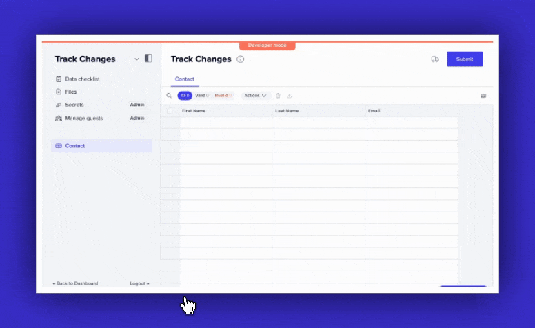

Previously, developers faced challenges in determining when all hooks had
finished running, essential for ensuring data transformation completion and
preventing unintended data egress. As a workaround, they resorted to creating
placeholder fields that defaulted to invalid states. When a hook completed
processing for a record, it marked the field as valid, allowing submission only
when there were no errors in this field.

Now, we're thrilled to introduce a solution to simplify this process—an all-new
event: `commit:completed`. This event signals the end of all processing tasks.

```jsx
settings: [{ trackChanges: true }];
```

Add a `settings` parameter in your sheet that includes `trackChanges: true,` to
disable actions on both Sheets and Workbooks until any pending commits have been
completed.

[Learn more](../blueprint/sheet-options#settings)
</Update>

<Update label="10-25-2023" description="spaces">
**New Job Mode: `toolbar-blocking`**

We're excited to introduce a third job mode called `toolbarBlocking` alongside
the existing `foreground` and `background` modes. With this new mode,
`toolbarBlocking`, you have the flexibility to disable the Sheet Toolbar and
Column Header Menus while still allowing users to enter records manually.

[Learn more](../orchestration/actions#optional-parameters)
</Update>

<Update label="10-18-2023" description="spaces">
**Improved copy-paste experience while bulk selecting cells**

We've enhanced the bulk selection experience by enabling paste functionality.
When you paste, we simply transition you out of the selection state, similar to
when editing. Note: if you paste without selecting any cells, the operation will
automatically apply to the bulk-selected rows.
</Update>

<Update label="10-16-2023" description="dataxp">
In the past, when your Space took more than 10 seconds to build, an "empty space
created" message would appear. With our latest update, as long as you
acknowledge the space:configure job, you can rest assured this dialog will no
longer appear.
</Update>

<Update label="10-16-2023" description="spaces">
**New: Embed Sheets inside Documents**

Now, by simply incorporating the `embed` HTML entity into your markdown body and
providing the sheet ID, workbook ID, and name, you can effortlessly embed Sheets
into Documents. Additionally, you have the flexibility to choose whether the
embedded Sheet starts in an expanded or collapsed state when the document is
loaded.

```html
<embed
  type="embedded-sheet"
  name="Contacts"
  defaultExpanded="true"
  sheetId="your_sheet_id"
  workbookId="your_workbook_id"
/>
```

This enhancement provides further freedom to tailor document-driven interactions
precisely to your needs.

[Learn more](../guides/documents#embedding-sheets-in-documents)
</Update>

<Update label="10-13-2023" description="dataxp">
**Actions are now available on Documents.**

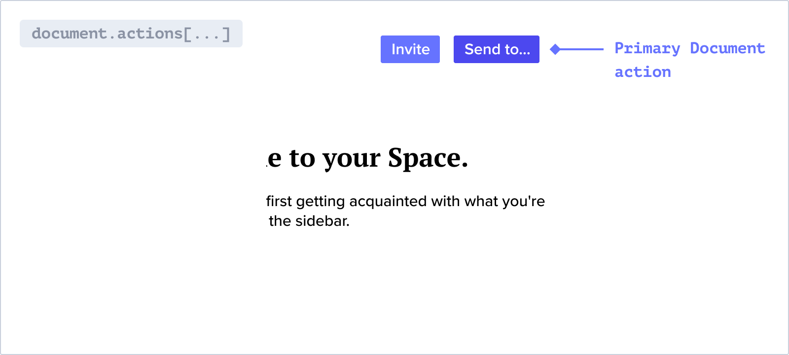

Documents, which are standalone webpages within your Spaces, can now host a
variety of actions, just like Workbooks, Sheets, and Files.

Document-Mounted Actions have their own configuration within a Document object.
The executable code within an Action is compiled into a Job entity, offering the
flexibility to run asynchronously or immediately. This empowers you to create
more interactive and dynamic Documents, enhancing the overall user experience
within your Flatfile Spaces.

```jsx workbook.js
//your document can now have an action that looks like this
actions: [
  {
    operation: 'sendAction',
    mode: 'foreground',
    label: 'Send to...',
    description: 'Send this page to someone.',
    primary: true,
  },
  {...}
]
```

[Learn more](../guides/actions#document-mounted)
</Update>

<Update label="10-11-2023" description="spaces">
**The API now supports two new actions: `sheets.lock` and `sheets.unlock`.**

With the introduction of these API actions, you gain the ability to manage sheet
locking within your application. The `sheets.lock` action allows you to lock a
sheet, preventing any further modifications to its content. Conversely, the
`sheets.unlock` action enables you to release the lock and restore full editing
capabilities to the sheet.

These new API actions provide greater control and flexibility when it comes to
managing sheet access and data integrity.

[See the endpoint](https://reference.flatfile.com/api-reference/sheets/lock-a-sheet)
</Update>

<Update label="10-11-2023" description="spaces">
**New: Full-screen Documents!**

Documents have gained a new capability, allowing them to seamlessly transition
into full-screen takeovers, thus removing their presence from the sidebar.

**How it works:**

To enable this functionality, we've introduced a new property on Documents:
`treatments`. This property allows users to define specific descriptors for each
Document. When a Document is assigned the "ephemeral" treatment, it will
transform into a full-screen overlay, visible exclusively within the Spaces
dashboard, while being discreetly tucked away from the Spaces sidebar.

This enhancement enhances user creativity and provides the freedom to tailor
document-driven interactions precisely to their needs.

```ts
await api.documents.create(spaceId, {
  treatments: ["ephemeral"],
  title: "Getting Started",
});
```

[Learn more](../guides/documents#ephemeral-documents)
</Update>

<Update label="10-11-2023" description="spaces">
**We’ve added Indonesia (ID) translations!**

Building upon our existing language support (based on your customers’ browser
locale), which already included French, German, Portuguese and Spanish
translations, we’ve expanded our capabilities to cater to an even broader
audience.

Need another language? Let us know and we’ll prioritize getting it added.
</Update>

<Update label="10-09-2023" description="dataxp">
**Now Available: Set estimated time of completion on Jobs**

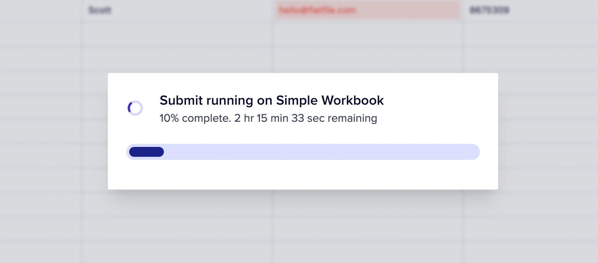

When acknowledging a job from a Workbook or Sheet action, you now have the
option to set the `estimatedCompletionAt` parameter. Setting the estimated time
of completion for the job leads to more informative and interactive features in
the UI.

1. In the Foreground Job overlay, you'll see real-time progress displayed as a
   percentage, along with an estimate of the remaining time.

2. Additionally, the Jobs Panel will share visibility into the estimated
   remaining time for acknowledged jobs.

[Learn more about using Actions](../guides/actions).
</Update>

<Update label="10-09-2023" description="files">
Previously, when uploading a file, actions could only be added to it after the
file was uploaded (by calling a file update via a listener). Now, with our
latest update, you can now include actions during file upload allowing actions
to be applied to the file immediately upon creation.

See the
[API Reference](https://reference.flatfile.com/api-reference/files/upload-a-file).
</Update>

<Update label="10-09-2023" description="dataxp">
The find/replace operation is now able to handle large datasets. Now, records
are batched into groups of 10,000 rows, and a unique versionId is assigned to
each batch. Additionally, the workbook service will emit events for each batch
processed.

This improvement is particularly beneficial for @flatfile/plugin-record-hook,
which can now retrieve and respond to all records in a single find/replace
operation, thanks to the 10,000-row batching.
</Update>

<Update label="10-09-2023" description="core">
When adding a secret to a space via the API, we have expanded the flexibility of
secret names. While the API allows spaces within secret names, the UI previously
restricted them by filtering spaces in the regex validation logic for Secret
Names. With this update, space characters are now considered valid and accepted
characters in secret names, aligning the behavior between the API and the UI.

Learn more about [sharing secrets](../guides/secrets).
</Update>

<Update label="10-08-2023" description="dataxp">
**Now Available: Accept Dynamic Inputs on Actions**

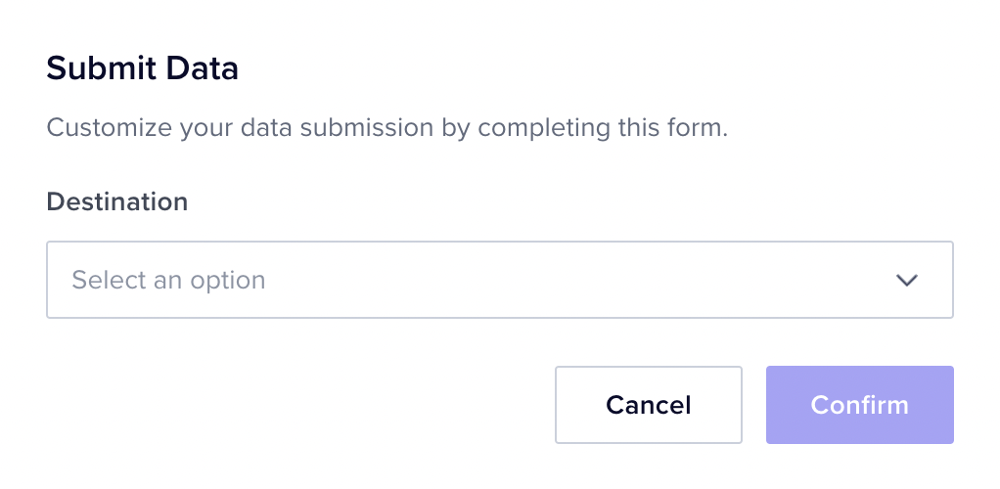

Now, when initiating an action, you have the option to gather additional
information from end users to facilitate the successful completion of the
intended task.

**Here’s how it works:**

Suppose you want to allow users to specify the name of the file they intend to
export. In such cases, you can configure input fields for your action. When an
end user triggers this action, a secondary dialog will appear, prompting them to
provide the necessary information.

**The available input types include:**

- `string`: For capturing text-based information.
- `textarea`: Ideal for longer text entries or descriptions.
- `number`: To collect numeric data.
- `boolean`: For simple yes/no or true/false responses.
- `enum`: Enables users to select from a predefined list of options.

**Two easy ways to get started:**

- Learn about all the parameters available on `inputForm` for Actions
  [here](../orchestration/actions#inputform).
- Or follow this copy/paste [Guide](../guides/actions#actions-with-input-forms)
  to quickly see it in action in your code.
</Update>

<Update label="10-05-2023" description="dataxp">
**Exciting Update: Additional Fields**

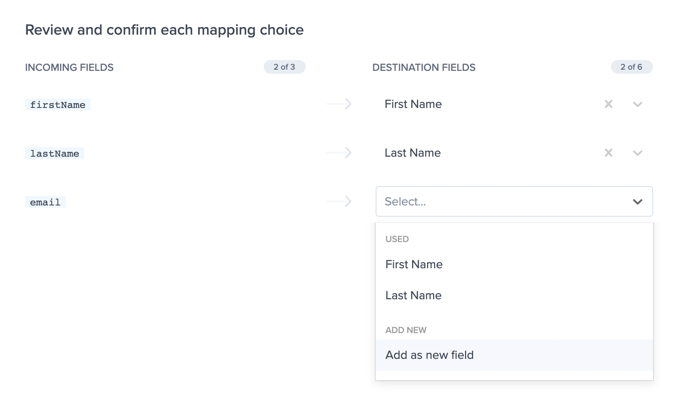

With additional fields, end users can seamlessly map to fields that don’t exist
by simply adding a new property to any of your new or pre-existing Blueprint(s).

Here’s how it works:

- When you set allowAdditionalFields to true, your Sheet gains the ability to
  accept additional fields, extending beyond what’s originally specified in its
  configuration.
- These extra fields can be incorporated, either through API integrations or by
  end users during the file import process.
- Fields that go beyond the Blueprint’s initial setup are marked with a
  treatment property set to additional, ensuring complete transparency over what
  extends the Blueprint.
- What’s more, adding a custom field is a breeze—its name will be automatically
  set to match the header name from the file being mapped. This simplifies the
  process.

[See the docs](../blueprint/sheet-options).
</Update>

<Update label="10-02-2023" description="spaces">
**Introducing New and Enhanced Event Logs**

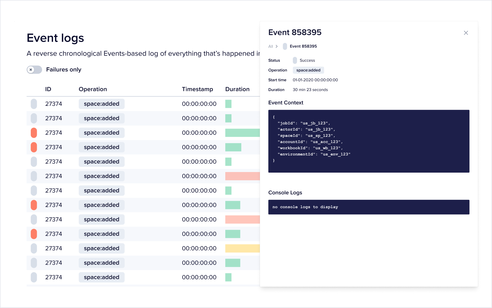

Our aim is to make it easy for everyone to monitor events, find problems, and
help developers avoid overcomplicating their code with excessive Console logs
that would need removal later.

With our enhanced Event logs, you can now:

1. View a comprehensive list of logged events, categorized by event topic.
2. Easily discern the status of each event.
3. Gauge the execution time of each event.
4. Access events chronologically, with the most recent at the top.
5. Dive into each event for context and review any associated console logs.

As an added bonus, you have the capability to filter events, focusing solely on
failures.

See it live: [platform.flatfie.com/logs](http://platform.flatfile.com/logs)
</Update>

<Update label="10-02-2023" description="spaces">
Choosing a `namespace` on Space creation is now easier than ever. Rather than
manually typing the namespaces into a free-form text field, you can simply
choose from a dropdown menu of available options. The available namespaces are
conveniently listed within the `namespaces` array of the Environment, providing
a more efficient and accurate way to handle namespace selection.
</Update>

<Update label="10-02-2023" description="transform">
Previously, when using the find and replace feature, only the initial batch of
records had data hooks run again. Now, the find/replace operation efficiently
groups records into batches of 10,000 rows, assigning a unique versionId to each
batch. This improvement empowers record-hooks to process all records seamlessly
within a single find/replace operation.
</Update>

<Update label="10-02-2023" description="spaces">
Now, you can include a free-form JSON object as `metadata` on your Workbook,
providing you with a flexible way to store additional information related to it.
Whether you're creating a new Workbook or updating an existing one, you have the
option to enrich your Workbooks with meaningful metadata.
</Update>

<Update label="10-02-2023" description="spaces">
Previously, when adding a secret to a space through the API, we supported spaces
in secret names. However, the UI had regex logic that filtered out spaces when
validating secret names.

In this update, we've harmonized the process by accepting space characters as
valid characters for secret names in both the API and the UI. Your secret names
can now include spaces without any issues.
</Update>

<Update label="10-02-2023" description="dataxp">
We've resolved an issue where long messages would overflow the cell in
validation messages. By implementing a straightforward `word-break` property,
your validation messages will now display lengthy messages more elegantly.
</Update>

<Update label="09-27-2023" description="spaces">
**We’ve added Portuguese (Brazilian) translations!**

Building upon our existing language support (based on your customers’ browser
locale), which already included French, German, and Spanish translations, we’ve
expanded our capabilities to cater to an even broader audience.

Need another language? Let us know and we’ll prioritize getting it added.
</Update>

<Update label="09-27-2023" description="spaces">
**Enhanced Document Customization with Markdown & HTML Support**

Until now, you could only utilize Markdown for your Documents. However, we're
excited to inform you that HTML support has been seamlessly integrated, offering
you even more versatility to tailor your Documents exactly to your liking.
</Update>

<Update label="09-22-2023" description="dataxp">
We've revamped the way partial replaces work, enhancing your data editing
experience for maximum smoothness and intuitiveness. In the past, when you
attempted to replace specific characters with an empty string (""), it
occasionally resulted in the cell value becoming null, which wasn't quite what
you had in mind.

For instance, if you needed to eliminate dashes from UUID fields, you'd
naturally want "abc-123" to transform into "abc123" rather than mysteriously
turning null.

We value your feedback. Now, you can confidently perform partial replacements
without the hassle of unexpected null values.
</Update>

<Update label="09-22-2023" description="files">
We've made improvements behind the scenes to ensure that your data gets mapped
with more precision. Previously, some data could be missed during mapping, but
now, we're considering both the option labels and values, making sure nothing is
left behind. This means you'll have a smoother and more reliable experience when
mapping your data, ensuring that everything is captured correctly.
</Update>

<Update label="09-20-2023" description="spaces">
**Localization is Now Available**


We are excited to introduce localization features in Flatfile! Now, your
customers will enjoy automatic translations based on their browser locale,
including French, German, and Spanish.

Key Features:

- Translations are exclusively applied in Spaces (guest areas).
- Our user-friendly guide will assist you in effortlessly translating and
  personalizing the content within your space, whether it's custom actions,
  documents, and more.
- Require another language? Send us a note, and we'll make it a priority to
  include it.

[Follow the guide](../guides/localization) or try the
[Localization demo Space](https://platform.flatfile.com/getting-started) to get
started.
</Update>

<Update label="09-20-2023" description="dataxp">
**New: Promote Sheet Actions**

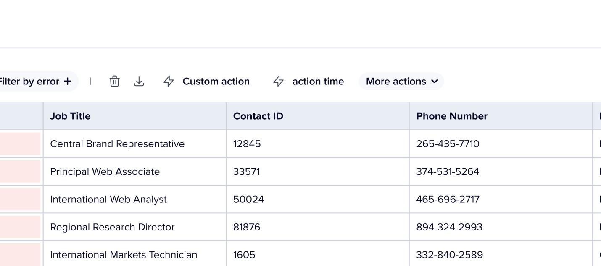

Previously, the `primary:true` concept on Actions didn't affect Sheet actions,
leaving them all in the "more actions" drop-down. But now, setting primary to
true will showcase these actions right in the Sheet toolbar, as buttons with
clear, user-friendly text.
</Update>

<Update label="09-20-2023" description="dataxp">
You can now effortlessly view up to 500k records at once. When you reach the end
of the table, a helpful message will appear, reminding you that there's more
data waiting. Simply search or filter to reduce the size of your dataset and
access it all. This change was added due to browser limitations that restrict
maximum height in the DOM.
</Update>

<Update label="09-15-2023" description="spaces">
**Introducing: Code Blocks for Documents**


We've introduced the ability to add code blocks to your Documents. You can now
use the following syntax to define code blocks and specify the language:


Your code will be formatted accordingly, enhancing the clarity and presentation
of your content.
</Update>

<Update label="09-15-2023" description="spaces">
Previously, guests without access to the specific workbook would encounter a
"Workbook Not Found" error. Now, a fallback mechanism has been implemented to
validate access to the `primaryWorkbook`, ensuring a smoother experience for
users.
</Update>

<Update label="09-13-2023" description="dataxp">
Introducing support for finding empty fields in ffql using the syntax:

```jsx
filter: first_name eq ""
```

Now, you can easily query and filter records with empty values.
</Update>

<Update label="09-13-2023" description="core">
Resolved an issue where attempting to upsert an Environment secret that was
already defined within a Space was not functioning as expected. This fix ensures
proper handling when upserting a secret into an Environment after specifying a
Space ID.
</Update>

<Update label="09-13-2023" description="files">
Resolved an issue where the import button could prematurely appear before a file
was ready to be imported. This was due to an early update of the file's status
with a workbook ID, which has now been adjusted to wait until the data is
queriable before updating. The import process now aligns better with the file's
readiness.
</Update>

<Update label="09-13-2023" description="dataxp">
Experience improved performance (for instance, when scrolling to the bottom of
the data table) with large workbooks as we've optimized query clauses and
updated indexes. Plus, we've seamlessly migrated all existing workbooks to
benefit from these enhancements.
</Update>

<Update label="09-11-2023" description="files">
When a file stream becomes unreadable due to file malformation, improvements
were made to ensure that any errors are correctly communicated to the UI.
</Update>

<Update label="09-11-2023" description="files">
Experience improved performance (for instance, when scrolling to the bottom of
the data table) with large workbooks as we've optimized query clauses and
updated indexes. Plus, we've seamlessly migrated all existing workbooks to
benefit from these enhancements.
</Update>

<Update label="09-08-2023" description="dataxp">
Documents in the sidebar are now organized based on their creation date. This
enhancement helps developers have more control the order of their Documents.
</Update>

<Update label="09-08-2023" description="spaces">
If you have access to multiple Spaces, you'll notice a dropdown menu at the top
left corner of each Space. Previously, there was an issue where all the data
within the Space would update correctly, except for Workbooks/Sheets in the
sidebar. This issue has been successfully resolved.
</Update>

<Update label="09-08-2023" description="dataxp">
2 new Demo spaces were added: Documents & Theming. In these demo Spaces, you'll
learn how to:

1. Add Markdown + HTML Documents to your Space
2. Customize the look and feel of Flatfile to match your brand
</Update>

<Update label="09-08-2023" description="dataxp">
We've extended the `job:ready` timeout to 10 minutes, aligning it with the
extractor timeout. This adjustment provides more time for all jobs running
within an Agent.
</Update>

<Update label="09-06-2023" description="dataxp">
**New Job Outcome Acknowledgements**

**`acknowledge: false`**

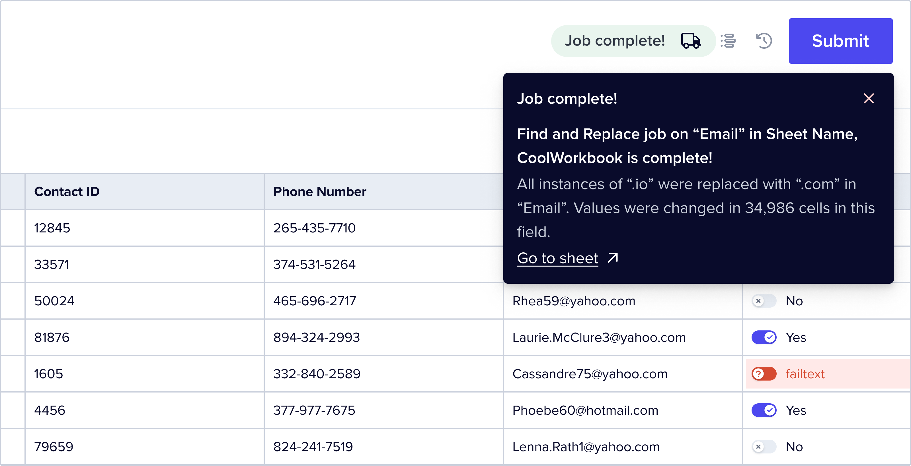

By default, job outcomes are reported through a toast notification in the
top-right corner. To utilize this, simply set `outcome => message`. This
approach ensures that your job completion status is promptly communicated to the
end user.

**`acknowledge: true`**

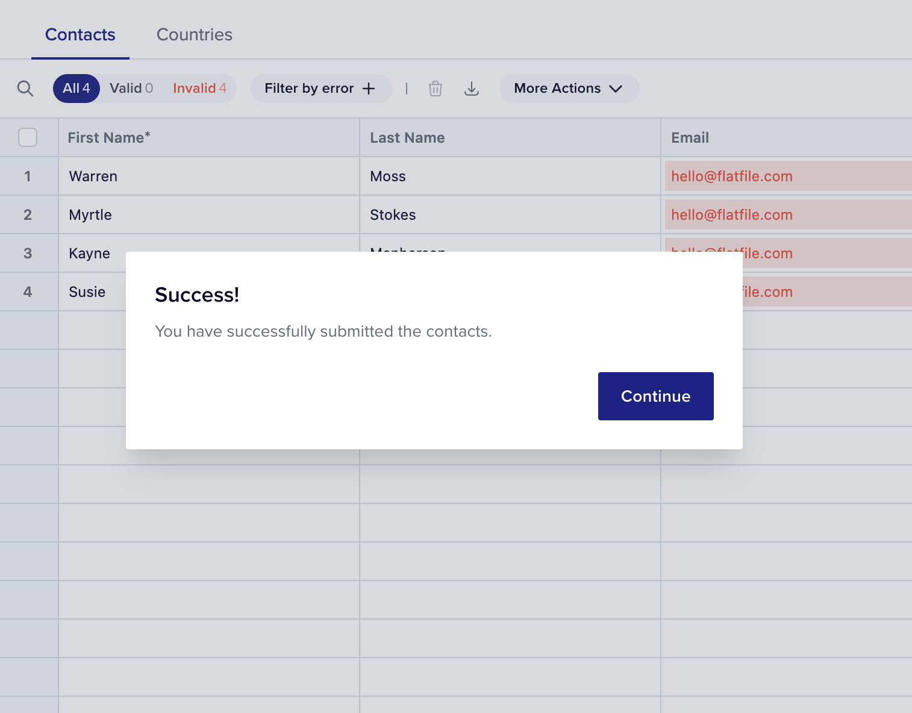

When the `acknowledge` option is configured as `true`, a persistent full-screen
modal is presented. This modal remains visible until the user interacts by
clicking the "Continue" button, acknowledging the outcome.

**Usage**

```jsx
await api.jobs.complete(jobId, {
  outcome: {
    acknowlege: true,
    message: "Text here.",
  },
});
```

This enhancement provides flexibility in how you choose to inform users about
job outcomes. [Learn more](../guides/actions#usage).
</Update>

<Update label="09-06-2023" description="dataxp">
**Enhanced Job Outcomes with Next Action Links**

Job outcomes have been upgraded to support `next` action links. Now, you can
display links to external URLs, trigger downloads, or retry jobes upon job
completion/failure.

**Usage**

```jsx listener
await api.jobs.complete(jobId, {
  outcome: {
    next: Url | Download | Retry,
    message: "Text here.",
  },
});
```

This improvement adds versatility and flexibility to your job outcomes,
enhancing user interaction and experience.

[Learn more](../orchestration/jobs#next-links).
</Update>

<Update label="09-06-2023" description="dataxp">
**Enhanced Action Button Behavior**


Two key enhancements to Actions have been introduced:

**Disable Actions When Invalid Records**: Developers can now add an optional
flag to Actions, preventing users from initiating Actions when Sheets or
Workbooks contain invalid records. This helps avoid unnecessary job failures and
ensures Actions are performed on valid data.

```jsx
constraints: [{ type: 'hasAllValid' }],
```

**Disable Actions When No Selected Records:** To enhance the user experience,
we've introduced the `hasSelection` flag. When added as a constraint, this flag
disables Actions if no records are selected in the Sheet or Workbook, ensuring
Actions are only triggered when relevant data is chosen.

```jsx
constraints: [ { type: 'hasSelection' }],
```

[Learn more](../orchestration/actions#optional-parameters).
</Update>

<Update label="09-01-2023" description="dataxp">
**Improved FFQL handling of dates and number comparisons**

**Enhanced Number Field Queries:**

When conducting equality or inequality FFQL comparisons for `number` fields, the
query value is now cast to a number and then compared with the parsed "shadow"
value. This rectifies issues related to numeric comparisons. Additionally, we've
resolved a bug where numbers with no digits before the decimal point (e.g.,
".3") were not being properly parsed into shadow values.

**Advanced Date Field Handling:**

For `date` fields, query values are now attempted to be parsed into dates. On
the SQL side, a `CASE` statement is employed to parse the stored values into
dates for accurate comparison. To accommodate SQL-side date parsing
requirements, we've integrated a regex pattern to detect `YYYY-MM-DD`, `m/d/yy`,
and `m/d/yyyy` formats. This ensures correct parsing and comparison of date
values.

**Fix for Invalid Number Input:**

We've resolved a bug where changing a number field to an invalid number left the
previous "shadow" value intact. Now, in such cases, the previous shadow value is
properly cleared, leading to consistent and accurate behavior.

These updates contribute to improved query handling, better data integrity, and
a more seamless experience when working with number and date fields.
</Update>

<Update label="09-01-2023" description="core">
Introducing caching for record counts, resulting in improved performance for API
requests.
</Update>

<Update label="09-01-2023" description="core">
The `PATCH /sheets` endpoint has been upgraded to accept both an array of
SheetUpdates and an array of SheetConfigs (backwards compatible). This expanded
capability empowers users with more flexible and efficient options when updating
Sheets.
</Update>

<Update label="09-01-2023" description="dataxp">
# 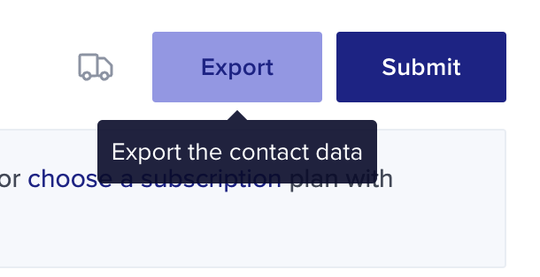

We've introduced a new parameter: `tooltip` to Actions, allowing the addition of
tooltips. These tooltips are now visible in the user interface for both buttons
and list items whenever the associated Action is enabled. This enhancement
provides users with clear and context-aware explanations for enabled Actions,
contributing to an improved overall user experience.
</Update>

<Update label="09-01-2023" description="dataxp">
Fixed a cosmetic issue with scrolling through Workbooks. The problem stemmed
from the outer container scrolling based on the inner content's height. By
applying overflow properties to the inner component, which holds a list of items
within a flex container, we have resolved this issue.
</Update>

<Update label="08-30-2023" description="spaces">
**🚀 4 New Example Spaces**

Visit the **Getting Started** page on your Dashboard to discover four new
options for effortlessly generating demo spaces:

1. Namespaces
2. Metadata
3. Egress
4. Sidebar Customization

Similar to the rest of the options, we've provided the underlying code for each
Space, simplifying the process of breaking down and comprehending the elements
on display.
</Update>

<Update label="08-30-2023" description="core">
**Authentication Query Enhancement**

The authentication query has been streamlined for optimized performance.
Extensive benchmarking has revealed that this refinement contributes to a
reduction of approximately 20 milliseconds for each request. This enhancement
results in faster overall processing and improved response times.
</Update>

<Update label="08-30-2023" description="dataxp">
The **Data Checklist** now includes data types that correspond to each field.
Additionally, the searchable dropdowns are now more user friendly.
</Update>

<Update label="08-30-2023" description="core">
A pagination logic issue concerning **Environments** has been resolved. The
correction ensures accurate calculation of the number of pages and consistent
delivery of valid responses in accordance with the
[Pagination](https://flatfile.stoplight.io/docs/api/1dcb99aada63f-pagination)
type.

Furthermore, the default page size for **Spaces** has been set to 10, aligning
it with the specifications outlined in the API documentation.
</Update>

<Update label="08-30-2023" description="dataxp">
Previously, attempting to navigate into a dropdown using the keyboard's tab key
was unresponsive. This issue has been addressed, and tabbing via keyboard now
smoothly activates dropdowns, accompanied by a focus outline for the custom
trigger.
</Update>

<Update label="08-30-2023" description="core">
The API specification has been updated to facilitate the mapping of `enum`
values of various types such as `string`, `integer`, or `boolean`. This
modification effectively resolves a server error response that was previously
encountered when utilizing such `enum` values within the API.

In addition, the loading state of the "Continue" button has been refined to
ensure smooth recovery from server errors. This adjustment enhances the overall
user experience by providing more graceful handling of unexpected issues during
the process.
</Update>

<Update label="08-25-2023" description="spaces">
**🚀 Instant Extraction for CSV/TSV/PSV Files**

With the removal of the extraction step for CSV/TSV/PSV files, the import
experience is now more seamless than ever. As soon as the upload is complete,
these files are instantly extracted, ensuring an efficient and immediate
handling of your data.

The impact of this change is remarkable. What used to take approximately 3 and a
half minutes to extract now concludes in less than 10 seconds.

In addition, we now natively support TSV and PSV files meaning you don't need to
use an extractor plugin to support these file types.

While speed is the prime advantage, this upgrade doesn’t merely boost
performance. It also simplifies and enhances reliability in our system.
Previously, concerns about only a fraction of a file being extracted are now
history. Furthermore, this approach strategically eases the load on our
database, reducing the likelihood of encountering resource limits.

In essence, it’s a win-win for both efficiency and user experience.
</Update>

<Update label="08-24-2023" description="spaces">
**🚀 A Revamped Starting Point**


Navigate to your Dashboard's Getting Started page to find an array of new
options for effortlessly creating demo spaces. Additionally, we've included the
underlying code for each Space, making it straightforward to deconstruct and
understand what you're seeing.
</Update>

<Update label="08-24-2023" description="infra">
**🚀 Major improvements to our queue system**

We’ve implemented a state-of-the-art technology to substantially enhance the
reliability and performance of our queue system. This improvement has a profound
impact on the execution of asynchronous tasks, like data validation.
</Update>

<Update label="08-24-2023" description="files">
Now, you can set a description for each Option Field value via API. End users
can then view this description as a tooltip during mapping.
</Update>

<Update label="08-24-2023" description="dataxp">
We've added new API routes to capture up to 5 snapshots of a Sheet, with the
flexibility to restore any of them using the API at your convenience. Stay tuned
as we prepare to bring this functionality to the UI as well.
</Update>

<Update label="08-24-2023" description="dataxp">
A Sheet with no access enabled (`access:[]`) now shows a lock icon on the Sheet
tab.
</Update>

<Update label="08-24-2023" description="files">
We opted to hide the files count on the Files page if there are no files.
</Update>

<Update label="08-24-2023" description="files">
A shrimp size update to the colors of the sidebar toggle so it looks good with
all themes.
</Update>

<Update label="08-24-2023" description="spaces">
Info inside `metadata` > `userInfo` will now display in the Spaces list.
</Update>

<Update label="08-24-2023" description="spaces">
Metadata allows you to store and retrieve additional data about a Space, Record,
or Field without exposing it to end users. Now, Environments also have a
`metadata` string array.
</Update>

<Update label="08-24-2023" description="spaces">
We made a small fix to allow better vertical scrolling in the Dashboard sidebar.
</Update>

<Update label="08-24-2023" description="dataxp">
CTRL + Z wasn't working for a minute. This is now fixed.
</Update>

<Update label="08-24-2023" description="dataxp">
If a boolean cell is empty, we only show the toggle on hover now.
</Update>

<Update label="08-24-2023" description="files">
We were seeing issues where corrupt files that ran through extraction did not
fail but simply skipped over the lines affected. This is now resolved.
</Update>

<Update label="08-20-2023" description="dataxp">
**🚀 Introducing Command+k Triggered Search and Transformation (Early Access)**

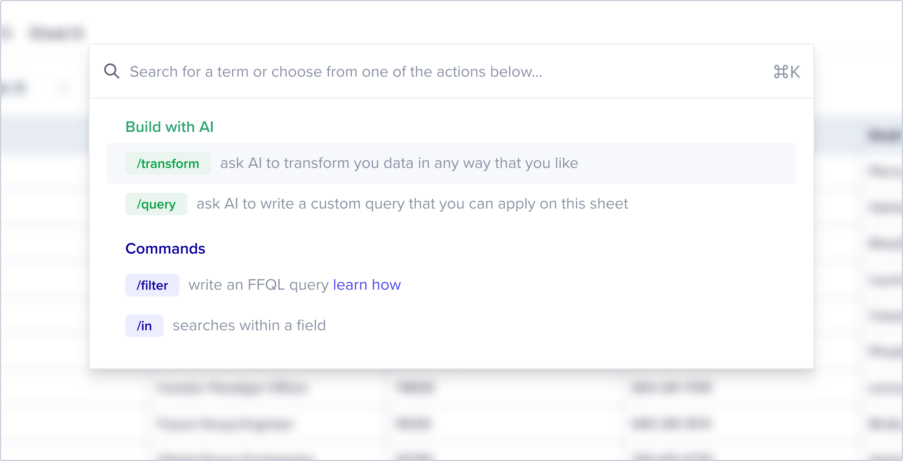

This update enhances your workflow by centralizing experiences under the
Command+k shortcut.

A straightforward forward slash, followed by these options, grants access to our
data transformation and query tools:

- `/transform` (AI-powered)
- `/query` (AI-powered)
- `/search` (global search)
- `/filter` (Flatfile Query Language, ffql)
- `/in` (field-specific search)

Chat with us or email [support@flatfile.com](mailto:support@flatfile.com) to
have this feature flagged on in your Account today!
</Update>

<Update label="08-20-2023" description="dataxp">
There is now a count at the top of the files list that shows the total number of
files.
</Update>

<Update label="08-20-2023" description="spaces">
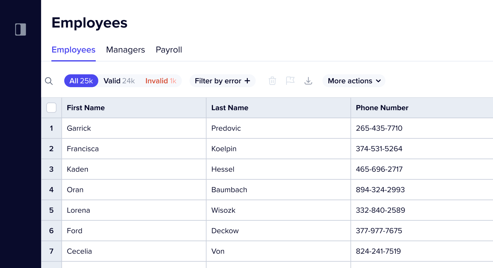

The Sidebar now has three different states:

- Collapsed state
- Open state
- Totally hidden state

Additionally, the Sidebar will now automatically collapse itself on smaller
screens.
</Update>

<Update label="08-20-2023" description="spaces">
We now handle overflowing space name(s) by:

- Breaking the word
- Limiting the name to two lines and giving it an ellipsis if it overflows
- Adding a tooltip with the space name to truncated names
- Previously, badge names in the data checklist could break to two lines making
  them hard to read. This is also fixed.
</Update>

<Update label="08-20-2023" description="theming">
When determining the lighter shades of each main theme colors, i.e. primary,
danger, warning and success, there are now checks to ensure no colors end up as
white.
</Update>

<Update label="08-20-2023" description="files">
The filename was added to the mapping scene so users can now see which file they
are currently mapping.
</Update>

<Update label="08-20-2023" description="files">
Cells with no data can now be unmapped using “Do not import”, if previously
mapped to a value.
</Update>

<Update label="08-20-2023" description="dataxp">
Filter: "Last Name" like A% will now retrieve all records where Last Name starts
with “A”. Previously, it was retrieving records that contained “A”.
</Update>

<Update label="08-20-2023" description="dataxp">
The continue button is now disabled on mapping scene while mappings are loading.
This ensures user can only advance to review scene after mappings are saved.
</Update>