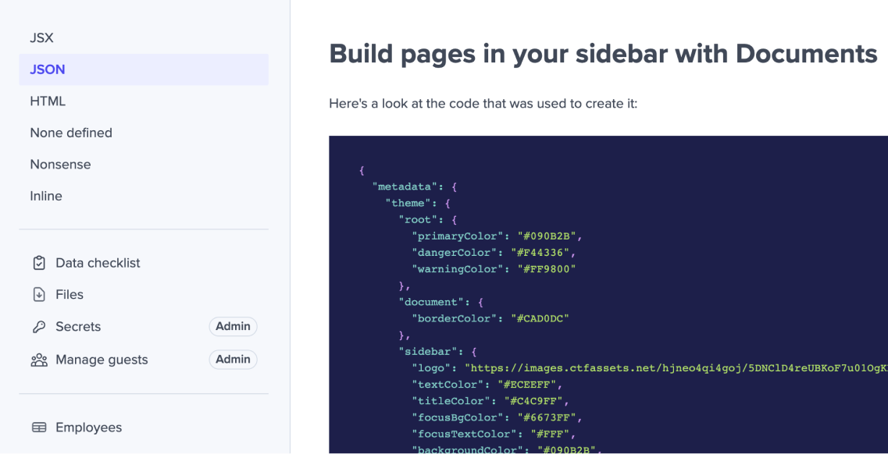

## September 15, 2023

<div style={{ display: "table", width: "auto" }}>

<div style={{ display: "table-row", width: "auto" }}>
    <Snippet file="chips/spaces.mdx" />
    <div
      style={{
        float: "left",
        display: "table-column",
        paddingLeft: "30px",
        width: "calc(80% - 30px)",
      }}
    >

      **Introducing: Code Blocks for Documents**

      

      We've introduced the ability to add code blocks to your Documents. You can now use the following syntax to define code blocks and specify the language:

      

    Your code will be formatted accordingly, enhancing the clarity and presentation of your content.

    </div>

  </div>

  <div style={{ display: "table-row", width: "auto" }}>
    <Snippet file="chips/spaces.mdx" />
    <div
      style={{
        float: "left",
        display: "table-column",
        paddingLeft: "30px",
        width: "calc(80% - 30px)",
      }}
    >

    Previously, guests without access to the specific workbook would encounter a "Workbook Not Found" error. Now, a fallback mechanism has been implemented to validate access to the `primaryWorkbook`, ensuring a smoother experience for users.

    </div>

  </div>

</div>

## September 13, 2023

<div style={{ display: "table", width: "auto" }}>

<div style={{ display: "table-row", width: "auto" }}>
    <Snippet file="chips/turntable.mdx" />
    <div
      style={{
        float: "left",
        display: "table-column",
        paddingLeft: "30px",
        width: "calc(80% - 30px)",
      }}
    >
        Introducing support for finding empty fields in ffql using the syntax: 
        
        ```filter: first_name eq ""```. 
        
        Now, you can easily query and filter records with empty values.
    </div>

  </div>

  <div style={{ display: "table-row", width: "auto" }}>
    <Snippet file="chips/core.mdx" />
    <div
      style={{
        float: "left",
        display: "table-column",
        paddingLeft: "30px",
        width: "calc(80% - 30px)",
      }}
    >
        Resolved an issue where attempting to upsert an Environment secret that was already defined within a Space was not functioning as expected. This fix ensures proper handling when upserting a secret into an Environment after specifying a Space ID.
    </div>

  </div>

  <div style={{ display: "table-row", width: "auto" }}>
    <Snippet file="chips/files.mdx" />
    <div
      style={{
        float: "left",
        display: "table-column",
        paddingLeft: "30px",
        width: "calc(80% - 30px)",
      }}
    >
       Resolved an issue where the import button could prematurely appear before a file was ready to be imported. This was due to an early update of the file's status with a workbook ID, which has now been adjusted to wait until the data is queriable before updating. The import process now aligns better with the file's readiness.
    </div>

  </div>

  <div style={{ display: "table-row", width: "auto" }}>
    <Snippet file="chips/turntable.mdx" />
    <div
      style={{
        float: "left",
        display: "table-column",
        paddingLeft: "30px",
        width: "calc(80% - 30px)",
      }}
    >
     Experience improved performance (for instance, when scrolling to the bottom of the data table) with large workbooks as we've optimized query clauses and updated indexes. Plus, we've seamlessly migrated all existing workbooks to benefit from these enhancements.
    </div>

  </div>

</div>

## September 11, 2023

<div style={{ display: "table", width: "auto" }}>

  <div style={{ display: "table-row", width: "auto" }}>
    <Snippet file="chips/files.mdx" />
    <div
      style={{
        float: "left",
        display: "table-column",
        paddingLeft: "30px",
        width: "calc(80% - 30px)",
      }}
    >
      When a file stream becomes unreadable due to file malformation, improvements were made to ensure that any errors are correctly communicated to the UI.
    </div>

  </div>

  <div style={{ display: "table-row", width: "auto" }}>
    <Snippet file="chips/files.mdx" />
    <div
      style={{
        float: "left",
        display: "table-column",
        paddingLeft: "30px",
        width: "calc(80% - 30px)",
      }}
    >
     Experience improved performance (for instance, when scrolling to the bottom of the data table) with large workbooks as we've optimized query clauses and updated indexes. Plus, we've seamlessly migrated all existing workbooks to benefit from these enhancements.
    </div>

  </div>

</div>

## September 8, 2023

<div style={{ display: "table", width: "auto" }}>

  <div style={{ display: "table-row", width: "auto" }}>
    <Snippet file="chips/turntable.mdx" />
    <div
      style={{
        float: "left",
        display: "table-column",
        paddingLeft: "30px",
        width: "calc(80% - 30px)",
      }}
    >
      Documents in the sidebar are now organized based on their creation date. This enhancement helps developers have more control the order of their Documents.
    </div>

  </div>

  <div style={{ display: "table-row", width: "auto" }}>
    <Snippet file="chips/spaces.mdx" />
    <div
      style={{
        float: "left",
        display: "table-column",
        paddingLeft: "30px",
        width: "calc(80% - 30px)",
      }}
    >
      If you have access to multiple Spaces, you'll notice a dropdown menu at the top left corner of each Space. Previously, there was an issue where all the data within the Space would update correctly, except for Workbooks/Sheets in the sidebar. This issue has been successfully resolved.

      </div>

  </div>

  <div style={{ display: "table-row", width: "auto" }}>
    <Snippet file="chips/turntable.mdx" />
    <div
      style={{
        float: "left",
        display: "table-column",
        paddingLeft: "30px",
        width: "calc(80% - 30px)",
      }}
    >
      2 new Demo spaces were added: Documents & Theming. In these demo Spaces, you'll learn how to:
      1. Add Markdown + HTML Documents to your Space
      2. Customize the look and feel of Flatfile to match your brand

    </div>

  </div>

  <div style={{ display: "table-row", width: "auto" }}>
    <Snippet file="chips/turntable.mdx" />
    <div
      style={{
        float: "left",
        display: "table-column",
        paddingLeft: "30px",
        width: "calc(80% - 30px)",
      }}
    >

      We've extended the `job:ready` timeout to 10 minutes, aligning it with the extractor timeout. This adjustment provides more time for all jobs running within an Agent.
      </div>

  </div>

</div>

## September 6, 2023

<div style={{ display: "table", width: "auto" }}>

  <div style={{ display: "table-row", width: "auto" }}>
    <Snippet file="chips/turntable.mdx" />
    <div
      style={{
        float: "left",
        display: "table-column",
        paddingLeft: "30px",
        width: "calc(80% - 30px)",
      }}
    >
      **New Job Outcome Acknowledgements**

      **`acknowledge: false`**

      

      By default, job outcomes are reported through a toast notification in the top-right corner. To utilize this, simply set `outcome => message`. This approach ensures that your job completion status is promptly communicated to the end user.

      **`acknowledge: true`**

      

      When the `acknowledge` option is configured as `true`, a persistent full-screen modal is presented. This modal remains visible until the user interacts by clicking the "Continue" button, acknowledging the outcome.

      **Usage**

      ```jsx
      await api.jobs.complete(jobId, {
        outcome: {
          acknowlege: true,
          message:
            "Text here.",
        },
      });
      ```

      This enhancement provides flexibility in how you choose to inform users about job outcomes. [Learn more](http://flatfile.com/docs/guides/actions#usage).

      </div>

  </div>
  <div style={{ display: "table-row", width: "auto" }}>
    <Snippet file="chips/turntable.mdx" />
    <div
      style={{
        float: "left",
        display: "table-column",
        paddingLeft: "30px",
        width: "calc(80% - 30px)",
      }}
    >
        **Enhanced Job Outcomes with Next Action Links**

      Job outcomes have been upgraded to support `next` action links. Now, you can display links to external URLs, Flatfile resources, or trigger downloads upon job completion.

      **Usage**
        <CodeGroup>
        ```jsx listener
        await api.jobs.complete(jobId, {
          outcome: {
            next: IdNext | WaitNext | UrlNext | DownloadNext,
            message:
              "Text here.",
          },
        });
        ```
        ```jsx Types
        type IdNext = {
          type: 'id' //link to a Flatfile resource
          id: string
        }

        type WaitNext = {
          type: 'wait' //only used in embedded Flatfile
        }

        type UrlNext = {
          type: 'url' //display a link to an external url
          url: string
          label: string
        }

        type DownloadNext = {
          type: 'download' // display and trigger a download
          url: string
          fileName: string
          label: string
        }
        ```
        </CodeGroup>

      This improvement adds versatility and flexibility to your job outcomes, enhancing user interaction and experience. [Learn more](http://flatfile.com/docs/guides/actions#usage).

      </div>

  </div>

  <div style={{ display: "table-row", width: "auto" }}>
    <Snippet file="chips/turntable.mdx" />
    <div
      style={{
        float: "left",
        display: "table-column",
        paddingLeft: "30px",
        width: "calc(80% - 30px)",
      }}
    >
        **Enhanced Action Button Behavior**

        

       Two key enhancements to Actions have been introduced:

        **Disable Actions When Invalid Records**: Developers can now add an optional `requireAllValid` flag to Actions, preventing users from initiating Actions when Sheets or Workbooks contain invalid records. This helps avoid unnecessary job failures and ensures Actions are performed on valid data.

        **Disable Actions When No Selected Records:** To enhance the user experience, we've introduced the `requireSelection` flag. When set to `true`, this flag disables Actions if no records are selected in the Sheet or Workbook, ensuring Actions are only triggered when relevant data is chosen.


      [Learn more](http://flatfile.com/docs/concepts/actions#optional-parameters).

      </div>

  </div>

</div>

## September 1, 2023

<div style={{ display: "table", width: "auto" }}>

<div style={{ display: "table-row", width: "auto" }}>
    <Snippet file="chips/turntable.mdx" />
    <div
      style={{
        float: "left",
        display: "table-column",
        paddingLeft: "30px",
        width: "calc(80% - 30px)",
      }}
    >
    **Improved FFQL handling of dates and number comparisons**

      **Enhanced Number Field Queries:** When conducting equality or inequality FFQL comparisons for `number` fields, the query value is now cast to a number and then compared with the parsed "shadow" value. This rectifies issues related to numeric comparisons. Additionally, we've resolved a bug where numbers with no digits before the decimal point (e.g., ".3") were not being properly parsed into shadow values.

      **Advanced Date Field Handling:** For `date` fields, query values are now attempted to be parsed into dates. On the SQL side, a `CASE` statement is employed to parse the stored values into dates for accurate comparison. To accommodate SQL-side date parsing requirements, we've integrated a regex pattern to detect `YYYY-MM-DD`, `m/d/yy`, and `m/d/yyyy` formats. This ensures correct parsing and comparison of date values.

      **Fix for Invalid Number Input:** We've resolved a bug where changing a number field to an invalid number left the previous "shadow" value intact. Now, in such cases, the previous shadow value is properly cleared, leading to consistent and accurate behavior.

      These updates contribute to improved query handling, better data integrity, and a more seamless experience when working with number and date fields.

      </div>

    </div>

  <div style={{ display: "table-row", width: "auto" }}>
    <Snippet file="chips/core.mdx" />
    <div
      style={{
        float: "left",
        display: "table-column",
        paddingLeft: "30px",
        width: "calc(80% - 30px)",
      }}
    >

      Introducing caching for record counts, resulting in significantly improved performance for API requests.

      </div>

    </div>

      <div style={{ display: "table-row", width: "auto" }}>
    <Snippet file="chips/core.mdx" />
    <div
      style={{
        float: "left",
        display: "table-column",
        paddingLeft: "30px",
        width: "calc(80% - 30px)",
      }}
    >

     The `PATCH /sheets` endpoint has been upgraded to accept both an array of SheetUpdates and an array of SheetConfigs (backwards compatible). This expanded capability empowers users with more flexible and efficient options when updating Sheets.

      </div>

    </div>

  <div style={{ display: "table-row", width: "auto" }}>
    <Snippet file="chips/turntable.mdx" />
    <div
      style={{
        float: "left",
        display: "table-column",
        paddingLeft: "30px",
        width: "calc(80% - 30px)",
      }}
    >

      

      We've introduced a new parameter: `tooltip` to Actions, allowing the addition of tooltips. These tooltips are now visible in the user interface for both buttons and list items whenever the associated Action is enabled. This enhancement provides users with clear and context-aware explanations for enabled Actions, contributing to an improved overall user experience.

      </div>

    </div>

    <div style={{ display: "table-row", width: "auto" }}>
    <Snippet file="chips/turntable.mdx" />
    <div
      style={{
        float: "left",
        display: "table-column",
        paddingLeft: "30px",
        width: "calc(80% - 30px)",
      }}
    >

      Fixed a cosmetic issue with scrolling through Workbooks. The problem stemmed from the outer container scrolling based on the inner content's height. By applying overflow properties to the inner component, which holds a list of items within a flex container, we have resolved this issue.

      </div>

    </div>

  </div>

## August 30, 2023

<div style={{ display: "table", width: "auto" }}>

  <div style={{ display: "table-row", width: "auto" }}>
    <Snippet file="chips/spaces.mdx" />
    <div
      style={{
        float: "left",
        display: "table-column",
        paddingLeft: "30px",
        width: "calc(80% - 30px)",
      }}
    >
      **🚀 4 New Example Spaces**

      Visit the **Getting Started** page on your Dashboard to discover four new options for effortlessly generating demo spaces:
      1. Namespaces
      2. Metadata
      3. Egress
      4. Sidebar Customization

Similar to the rest of the options, we've provided the underlying code for each Space, simplifying the process of breaking down and comprehending the elements on display.

      </div>

  </div>

  <div style={{ display: "table-row", width: "auto" }}>
    <Snippet file="chips/core.mdx" />
    <div
      style={{
        float: "left",
        display: "table-column",
        paddingLeft: "30px",
        width: "calc(80% - 30px)",
      }}
    >
      **Authentication Query Enhancement**

      The authentication query has been streamlined for optimized performance. Extensive benchmarking has revealed that this refinement contributes to a reduction of approximately 20 milliseconds for each request. This enhancement results in faster overall processing and improved response times.

      </div>

  </div>

  <div style={{ display: "table-row", width: "auto" }}>
    <Snippet file="chips/turntable.mdx" />
    <div
      style={{
        float: "left",
        display: "table-column",
        paddingLeft: "30px",
        width: "calc(80% - 30px)",
      }}
    >
      The **Data Checklist** now includes data types that correspond to each field. Additionally, the searchable dropdowns are now more user friendly.
      </div>

  </div>

  <div style={{ display: "table-row", width: "auto" }}>
    <Snippet file="chips/core.mdx" />
    <div
      style={{
        float: "left",
        display: "table-column",
        paddingLeft: "30px",
        width: "calc(80% - 30px)",
      }}
    >
      A pagination logic issue concerning **Environments** has been resolved. The correction ensures accurate calculation of the number of pages and consistent delivery of valid responses in accordance with the [Pagination](https://reference.flatfile.com/docs/api/1dcb99aada63f-pagination) type.

Furthermore, the default page size for **Spaces** has been set to 10, aligning it with the specifications outlined in the API documentation.

      </div>

  </div>

    <div style={{ display: "table-row", width: "auto" }}>
    <Snippet file="chips/turntable.mdx" />
    <div
      style={{
        float: "left",
        display: "table-column",
        paddingLeft: "30px",
        width: "calc(80% - 30px)",
      }}
    >
      Previously, attempting to navigate into a dropdown using the keyboard's tab key was unresponsive. This issue has been addressed, and tabbing via keyboard now smoothly activates dropdowns, accompanied by a focus outline for the custom trigger.

      </div>

  </div>

      <div style={{ display: "table-row", width: "auto" }}>
    <Snippet file="chips/core.mdx" />
    <div
      style={{
        float: "left",
        display: "table-column",
        paddingLeft: "30px",
        width: "calc(80% - 30px)",
      }}
    >
      The API specification has been updated to facilitate the mapping of `enum` values of various types such as `string`, `integer`, or `boolean`. This modification effectively resolves a server error response that was previously encountered when utilizing such `enum` values within the API.

      In addition, the loading state of the "Continue" button has been refined to ensure smooth recovery from server errors. This adjustment enhances the overall user experience by providing more graceful handling of unexpected issues during the process.

      </div>

  </div>

</div>

## August 25, 2023

<div style={{ display: "table", width: "auto" }}>

  <div style={{ display: "table-row", width: "auto" }}>
    <Snippet file="chips/spaces.mdx" />
    <div
      style={{
        float: "left",
        display: "table-column",
        paddingLeft: "30px",
        width: "calc(80% - 30px)",
      }}
    >
      **🚀 Instant Extraction for CSV/TSV/PSV Files**

      We’re thrilled to introduce a significant enhancement to our import process. With the removal of the extraction step for CSV/TSV/PSV files, the import experience is now more seamless than ever. As soon as the upload is complete, these files are instantly extracted, ensuring an efficient and immediate handling of your data.

      The impact of this change is remarkable. What used to take approximately 3 and a half minutes to extract now concludes in less than 10 seconds.

      In addition, we now natively support TSV and PSV files meaning you don't need to use an extractor plugin to support these file types.

      While speed is the prime advantage, this upgrade doesn’t merely boost performance. It also simplifies and enhances reliability in our system. Previously, concerns about only a fraction of a file being extracted are now history. Furthermore, this approach strategically eases the load on our database, reducing the likelihood of encountering resource limits.

      In essence, it’s a win-win for both efficiency and user experience.

      </div>

  </div>

</div>

## August 24, 2023

<div style={{ display: "table", width: "auto" }}>

  <div style={{ display: "table-row", width: "auto" }}>
    <Snippet file="chips/spaces.mdx" />
    <div
      style={{
        float: "left",
        display: "table-column",
        paddingLeft: "30px",
        width: "calc(80% - 30px)",
      }}
    >
      **🚀 A Revamped Starting Point**

      

      Navigate to your Dashboard's Getting Started page to find an array of new options for effortlessly creating demo spaces. Additionally, we've included the underlying code for each Space, making it straightforward to deconstruct and understand what you're seeing.

      </div>

  </div>

  <div style={{ display: "table-row", width: "auto" }}>
  <Snippet file="chips/infra.mdx" />
  <div
    style={{
      float: "left",
      display: "table-column",
      paddingLeft: "30px",
      width: "calc(80% - 30px)",
    }}
  >
     **🚀 Major improvements to our queue system**

    We’ve implemented a state-of-the-art technology to substantially enhance the reliability and performance of our queue system. This improvement has a profound impact on the execution of asynchronous tasks, like data validation.

  </div>
</div>

<div style={{ display: "table-row", width: "auto" }}>
  <Snippet file="chips/files.mdx" />
  <div
    style={{
      float: "left",
      display: "table-column",
      paddingLeft: "30px",
      width: "calc(80% - 30px)",
    }}
  >
    Now, you can set a description for each Option Field value via API. End
    users can then view this description as a tooltip during mapping.
  </div>
</div>

<div style={{ display: "table-row", width: "auto" }}>
  <Snippet file="chips/turntable.mdx" />
  <div
    style={{
      float: "left",
      display: "table-column",
      paddingLeft: "30px",
      width: "calc(80% - 30px)",
    }}
  >
    We've added new API routes to capture up to 5 snapshots of a Sheet, with the
    flexibility to restore any of them using the API at your convenience. Stay
    tuned as we prepare to bring this functionality to the UI as well.
  </div>
</div>

<div style={{ display: "table-row", width: "auto" }}>
  <Snippet file="chips/turntable.mdx" />
  <div
    style={{
      float: "left",
      display: "table-column",
      paddingLeft: "30px",
      width: "calc(80% - 30px)",
    }}
  >
    A Sheet with no access enabled (`access:[]`) now shows a lock icon on the
    Sheet tab.
  </div>
</div>

<div style={{ display: "table-row", width: "auto" }}>
  <Snippet file="chips/files.mdx" />
  <div
    style={{
      float: "left",
      display: "table-column",
      paddingLeft: "30px",
      width: "calc(80% - 30px)",
    }}
  >
    We opted to hide the files count on the Files page if there are no files.
  </div>
</div>

<div style={{ display: "table-row", width: "auto" }}>
  <Snippet file="chips/files.mdx" />
  <div
    style={{
      float: "left",
      display: "table-column",
      paddingLeft: "30px",
      width: "calc(80% - 30px)",
    }}
  >
    A shrimp size update to the colors of the sidebar toggle so it looks good
    with all themes.
  </div>
</div>

<div style={{ display: "table-row", width: "auto" }}>
  <Snippet file="chips/spaces.mdx" />
  <div
    style={{
      float: "left",
      display: "table-column",
      paddingLeft: "30px",
      width: "calc(80% - 30px)",
    }}
  >
    Info inside `metadata` > `userInfo` will now display in the Spaces list.
  </div>
</div>

<div style={{ display: "table-row", width: "auto" }}>
  <Snippet file="chips/spaces.mdx" />
  <div
    style={{
      float: "left",
      display: "table-column",
      paddingLeft: "30px",
      width: "calc(80% - 30px)",
    }}
  >
    Metadata allows you to store and retrieve additional data about a Space,
    Record, or Field without exposing it to end users. Now, Environments also
    have a `metadata` string array.
  </div>
</div>

<div style={{ display: "table-row", width: "auto" }}>
  <Snippet file="chips/spaces.mdx" />
  <div
    style={{
      float: "left",
      display: "table-column",
      paddingLeft: "30px",
      width: "calc(80% - 30px)",
    }}
  >
    We made a small fix to allow better vertical scrolling in the Dashboard
    sidebar.
  </div>
</div>

<div style={{ display: "table-row", width: "auto" }}>
  <Snippet file="chips/turntable.mdx" />
  <div
    style={{
      float: "left",
      display: "table-column",
      paddingLeft: "30px",
      width: "calc(80% - 30px)",
    }}
  >
    CTRL + Z wasn't working for a minute. This is now fixed.
  </div>
</div>

<div style={{ display: "table-row", width: "auto" }}>
  <Snippet file="chips/turntable.mdx" />
  <div
    style={{
      float: "left",
      display: "table-column",
      paddingLeft: "30px",
      width: "calc(80% - 30px)",
    }}
  >
    If a boolean cell is empty, we only show the toggle on hover now.
  </div>
</div>

<div style={{ display: "table-row", width: "auto" }}>
  <Snippet file="chips/files.mdx" />
  <div
    style={{
      float: "left",
      display: "table-column",
      paddingLeft: "30px",
      width: "calc(80% - 30px)",
    }}
  >
    We were seeing issues where corrupt files that ran through extraction did
    not fail but simply skipped over the lines affected. This is now resolved.
  </div>
</div>

</div>

## August 20, 2023

<div style={{ display: "table", width: "auto" }}>

  <div style={{ display: "table-row", width: "auto" }}>
    <Snippet file="chips/turntable.mdx" />
    <div
      style={{
        float: "left",
        display: "table-column",
        paddingLeft: "30px",
        width: "calc(80% - 30px)",
      }}
    >
      **🚀 Introducing Command+k Triggered Search and Transformation (Early Access)**

      

      This update enhances your workflow by centralizing experiences under the Command+k shortcut.

      A straightforward forward slash, followed by these options, grants access to our data transformation and query tools:

      - `/transform` (AI-powered)
      - `/query` (AI-powered)
      - `/search` (global search)
      - `/filter` (Flatfile Query Language, ffql)
      - `/in` (field-specific search)

      Chat with us or email [support@flatfile.com](mailto:support@flatfile.com) to have this feature flagged on in your Account today!

      </div>

  </div>

{" "}

<div style={{ display: "table-row", width: "auto" }}>
  <Snippet file="chips/turntable.mdx" />
  <div
    style={{
      float: "left",
      display: "table-column",
      paddingLeft: "30px",
      width: "calc(80% - 30px)",
    }}
  >
    There is now a count at the top of the files list that shows the total
    number of files.
  </div>
</div>

    <div style={{ display: "table-row", width: "auto" }}>
      <Snippet file="chips/spaces.mdx" />
      <div style={{ float: "left", display: "table-column", paddingLeft: "30px", width: "calc(80% - 30px)" }}>

      

        The Sidebar now has three different states:
        - Collapsed state
        - Open state
        - Totally hidden state

        Additionally, the Sidebar will now automatically collapse itself on smaller screens.
      </div>

    </div>

    <div style={{ display: "table-row", width: "auto" }}>
      <Snippet file="chips/spaces.mdx" />
      <div style={{ float: "left", display: "table-column", paddingLeft: "30px", width: "calc(80% - 30px)" }}>
        We now handle overflowing space name(s) by:
        - Breaking the word
        - Limiting the name to two lines and giving it an ellipsis if it overflows
        - Adding a tooltip with the space name to truncated names
        - Previously, badge names in the data checklist could break to two lines making them hard to read. This is also fixed.

    </div>

    </div>

{" "}

<div style={{ display: "table-row", width: "auto" }}>
  <Snippet file="chips/theming.mdx" />
  <div
    style={{
      float: "left",
      display: "table-column",
      paddingLeft: "30px",
      width: "calc(80% - 30px)",
    }}
  >
    When determining the lighter shades of each main theme colors, i.e. primary,
    danger, warning and success, there are now checks to ensure no colors end up
    as white.
  </div>
</div>

{" "}

<div style={{ display: "table-row", width: "auto" }}>
  <Snippet file="chips/files.mdx" />
  <div
    style={{
      float: "left",
      display: "table-column",
      paddingLeft: "30px",
      width: "calc(80% - 30px)",
    }}
  >
    The filename was added to the mapping scene so users can now see which file
    they are currently mapping.
  </div>
</div>

{" "}

<div style={{ display: "table-row", width: "auto" }}>
  <Snippet file="chips/files.mdx" />
  <div
    style={{
      float: "left",
      display: "table-column",
      paddingLeft: "30px",
      width: "calc(80% - 30px)",
    }}
  >
    Cells with no data can now be unmapped using “Do not import”, if previously
    mapped to a value.
  </div>
</div>

{" "}

<div style={{ display: "table-row", width: "auto" }}>
  <Snippet file="chips/turntable.mdx" />
  <div
    style={{
      float: "left",
      display: "table-column",
      paddingLeft: "30px",
      width: "calc(80% - 30px)",
    }}
  >
    Filter: "Last Name" like A% will now retrieve all records where Last Name
    starts with “A”. Previously, it was retrieving records that contained “A”.
  </div>
</div>

{" "}

<div style={{ display: "table-row", width: "auto" }}>
  <Snippet file="chips/turntable.mdx" />
  <div
    style={{
      float: "left",
      display: "table-column",
      paddingLeft: "30px",
      width: "calc(80% - 30px)",
    }}
  >
    The continue button is now disabled on mapping scene while mappings are
    loading. This ensures user can only advance to review scene after mappings
    are saved.
  </div>
</div>

</div>
