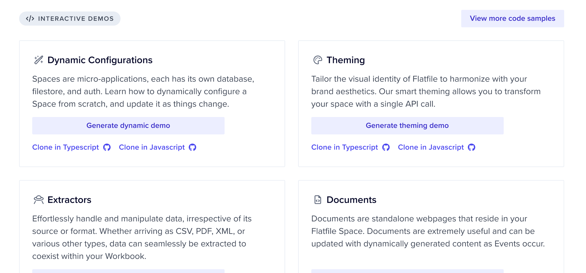

## August 30, 2023

  

    <Snippet file="chips/spaces.mdx" />
    

      **🚀 4 New Example Spaces**

      Visit the **Getting Started** page on your Dashboard to discover four new options for effortlessly generating demo spaces:
      1. Namespaces
      2. Metadata
      3. Egress
      4. Sidebar Customization

Similar to the rest of the options, we've provided the underlying code for each Space, simplifying the process of breaking down and comprehending the elements on display.

      

  

  

    <Snippet file="chips/core.mdx" />
    

      **Authentication Query Enhancement**

      The authentication query has been streamlined for optimized performance. Extensive benchmarking has revealed that this refinement contributes to a reduction of approximately 20 milliseconds for each request. This enhancement results in faster overall processing and improved response times.

      

  

  

    <Snippet file="chips/turntable.mdx" />
    

      The **Data Checklist** now includes data types that correspond to each field. Additionally, the searchable dropdowns are now more user friendly.
      

  

  

    <Snippet file="chips/core.mdx" />
    

      A pagination logic issue concerning **Environments** has been resolved. The correction ensures accurate calculation of the number of pages and consistent delivery of valid responses in accordance with the [Pagination](https://reference.flatfile.com/docs/api/1dcb99aada63f-pagination) type.

Furthermore, the default page size for **Spaces** has been set to 10, aligning it with the specifications outlined in the API documentation.

      

  

    

    <Snippet file="chips/turntable.mdx" />
    

      A custom button has been integrated into searchable dropdowns. This addition prevents filtering of results upon clicking the standard input. From now on, result filtering will exclusively occur in response to clicking the button only.

      

  

      

    <Snippet file="chips/core.mdx" />
    

      The API specification has been updated to facilitate the mapping of `enum` values of various types such as `string`, `integer`, or `boolean`. This modification effectively resolves a server error response that was previously encountered when utilizing such `enum` values within the API.

      In addition, the loading state of the "Continue" button has been refined to ensure smooth recovery from server errors. This adjustment enhances the overall user experience by providing more graceful handling of unexpected issues during the process.

      

  

        

    <Snippet file="chips/files.mdx" />
    

      In the recent change for instant extraction, we noticed header detection involved parsing the entire file, which posed challenges for large files. Now, we've limited this process to the first N lines.

      

  

  

## August 25, 2023

  

    <Snippet file="chips/spaces.mdx" />
    

      **🚀 Instant Extraction for CSV/TSV/PSV Files**

      We’re thrilled to introduce a significant enhancement to our import process. With the removal of the extraction step for CSV/TSV/PSV files, the import experience is now more seamless than ever. As soon as the upload is complete, these files are instantly extracted, ensuring an efficient and immediate handling of your data.

      The impact of this change is remarkable. What used to take approximately 3 and a half minutes to extract now concludes in less than 10 seconds.

      In addition, we now natively support TSV and PSV files meaning you don't need to use an extractor plugin to support these file types.

      While speed is the prime advantage, this upgrade doesn’t merely boost performance. It also simplifies and enhances reliability in our system. Previously, concerns about only a fraction of a file being extracted are now history. Furthermore, this approach strategically eases the load on our database, reducing the likelihood of encountering resource limits.

      In essence, it’s a win-win for both efficiency and user experience.

      

  

## August 24, 2023

  

    <Snippet file="chips/spaces.mdx" />
    

      **🚀 A Revamped Starting Point**

      

      Navigate to your Dashboard's Getting Started page to find an array of new options for effortlessly creating demo spaces. Additionally, we've included the underlying code for each Space, making it straightforward to deconstruct and understand what you're seeing.

      

  

  

  <Snippet file="chips/infra.mdx" />
  

     **🚀 Major improvements to our queue system**

    We’ve implemented a state-of-the-art technology to substantially enhance the reliability and performance of our queue system. This improvement has a profound impact on the execution of asynchronous tasks, like data validation.

  

  <Snippet file="chips/files.mdx" />
  

    Now, you can set a description for each Option Field value via API. End
    users can then view this description as a tooltip during mapping.
  

  <Snippet file="chips/turntable.mdx" />
  

    We've added new API routes to capture up to 5 snapshots of a Sheet, with the
    flexibility to restore any of them using the API at your convenience. Stay
    tuned as we prepare to bring this functionality to the UI as well.
  

  <Snippet file="chips/turntable.mdx" />
  

    A Sheet with no access enabled (`access:[]`) now shows a lock icon on the
    Sheet tab.
  

  <Snippet file="chips/files.mdx" />
  

    We opted to hide the files count on the Files page if there are no files.
  

  <Snippet file="chips/files.mdx" />
  

    A shrimp size update to the colors of the sidebar toggle so it looks good
    with all themes.
  

  <Snippet file="chips/spaces.mdx" />
  

    Info inside `metadata` > `userInfo` will now display in the Spaces list.
  

  <Snippet file="chips/spaces.mdx" />
  

    Metadata allows you to store and retrieve additional data about a Space,
    Record, or Field without exposing it to end users. Now, Environments also
    have a `metadata` string array.
  

  <Snippet file="chips/spaces.mdx" />
  

    We made a small fix to allow better vertical scrolling in the Dashboard
    sidebar.
  

  <Snippet file="chips/turntable.mdx" />
  

    CTRL + Z wasn't working for a minute. This is now fixed.
  

  <Snippet file="chips/turntable.mdx" />
  

    If a boolean cell is empty, we only show the toggle on hover now.
  

  <Snippet file="chips/files.mdx" />
  

    We were seeing issues where corrupt files that ran through extraction did
    not fail but simply skipped over the lines affected. This is now resolved.
  

## August 20, 2023

  

    <Snippet file="chips/turntable.mdx" />
    

      **🚀 Introducing Command+k Triggered Search and Transformation (Early Access)**

      

      This update enhances your workflow by centralizing experiences under the Command+k shortcut.

      A straightforward forward slash, followed by these options, grants access to our data transformation and query tools:

      - `/transform` (AI-powered)
      - `/query` (AI-powered)
      - `/search` (global search)
      - `/filter` (Flatfile Query Language, ffql)
      - `/in` (field-specific search)

      Chat with us or email [support@flatfile.com](support@flatfile.com) to have this feature flagged on in your Account today!

      

  

{" "}

  <Snippet file="chips/turntable.mdx" />
  

    There is now a count at the top of the files list that shows the total
    number of files.
  

    

      <Snippet file="chips/spaces.mdx" />
      

      

        The Sidebar now has three different states:
        - Collapsed state
        - Open state
        - Totally hidden state

        Additionally, the Sidebar will now automatically collapse itself on smaller screens.
      

    

    

      <Snippet file="chips/spaces.mdx" />
      

        We now handle overflowing space name(s) by:
        - Breaking the word
        - Limiting the name to two lines and giving it an ellipsis if it overflows
        - Adding a tooltip with the space name to truncated names
        - Previously, badge names in the data checklist could break to two lines making them hard to read. This is also fixed.

    

    

{" "}

  <Snippet file="chips/theming.mdx" />
  

    When determining the lighter shades of each main theme colors, i.e. primary,
    danger, warning and success, there are now checks to ensure no colors end up
    as white.
  

{" "}

  <Snippet file="chips/files.mdx" />
  

    The filename was added to the mapping scene so users can now see which file
    they are currently mapping.
  

{" "}

  <Snippet file="chips/files.mdx" />
  

    Cells with no data can now be unmapped using “Do not import”, if previously
    mapped to a value.
  

{" "}

  <Snippet file="chips/turntable.mdx" />
  

    Filter: "Last Name" like A% will now retrieve all records where Last Name
    starts with “A”. Previously, it was retrieving records that contained “A”.
  

{" "}

  <Snippet file="chips/turntable.mdx" />
  

    The continue button is now disabled on mapping scene while mappings are
    loading. This ensures user can only advance to review scene after mappings
    are saved.
  

