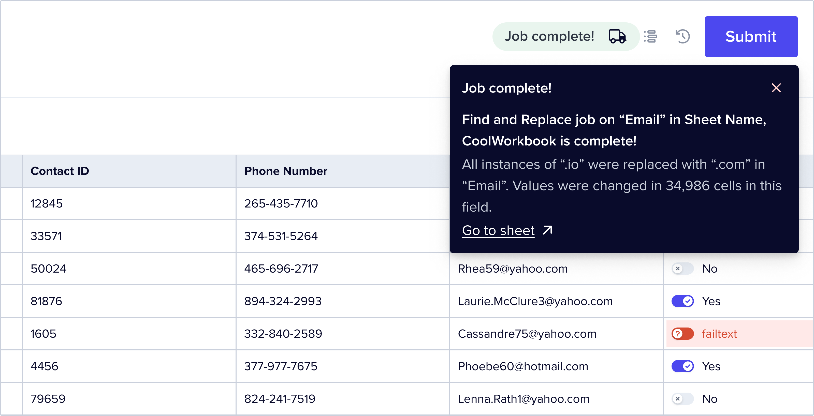

### September 17, 2023

  

    <Snippet file="chips/core_plugin.mdx" />
    

    🚀  **Introducing `@flatfile/util-response-rejection`**

    

    Meet `@flatfile/util-response-rejection`, a new utility for showcasing rejected Records _from an external API_ to your customers. Managing rejected data during egress is vital for maintaining data accuracy, and this utility simplifies the entire process, ensuring a smoother experience for handling these instances.

    Here's what it does:

    1. Takes a `RejectionResponse` containing rejected Records and a rejection message.
    2. Locates the corresponding Record and adds the rejection message as an error to the Record cell.

    You can also utilize this utility directly with any listener.

    Learn more in the [docs](../../../plugins-docs/utils/response-rejection).

    

  

  

