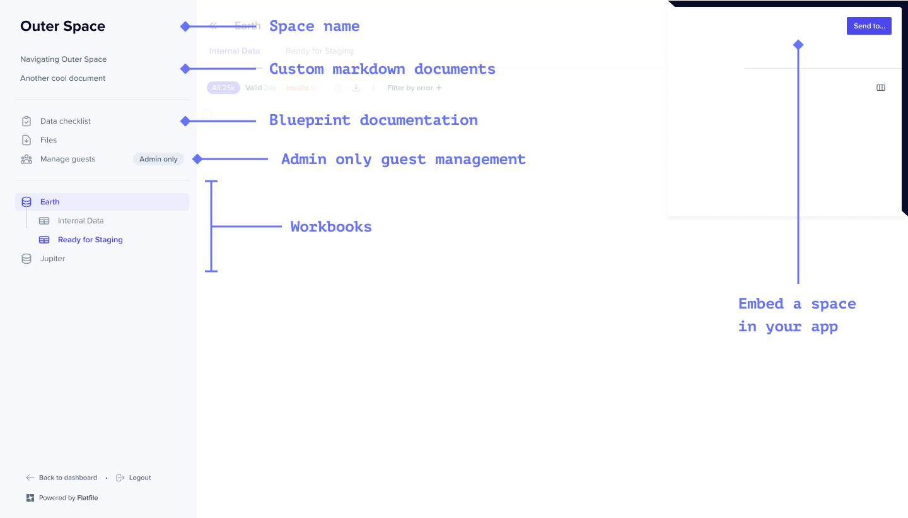

Flatfile Spaces are micro-applications, each having their own database, filestore, and auth. 
Use Spaces to integrate Flatfile into your data exchange workflow, whether that happens directly 
in your application or as part of a currently offline process. 

With Spaces, you can:

<CardGroup cols={3}>
  <Card title="Embed Flatfile in your app" icon="person-to-portal" href="/core-paths/embedding" >
  </Card>
  <Card title="Setup headless file feeds" icon="bolt-auto" href="/core-paths/headless" >
  </Card>
  <Card title="Build custom workflows" icon="arrow-progress" href="/core-paths/workflows">
  </Card>
</CardGroup>

---

## Anatomy

A Space is comprised of Workbooks, Files, Users, Documents, Themes and Metadata.

### Reference

[See API Reference](https://flatfile.stoplight.io/docs/v10/25e20c8ab61c5-create-a-space)

#### `Workbooks` *object*
A Space contains any number of Workbooks. Each <Tooltip tip="Learn more about Workbooks">[Workbook](docs.com)</Tooltip> is a Blueprint-defined database.

<Tip>You can define a primary Workbook for any Space, and that Workbook will always remain at the top of the list.</Tip>

#### `Files` *object*
Files are uploaded directly to a Space.

#### `Users` *object*
By default, all global Admins in Flatfile have access to all Spaces. Additionally, you can configure a Space to allow for either temporary (`shared_link`) or named (`magic_link`) Guest Users.

#### `Documents` *object*
Documents are custom pages that are mounted on the Space and display in the sidebar of a Space in the order of their addition to the Space. 

#### `Theme` *object*
Theming of Flatfile is controlled at the Space level. A comprehensive list of Theme options are available [here](../guides/theming).

#### `Metadata` *object*
Spaces can be created and updated with Metadata. This could include a company-specific identifier such as a UUID for use in API operations in the Space.
