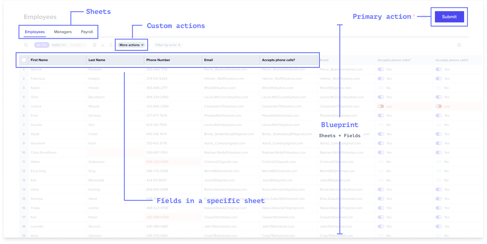

Workbooks are analagous to a database and like a database are configured with a type-strict schema. 
A Workbook replaces the spreadsheet template you may share 
with your users today when requesting data during the data collection phase 
of customer onboarding or other file-based data exchange processes. Unlike a spreadsheet, 
it's designed to allow your team and users to validate, correct, and import data with real-time feedback.

With Workbooks, you can:
1. Accept data from many file types beyond CSVs. (And you can write your own file extractors if you can't find a plugin.)
2. Automatically apply any validation rules a developer has previously defined.
3. Provide end users the ability to add, remove, review, filter, and correct any data imported into a Workbook.
4. Define [in code] at least one primary action that submits the reviewed data to a destination API, database, or workflow step of your choosing.

---

## Anatomy

A Workbook is comprised of one or more Sheets plus any actions you want to take on those Sheets.

### Reference

[See API Reference](https://flatfile.stoplight.io/docs/v10/1a7c2b8c1d306-create-a-workbook)

#### `Sheets` *array*
A schema contains Sheets. Like tables in a database or sheets in a spreadsheet, Sheets isolate different data schemas.

[Learn more about Blueprint](../guides/blueprint)

#### `Fields` *array*
Sheets contain Fields. Fields are defined properties of your schema (eg a first_name on a contact sheet.)

[Learn more about Blueprint](../guides/blueprint)

#### `Actions` *array*
Workbooks and sheets can also contain Actions. Actions are developer-defined operations or macros invoked by end users on selected data like Submit to API, Download as PDF.

[Learn more about Actions](../guides/custom-actions)

