## Overview

The Flatfile data experience empowers users with an intuitive interface resembling spreadsheets. It streamlines data mapping, instant feedback, and error resolution through features like error highlights, warnings, and automated adjustments.

### About Flatfile's Data Table

The Flatfile data table is designed for human-friendly data review and error resolution. While it looks and interacts like most spreadsheet software, it is also tied directly into your Flatfile configuration, allowing for instantaneous feedback to the end user.

You define a target structure for each dataset, and the end user maps their data into the desired format for review in the data table. The data table is automatically encoded with validation rules when you configure a [Flatfile blueprint](https://flatfile.com/docs/blueprint/overview).

### Highlighting Anomalies

You can further [encode validation rules as errors or warnings](https://flatfile.com/docs/guides/handling-data#flatfilerecord-validate), each gets slightly different treatment:

#### Errors

Errors are highlighted in red, though this color can be custom configured to be any color of your choice. We do recommend that you use shades of red close to our default since red is the most commonly used color to indicate “error” or “danger”. You can also configure a custom message to accompany errors. The example below shows what a user sees when they hover over a cell with an error on it:

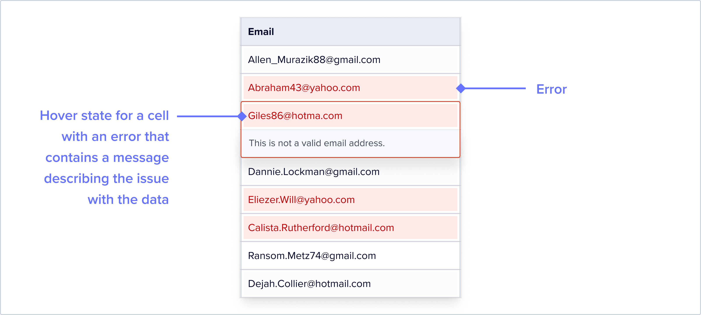

It’s very easy to filter any dataset to just show records with errors, using our *record status quick filter*:

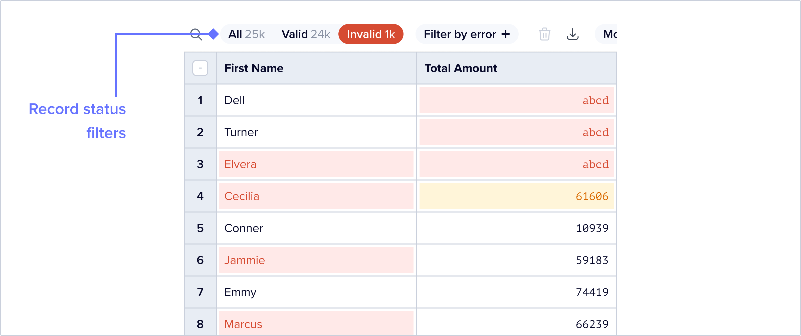

#### Warnings

Warnings are highlighted in yellow, and do not show up when you filter the dataset to just show records with errors. We recommend using Warnings to draw your users attention to potentially problematic data that is perhaps less important for them to resolve. Although Warning colors are configurable, we recommend that you choose colors as close to our defaults as possible to ensure optimal readability.
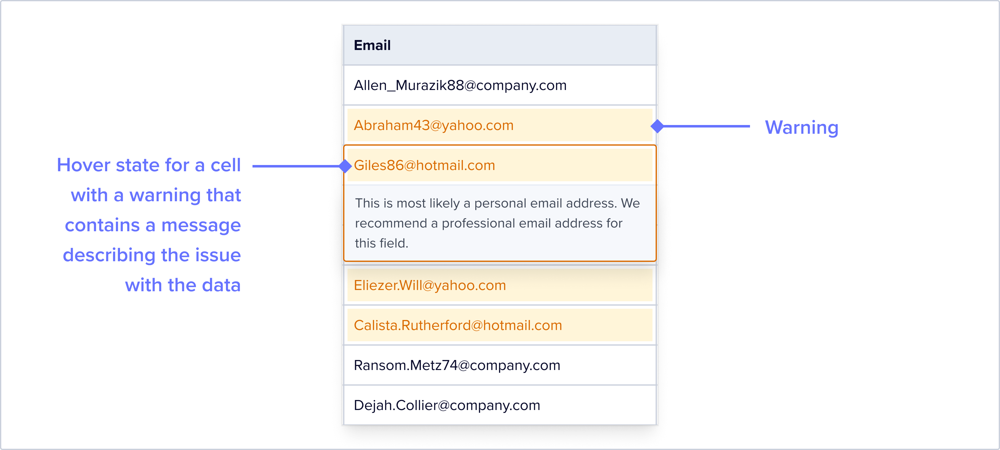

​​You can also introduce additional custom logic in the form of bespoke Record Hooks or from the Flatfile plugin library.

### Automatically Modified Data

You can configure record hooks that automatically modify data to correct it in your implementation of Flatfile. Record hooks are often configured with a message that summarizes the nature of the change, and the reason behind. We highlight automatically modified data to your end user like this:

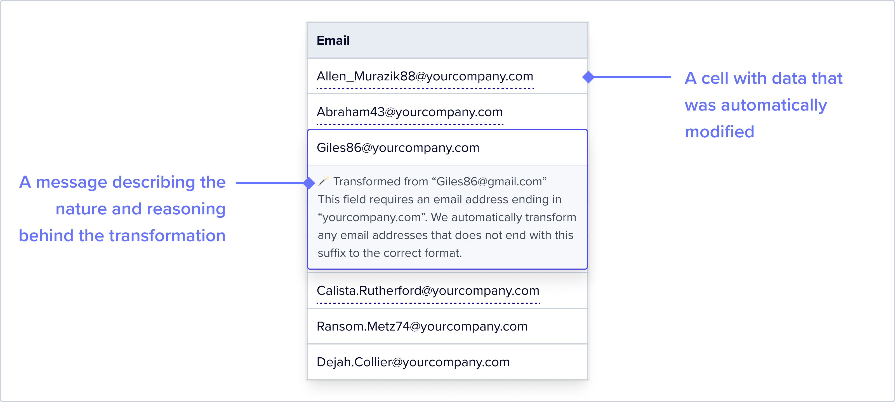

### Filtering Data

Earlier, we referenced the *record status quick filter*. This is a quick filter optimized to surface records based on whether they are valid or invalid. This button group shows counts by status – it’s a great way to get a high level of view of the dataset. This makes it really easy for your users to find dirty data.

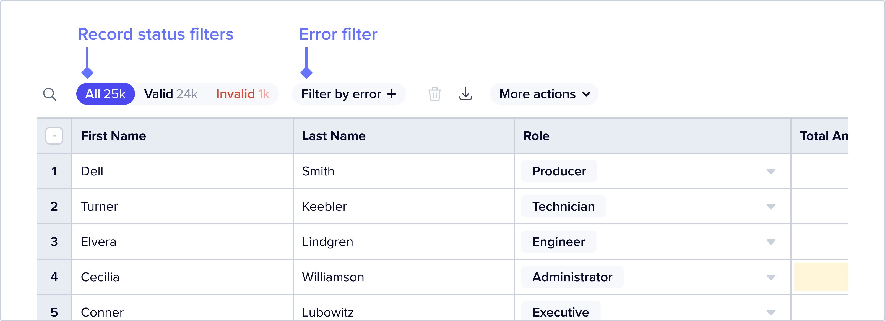

#### Filter by Error

Users can also further filter data by using the *filter by error* feature. Clicking this opens a dropdown that offers a list of field names – selecting a field name will filter the dataset to records that have an error on that field.
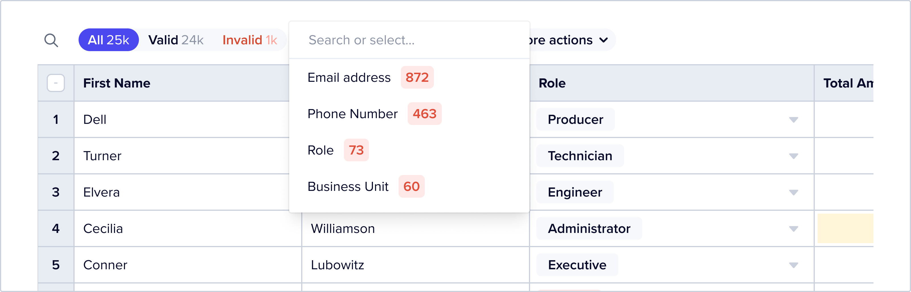

The Record Status button group updates counts to show both “all” and “filtered” counts by status:
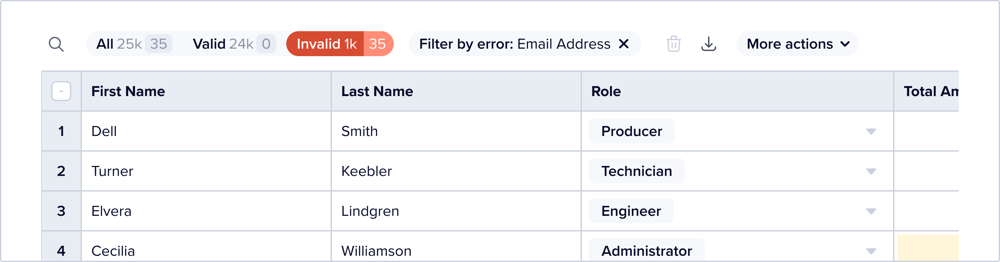

#### Filter with FFQL

Users can also filter data using [FFQL](https://flatfile.com/docs/developer-tools/flatfile_query_language), a simple querying language that allows you to string together a series of AND and OR statements to filter a dataset down to far more specific criteria.

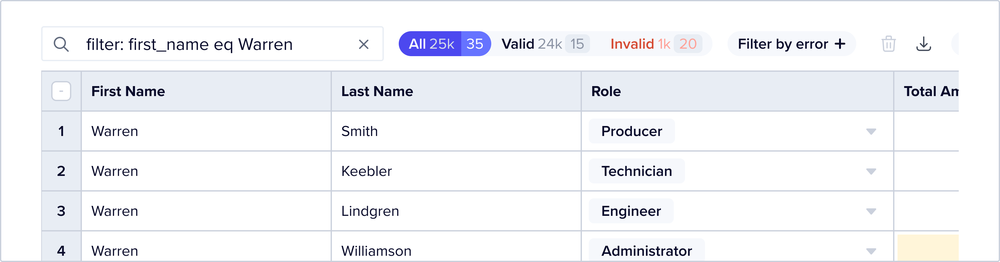

#### AI Assisted Filtering

Users can also use our *AI Assist* feature and ask AI to write a query for them. Type “Cmd+K” or “Ctrl+K” and type “/query” followed by a description of the filter criteria.

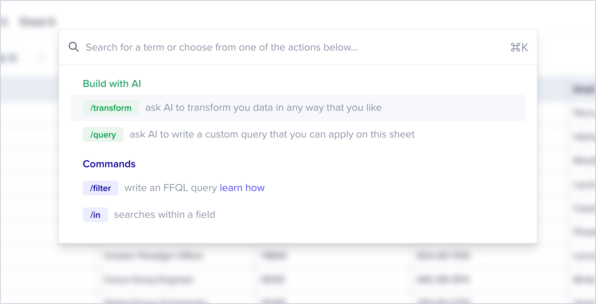

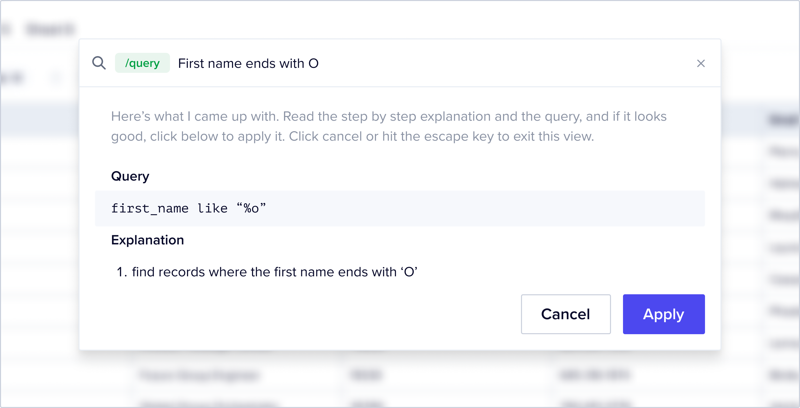

### Bulk Resolution of Errors

Flatfile offers two out of the box features for bulk resolution of common errors – *find and replace* and *replace empty values*. You can find this functionality by clicking on the column context menu – a three dot icon that appears when you hover over a column header:

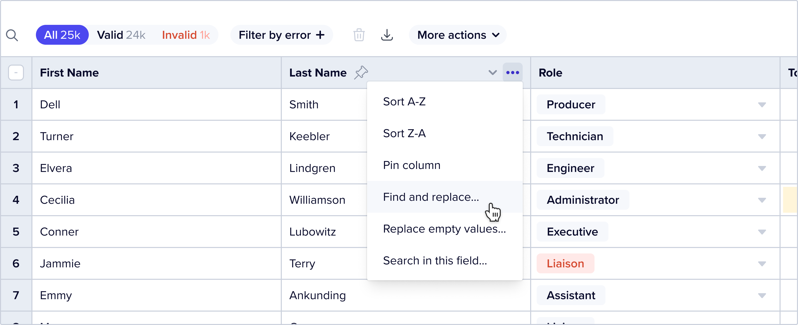

Both *find and replace* and *replace empty values* are restricted to the column from which they are triggered. We have also encoded additional guardrails based on data types. For example, if you trigger *find and replace* from a categorical data type field, we limit the “replace” options to only the valid option encoded into that field in the Blueprint. This prevents a user from accidentally introducing new errors when using a bulk action.

Here is an example of the available “replace” options in a *find and replace* triggered from a field named “Deal Status” for which the encoded valid options in the Blueprint are “Interested”, “Meeting”, “New”, “Not a fit” and “Opportunity”:

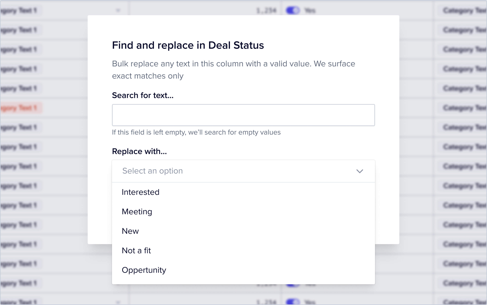

Similarly, if you trigger *find and replace* from a numerical field, the only accepted inputs are numerical values. For boolean fields, you must choose from one of the two encoded boolean values.

We do not offer these features on fields that have been configured with a “unique” requirement, since it would make no sense to bulk replace cells with identical values that would break the “unique” rule encoded into the Blueprint. (Note: I don’t think this is true right now and we should fix this)

## Sheet Actions

You can configure more specific methods of bulk error resolution using our [Actions framework](https://flatfile.com/docs/guides/actions) that are specific to the nature of the data that you expect to see.

For example, if you know that your customers often bring in a column that contains full names but your blueprint wants a First Name and Last Name in two separate columns you can configure a “Name Splitter” action that detects if either of your configured blueprint fields, “First Name” or “Last Name” contain a full name, and if so, to split the name and place the first name in the “First Name” field and the “Last Name” in the last name field.

## Combining Filters with Bulk Error Resolution Methods

Flatfile offers multiple ways in which a user can slice and dice data via the *record Status quick filter*, *filter by error* feature and *FFQL*. Users can select all data using our checkbox UI by clicking on the checkbox on the top left of the table, or more granularly select data by individually checking boxes.

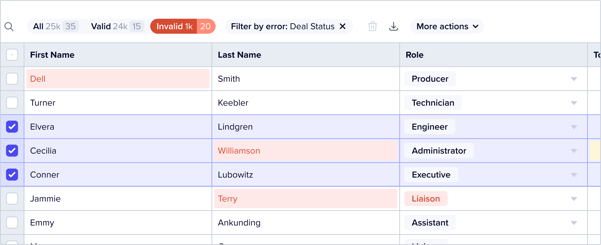

This can be a powerful tool when combined with the various methods for the bulk resolution for errors. Users can select specific data and then only perform either a default or custom action on that data.

## Just Good Data UX

Flatfile has a few [core data types](https://flatfile.com/docs/blueprint/field-types), and they are styled differently to make it super easy for a user to immediately understand what kind of data they’re looking at, to learn more about data in a cell and to edit data.

### Strings

[Strings](https://flatfile.com/docs/blueprint/field-types#string-default) or free text data are the most simply styled: our default font, with text aligned to the left, as is most of the data in our data table:

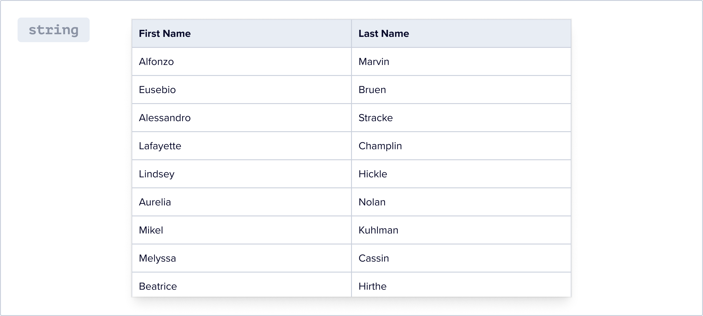

### Numbers

[Numbers](https://flatfile.com/docs/blueprint/field-types#number) are displayed in a monospaced font that is easily visually differentiated from our default text font, and are right aligned. We think it’s important to make numerical and string data visually distinct, since it can be easy to conflate string data that look like numbers (for example, a userid that contains only numbers) with numerical data.

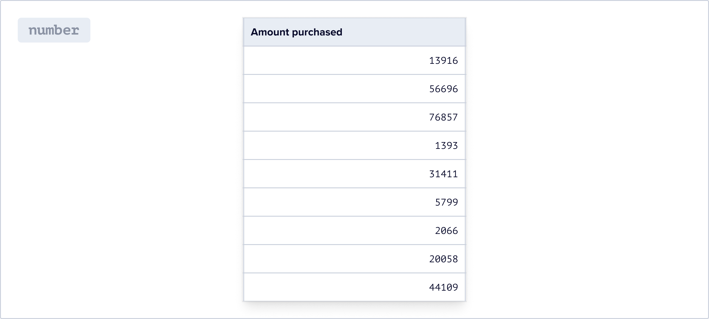

### Enums

Categorical data or [enums](https://flatfile.com/docs/blueprint/field-types#enum) are displayed as tags, and the edit experience is similar to that of a dropdown. This makes it really easy for a user to switch between different valid option. The dropdown is searchable to make for a pleasant user experience when the number of valid options is large. We restrict the entry of new data in these fields to valid options.

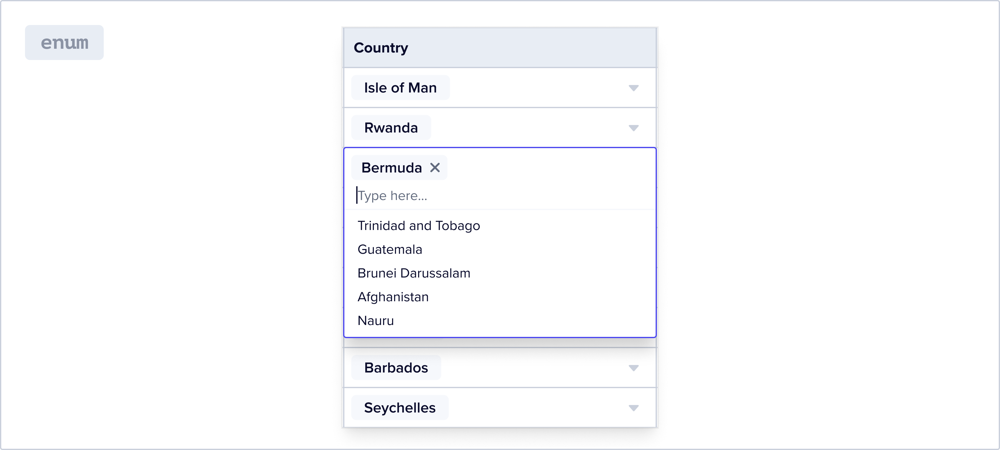

### Booleans

[Booleans](https://flatfile.com/docs/blueprint/field-types#boolean) are displayed along with a tiny toggle UI. The “on” state of the toggle is brightly colored, while the “off” state is gray. This makes it easy to visually see how many values are “on” vs “off”. Clicking the toggle switches the value.

When there’s an unexpected value in a Boolean field, it turns yellow or red, depending on whether it’s a warning or error. No data is represented by an empty cell – but if a user were to hover over that cell a toggle in “off” state appears.

Clicking on a toggle when the cell is either in a warning, error or empty state turns it “on” and adds the value corresponding to the “on” state to that cell.

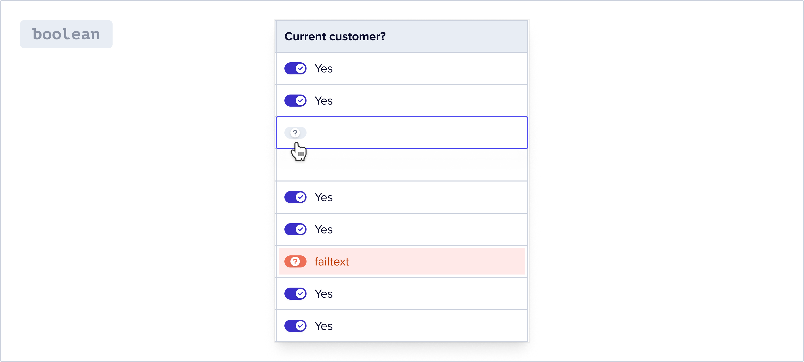
