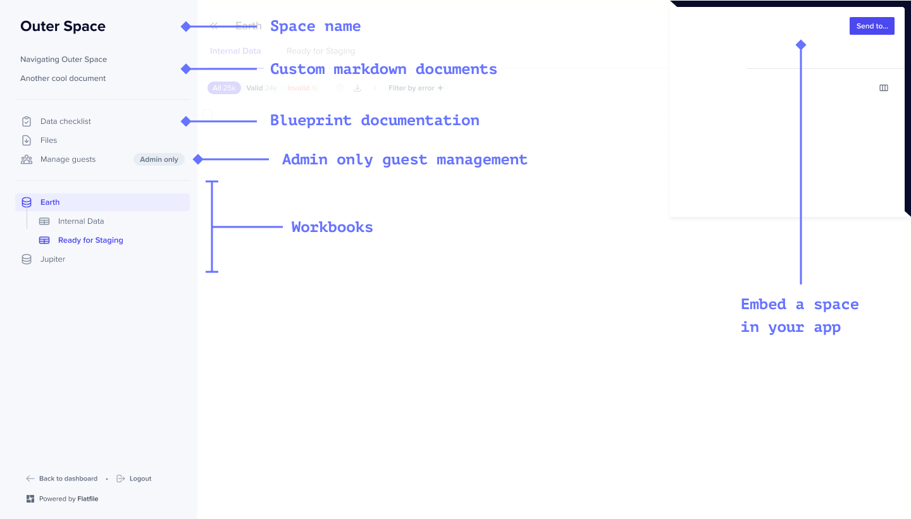

<Snippet file="shared/dxpbanner.mdx" />

Flatfile Spaces are micro-applications, each having their own database, filestore, and auth.
Use Spaces to integrate Flatfile into your data exchange workflow, whether that happens directly
in your application or as part of a currently offline process.

With Spaces, you can:

<CardGroup cols={3}>
  <Card
    title="Embed Flatfile in your app"
    icon="person-to-portal"
    href="../apps/embedding"
  ></Card>
  <Card
    title="Setup headless file feeds"
    icon="bolt-auto"
    href="../guides/automap"
  ></Card>
  <Card
    title="Run onboarding projects"
    icon="arrow-progress"
    href="../apps/projects"
  ></Card>
</CardGroup>

---

## Anatomy

A Space is comprised of Workbooks, Files, Users, Documents, Themes and Metadata.

### Reference

[See API Reference](https://flatfile.stoplight.io/docs/api/25e20c8ab61c5-create-a-space)

#### `Workbooks` _object_

A Space contains any number of Workbooks. Each <Tooltip tip="Analogous to a database...">[Workbook](../apps/workbooks)</Tooltip> is a Blueprint-defined database.

<Tip>
  Add the label 'pinned' to your workbook to ensure it appears as the first
  workbook in the sidebar.
</Tip>

#### `Files` _object_

Files are uploaded directly to a Space.

#### `Users` _object_

By default, all global Admins in Flatfile have access to all Spaces. Additionally, you can configure a Space to allow for either temporary (`shared_link`) or named (`magic_link`) Guest Users.

#### `Documents` _object_

Documents are custom pages that are mounted on the Space and display in the sidebar of a Space in the order of their addition to the Space.

#### `Theme` _object_

Theming of Flatfile is controlled at the Space level. A comprehensive list of Theme options are available [here](../guides/theming).

#### `Metadata` _object_

Spaces can be created and updated with Metadata. This could include a company-specific identifier such as a UUID for use in API operations in the Space.
