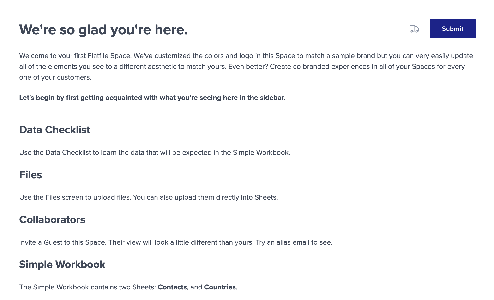
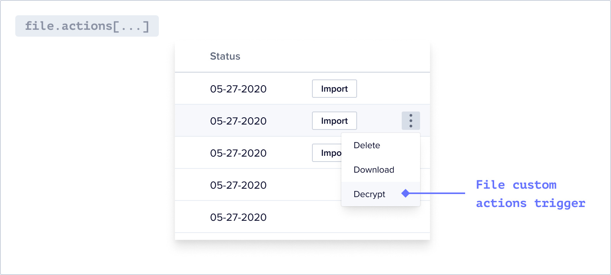

<Snippet file="shared/dxpbanner.mdx" />

An Action is a code-based operation that runs where that Action is mounted. Actions run when a user clicks the corresponding user prompt in Flatfile.

## Overview

Workbook & Sheet-mounted Actions are configured within a <Tooltip tip="A Data Definition Language...">Blueprint</Tooltip> object, while File-mounted actions are appended to the file during the upload process.

The executable code within an Action is compiled into a <Tooltip tip="Large asynchronous work...">Job</Tooltip> entity, providing the capability to run asynchronously or immediately.

Sheet-mounted actions can be executed on the entire Sheet, for a filtered view of the Sheet, or selectively for the chosen records.

## Workbook-mounted

Once a user has extracted and mapped data into a <Tooltip tip="Analogous to a database...">[Workbook](../apps/workbooks)</Tooltip>, it may be more efficient to run an operation on the entire dataset rather than making atomic transformations at the record- or field-level.

For example:

- Sending a webhook that notifies your API of the data's readiness
- Populating a Sheet with data from another source
- Adding two different fields together after a user review's initial validation checks
- Moving valid data from an editable Sheet to a read-only Sheet

Workbook-mounted actions are represented as buttons in the top right of the Workbook.


### Usage

First, configure your action on your Blueprint.

<Info>
  If you configure `primary: true` on an Action, it will be represented as the
  rightmost button in the Workbook.

If you configure `trackChanges: true`, it will disable your actions
until all commits are complete (usually data hooks).

</Info>

<Snippet file="shared/workbook_submit_pt1.mdx" />

Next, listen for a `job:ready` and filter on the `job` you'd like to process. Be sure to complete the job when it's complete.

<Snippet file="shared/workbook_submit_pt2.mdx" />

## Document-mounted

Document-mounted actions are similar to Workbook-mounted actions. They appear in the top right corner of your Document:



Read more about Documents [here](./documents).

### Usage

Define Document-mounted Actions using the `actions` parameter when you create a Document.

<Info>
  If you configure `primary: true` on an Action, it will be represented as the
  rightmost button in the Document.
</Info>

<Snippet file="guides/documents/document-actions.mdx" />

In your listener, listen for the job's event and perform your desired operations.

<CodeGroup>

```js listener.js
export default function flatfileEventListener(listener) {
  listener.on(
    "job:ready",
    { job: "document:contacts:submit" },
    async (event) => {
      const { context, payload } = event;
      const { jobId, workbookId } = context;

      try {
        await api.jobs.ack(jobId, {
          info: "Starting submit job...",
          progress: 10,
          estimatedCompletionAt: new Date("Tue Aug 23 2023 16:19:42 GMT-0700"),
        });

        // Do your work here

        await api.jobs.complete(jobId, {
          outcome: {
            message: `Submit job was completed succesfully.`,
          },
        });
      } catch (error) {
        console.log(`There was an error: ${JSON.stringify(error)}`);
        await api.jobs.fail(jobId, {
          outcome: {
            message: `This job failed.`,
          },
        });
      }
    }
  );
}
```

```js listener.ts
import { FlatfileListener, FlatfileEvent } from "@flatfile/listener";

export default function flatfileEventListener(listener: FlatfileListener) {
  listener.on(
    "job:ready",
    { job: "document:contacts:submit" },
    async (event: FlatfileEvent) => {
      const { context, payload } = event;
      const { jobId, workbookId } = context;

      try {
        await api.jobs.ack(jobId, {
          info: "Starting submit job...",
          // "progress" value must be a whole integer
          progress: 10,
          estimatedCompletionAt: new Date("Tue Aug 23 2023 16:19:42 GMT-0700"),
        });

        // Do your work here

        await api.jobs.complete(jobId, {
          outcome: {
            message: `Submit job was completed succesfully.`,
          },
        });
      } catch (error) {
        console.log(`There was an error: ${JSON.stringify(error)}`);
        await api.jobs.fail(jobId, {
          outcome: {
            message: `This job failed.`,
          },
        });
      }
    }
  );
}
```

</CodeGroup>

## Sheet-mounted

<Info>Each Sheet has built-in Actions like download.</Info>

Sheet-mounted actions are represented as a dropdown in the toolbar of the Sheet.


### Usage

First, configure your action on your Blueprint.

```jsx sheet.js
sheets : [
  {
    name: "Sheet Name",
    actions: [
      {
        operation: 'duplicate',
        mode: 'background',
        label: 'Duplicate selected names',
        description: 'Duplicate names for selected rows',
        primary: true,
      },
      {...}
    ]
  }
]
```

Next, listen for a `job:ready` and filter on the `domain` (sheet) and the
`operation` of where the action was placed. Be sure to complete to job when
it's complete.

<CodeGroup>

```jsx listener.js
listener.on(
  "job:ready",
  { job: "sheet:duplicate" },
  async ({ context: { jobId } }) => {
    try {
      await api.jobs.ack(jobId, {
        info: "Getting started.",
        // "progress" value must be a whole integer
        progress: 10,
        estimatedCompletionAt: new Date("Tue Aug 23 2023 16:19:42 GMT-0700"),
      });

      // Do your work here

      await api.jobs.complete(jobId, {
        info: "This job is now complete.",
      });
    } catch (error) {
      console.error("Error:", error.stack);

      await api.jobs.fail(jobId, {
        info: "This job did not work.",
      });
    }
  }
);
```

```jsx listener.ts
listener.on(
  "job:ready",
  { job: "sheet:duplicate" },
  async ({ context: { jobId } }: FlatfileEvent) => {
    try {
      await api.jobs.ack(jobId, {
        info: "Getting started.",
        // "progress" value must be a whole integer
        progress: 10,
        estimatedCompletionAt: new Date("Tue Aug 23 2023 16:19:42 GMT-0700"),
      });

      // Do your work here

      await api.jobs.complete(jobId, {
        info: "This job is now complete.",
      });
    } catch (error) {
      console.error("Error:", error.stack);

      await api.jobs.fail(jobId, {
        info: "This job did not work.",
      });
    }
  }
);
```

</CodeGroup>

Get the example in the [getting-started](https://github.com/FlatFilers/flatfile-docs-kitchen-sink/tree/main/typescript/actions) repo

### Retrieving data

Data from the Sheet can be retrieved either by calling the API with `records.get` or through data passed in through `event.data`. Here are some examples demonstrating how you can extract data from a Sheet-mounted action:

#### From the entire Sheet

This method allows you to access and process data from the complete Sheet, regardless of the current view or selected records.

```jsx
//inside listener.on()

const { jobId, sheetId } = event.context;

//retrieve all records from sheet
const response = await api.records.get(sheetId);

//print records
console.log(response.data.records);
```

#### From a filtered view of the Sheet

By applying filters to the Sheet, you can narrow down the data based on specific criteria. This enables you to retrieve and work with a subset of records that meet the defined filter conditions.

`event.data` returns a promise resolving to an object with a records property so we extract the records property directly from the event.data object.

<Warning>
  If rows are selected, only the corresponding records will be passed through
  the event for further processing.
</Warning>

```jsx
//inside listener.on()
const { jobId } = event.context;
const { records } = await event.data;

try {
  if (!records || records.length === 0) {
    console.log("No rows were selected or in view.");
    await api.jobs.fail(jobId, {
      outcome: {
        message: "No rows were selected or in view, please try again.",
      },
    });
    return;
  }

  //print records
  console.log(records);

  await api.jobs.complete(jobId, {
    outcome: {
      message: "Records were printed to console, check it out.",
    },
  });
} catch (error) {
  console.log(`Error: ${JSON.stringify(error, null, 2)}`);

  await api.jobs.fail(jobId, {
    outcome: {
      message: "This action failed, check logs.",
    },
  });
}
```

#### For chosen records

When rows are selected, `event.data` will only extract information exclusively for the chosen records, providing focused data retrieval for targeted analysis or operations.

`event.data` returns a promise resolving to an object with a records property so we extract the records property directly from the event.data object.

<Note>This code is the same as the filtered view of the Sheet.</Note>

```jsx
//inside listener.on()
const { jobId } = event.context;
const { records } = await event.data;

try {
  if (!records || records.length === 0) {
    console.log("No rows were selected or in view.");
    await api.jobs.fail(jobId, {
      outcome: {
        message: "No rows were selected or in view, please try again.",
      },
    });
    return;
  }

  //print records
  console.log(records);

  await api.jobs.complete(jobId, {
    outcome: {
      message: "Records were printed to console, check it out.",
    },
  });
} catch (error) {
  console.log(`Error: ${JSON.stringify(error, null, 2)}`);

  await api.jobs.fail(jobId, {
    outcome: {
      message: "This action failed, check logs.",
    },
  });
}
```

## File-mounted

<Info>Each file has built-in actions like Delete and Download.</Info>

File-mounted actions are represented as a dropdown menu for each file in the Files list. You can attach additional actions to a File.



### Usage

First, listen for a `file:ready` event and add one or more actions to the file.

<CodeGroup>

```jsx listener.js file:ready
listener.on("file:created", async ({ context: { fileId } }) => {
  const file = await api.files.get(fileId);
  const actions = file.data?.actions || [];
  const newActions = [
    ...actions,
    {
      operation: "logFileContents",
      label: "Log File Metadata",
      description: "This will log the file metadata.",
    },
    {
      operation: "decryptAction",
      label: "Decrypt File",
      description: "This will create a new decrypted file.",
    },
  ];
  await api.files.update(fileId, {
    actions: newActions,
  });
});
```

```jsx listener.ts file:ready
listener.on("file:created", async ({ context: { fileId } }: FlatfileEvent) => {
  const file = await api.files.get(fileId);
  const actions = file.data?.actions || [];
  const newActions = [
    ...actions,
    {
      operation: "logFileContents",
      label: "Log File Metadata",
      description: "This will log the file metadata.",
    },
    {
      operation: "decryptAction",
      label: "Decrypt File",
      description: "This will create a new decrypted file.",
    },
  ];
  await api.files.update(fileId, {
    actions: newActions,
  });
});
```

</CodeGroup>

Next, listen for `job:ready` and filter on the `domain` (file) and the `operation` of where the Action was placed. Be sure to complete to job when it's complete.

<CodeGroup>

```JavaScript listener.js job:ready
//when the button is clicked in the file dropdown

listener.on(
  "job:ready",
  { job: "file:logFileContents" },
  async ({ context: { fileId, jobId } }) => {
    await acknowledgeJob(jobId, "Gettin started.", 10);

    const file = await api.files.get(fileId);
    console.log({ file });

    await completeJob(jobId, "Logging file contents is complete.");
  }
);

listener.on(
  "job:ready",
  { job: "file:decryptAction" },
  async ({ context: { spaceId, fileId, jobId, environmentId } }) => {
    try {
      await acknowledgeJob(jobId, "Gettin started.", 10);

      const fileResponse = await api.files.get(fileId);

      const buffer = await getFileBufferFromApi(fileId);
      const { name, ext } = fileResponse.data;
      const newFileName = name
        ? name.split(".")[0] + "[Decrypted]." + ext
        : "DecryptedFile.csv";

      const formData = new FormData();
      formData.append("file", buffer, { filename: newFileName });
      formData.append("spaceId", spaceId);
      formData.append("environmentId", environmentId);

      await uploadDecryptedFile(formData);

      await completeJob(jobId, "Decrypting is now complete.");
    } catch (e) {
      await failJob(jobId, "The decryption job failed.");
    }
  }
);

async function acknowledgeJob(jobId, info, progress, estimatedCompletionAt) {
  await api.jobs.ack(jobId, {
    info,
    progress,
    estimatedCompletionAt
  });
}

async function completeJob(jobId, message) {
  await api.jobs.complete(jobId, {
    outcome: {
      message,
    },
  });
}

async function failJob(jobId, message) {
  await api.jobs.fail(jobId, {
    outcome: {
      message,
    },
  });
}
```

```jsx listener.ts job:ready
//when the button is clicked in the file dropdown

listener.on(
  "job:ready",
  { job: "file:logFileContents" },
  async ({ context: { fileId, jobId } }: FlatfileEvent) => {
    await acknowledgeJob(jobId, "Gettin started.", 10);

    const file = await api.files.get(fileId);
    console.log({ file });

    await completeJob(jobId, "Logging file contents is complete.");
  }
);

listener.on(
  "job:ready",
  { job: "file:decryptAction" },
  async ({
    context: { spaceId, fileId, jobId, environmentId },
  }: FlatfileEvent) => {
    try {
      await acknowledgeJob(jobId, "Gettin started.", 10);

      const fileResponse = await api.files.get(fileId);

      const buffer = await getFileBufferFromApi(fileId);
      const { name, ext } = fileResponse.data;
      const newFileName = name
        ? name.split(".")[0] + "[Decrypted]." + ext
        : "DecryptedFile.csv";

      const formData = new FormData();
      formData.append("file", buffer, { filename: newFileName });
      formData.append("spaceId", spaceId);
      formData.append("environmentId", environmentId);

      await uploadDecryptedFile(formData);

      await completeJob(jobId, "Decrypting is now complete.");
    } catch (e) {
      await failJob(jobId, "The decryption job failed.");
    }
  }
);

async function acknowledgeJob(
  jobId: string,
  info: string,
  progress: number,
  estimatedCompletionAt: Date | undefined = undefined
) {
  await api.jobs.ack(jobId, {
    info,
    progress,
    estimatedCompletionAt,
  });
}

async function completeJob(jobId: string, message: string) {
  await api.jobs.complete(jobId, {
    outcome: {
      message,
    },
  });
}

async function failJob(jobId: string, message: string) {
  await api.jobs.fail(jobId, {
    outcome: {
      message,
    },
  });
}
```

</CodeGroup>

Get the example in the [flatfile-docs-kitchen-sink ts](https://github.com/FlatFilers/flatfile-docs-kitchen-sink/blob/main/typescript/shared/workbook_submit.ts) or [flatfile-docs-kitchen-sink js](https://github.com/FlatFilers/flatfile-docs-kitchen-sink/blob/main/javascript/shared/workbook_submit.js) repo

## Actions with Input Forms

If you configure input fields for your action, a secondary dialog will be presented to the end user, prompting them to provide the necessary information. Once the user has entered the required details, they can proceed with the action.

### Usage

First, configure your action to have an inputForm on your Blueprint. These will appear once the action button is clicked.

<Snippet file="shared/workbook_submit_pt4.mdx" />

Next, listen for a `job:ready` and filter on the `job` you'd like to process. Grab the data entered in the form from the job itself and leverage it as required for your use case.

<Snippet file="shared/workbook_submit_pt5.mdx" />

## Actions with Constraints

### Usage

#### Workbook & Sheet-mounted

1. Adding a `hasAllValid` constraint on an Action will
   disable a Workbook Action when there are invalid records.
2. Adding a `hasData` on an Action will
   disable a Workbook Action when there are no records.

```jsx
actions: [
  {
    operation: 'submitActionFg',
    mode: 'foreground',
    label: 'Submit data elsewhere',
    description: 'Submit this data to a webhook.',
    primary: true,
    constraints: [{ type: 'hasAllValid'},{ type: 'hasData' }]
  },
  {...}
],
```

#### Sheet-Mounted only

Adding a constraint of `hasSelection` on an Action will disable a Sheet Action when no records in the Sheet are selected.

```jsx sheet.js
sheets : [
  {
    name: "Sheet Name",
    actions: [
      {
        operation: 'duplicate',
        mode: 'background',
        label: 'Duplicate selected names',
        description: 'Duplicate names for selected rows',
        constraints: [{ type: 'hasSelection' }],
        primary: true,
      },
      {...}
    ]
  }
]
```

## Actions with Messages

Add custom messages to actions, tailored according to their state:

- Error
- Info

These messages will be displayed as tooltips when users hover over an action, providing context-specific text that corresponds to the action's current state. When an error message is present on an action, the action will be disabled.

### Usage

Simply add a messages property to your action configuration. This property should be an array of objects, each specifying a message type and its content.

```jsx
  actions: [
    {
      operation: 'duplicate',
      mode: 'background',
      label: 'Duplicate selected names',
      description: 'Duplicate names for selected rows',
      messages: [
        { type: 'error', content: 'This is an error message' },
      ],
      primary: true,
    },
    {...}
  ]
```

## Example Project

Find the documents example in the Flatfile GitHub repository.

<CardGroup cols={2}>
  <Card
    title="typescript"
    icon="code-merge"
    href="https://github.com/FlatFilers/flatfile-docs-kitchen-sink/tree/main/typescript/actions"
  >
    Clone the Actions example in Typescript
  </Card>
  <Card
    title="javascript"
    icon="js"
    href="https://github.com/FlatFilers/flatfile-docs-kitchen-sink/tree/main/javascript/actions"
  >
    Clone the Actions example in Javascript
  </Card>
</CardGroup>
