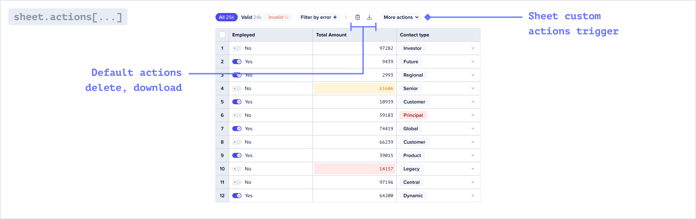
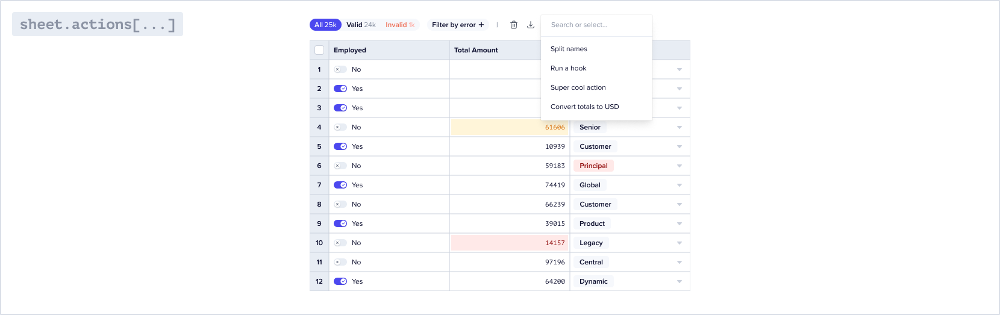
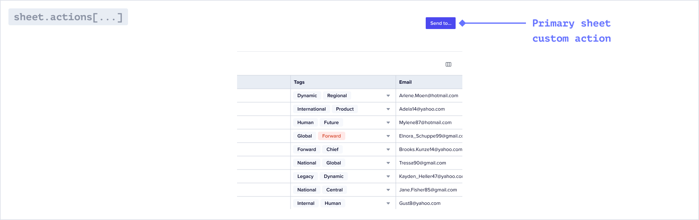

An action is a code-based operation that runs where that action is mounted. Actions run when a user clicks the corresponding user prompt in Flatfile.

<Info>
Each Workbook has built-in Actions. In addition, you can attach a Custom Action to a Sheet and/or a Workbook.
</Info>

## Sheet-mounted Custom Actions



Once a user has extracted and mapped data into a <Tooltip tip="A collection of fields...">[Sheet](../concepts/workbooks#sheets-array)</Tooltip>, it may be more efficient to run an operation on the entire dataset rather than making atomic transformations at the record- or field-level. For example:
* Sending a webhook that notifies your API of the data's readiness
* Populating the Sheet with data from another source
* Adding two different fields together after a user review's initial validation checks
* Moving valid data from an editable Sheet to a read-only Sheet

### Types of custom actions

Sheet-mounted Custom Actions are represented in two forms:

#### Dropdown



By default, all Custom Actions are included in a drop-down in the Sheet header.

#### Primary call to action



If you configure `primary: true` on a Custom Action, it will be represented as a button in the Sheet.

### How to mount and listen for a Sheet-level Custom Action

<CodeGroup>

```jsx blueprint.js
actions: [
  {
    slug: "download_as_pdf",
    label: "Download as PDF",
    type: "string",
    description: "This message shows in the pop up after clicking the action.",
    primary: false
  },
  {...}
]
```

```jsx listener.js
listener.on('action:triggered', async (event) => {
     //perform the action here
  })
```

</CodeGroup>

Sheet-level Custom Actions are configured within a <Tooltip tip="A Data Definition Language...">[Blueprint](../concepts/workbooks#blueprint-object)</Tooltip>. 
The executable code within an Action is compiled into a <Tooltip tip="Large asynchronous work...">[Job](../concepts/jobs)</Tooltip> and can run asyncronously or immediately.
