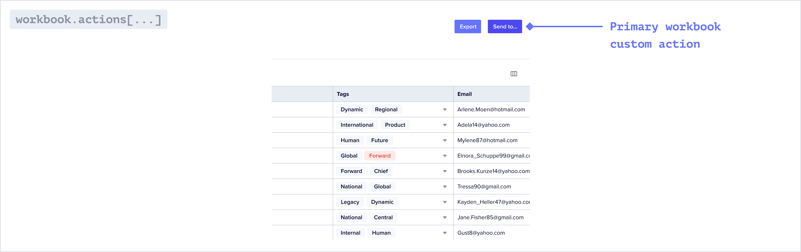

An action is a code-based operation that runs where that action is mounted. Actions run when a user clicks the corresponding user prompt in Flatfile.

Custom Actions are configured within a <Tooltip tip="A Data Definition Language...">[Blueprint](../concepts/workbooks#blueprint-object)</Tooltip>. 
The executable code within an Action is compiled into a <Tooltip tip="Large asynchronous work...">[Job](../concepts/jobs)</Tooltip> and can run asyncronously or immediately.

## Overview

Once a user has extracted and mapped data into a <Tooltip tip="Analogous to a database...">[Workbook](../concepts/workbooks)</Tooltip>, it may be more efficient to run an operation on the entire dataset rather than making atomic transformations at the record- or field-level. For example:
* Sending a webhook that notifies your API of the data's readiness
* Populating a Sheet with data from another source
* Adding two different fields together after a user review's initial validation checks
* Moving valid data from an editable Sheet to a read-only Sheet

## Workbook-mounted

Workbook-mounted custom actions are represented as buttons in the top right of the Workbook.



### Usage

Listen for a `job:ready` and filter on the `domain` (workbook) and the `operation` of where the action was placed. Be sure to complete to job when it's complete.

<Info>
  If you configure `primary: true` on a custom action, it will be represented as the rightmost button in the Workbook.
</Info>

<CodeGroup>

```jsx workbook.js
actions: [
  {
    operation: 'submitActionFg',
    mode: 'foreground',
    label: 'Submit data elsewhere',
    type: 'string',
    description: 'Submit this data to a webhook.',
    primary: true,
  },
  {...}
]
```

```jsx listener.js
listener.filter({ job: 'workbook:submitActionFg' }, (configure) => {
    configure.on('job:ready', async (event) => {

    const { jobId } = event.context;

      try {
        await api.jobs.ack(jobId, {
          info: 'Gettin started.',
          progress: 10 //optional
        });

        //do your work here

        await api.jobs.complete(jobId, {
          info: 'This job is now complete.'
        });
      }
      catch (error) {
        console.log(`Error: ${JSON.stringify(error, null, 2)}`);

        await api.jobs.fail(jobId, {
          info: 'This job did not work.'
        });
      }

  })
})
```
</CodeGroup>

## Sheet-mounted

<Info>Each Sheet has built-in Actions.</Info>

Sheet-mounted custom actions are represented as a dropdown in the toolbar of the Sheet. In addition, you can attach a custom action to a Sheet.


### Usage

Listen for a `job:ready` and filter on the `domain` (sheet) and the `operation` of where the action was placed. Be sure to complete to job when it's complete.

<CodeGroup>

```jsx sheet.js
sheets : [
  {
    name: "Sheet Name",
    actions: [
      {
        operation: 'capitalizeNamesBg',
        mode: 'background',
        label: 'Capitalize selected names',
        type: 'string',
        description: 'Capitalize names for selected rows',
        primary: true,
      },
      {...}
    ]
  }
]
```

```jsx listener.js
listener.filter({ job: 'sheet:capitalizeNamesBg' }, (configure) => {
    configure.on('job:ready', async (event) => {

    const { jobId } = event.context;

      try {
        await api.jobs.ack(jobId, {
          info: 'Gettin started.',
          progress: 10 //optional
        });

        //do your work here

        await api.jobs.complete(jobId, {
          info: 'This job is now complete.'
        });
      }
      catch (error) {
        console.log(`Error: ${JSON.stringify(error, null, 2)}`);

        await api.jobs.fail(jobId, {
          info: 'This job did not work.'
        });
      }

  })
})
```

</CodeGroup>
