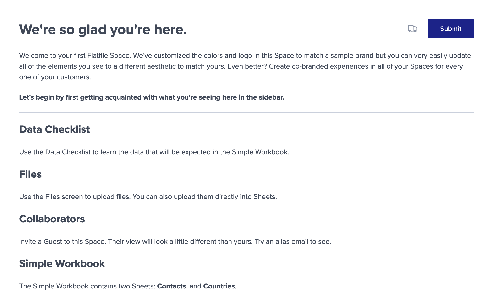

Documents are standalone webpages for your Flatfile <Tooltip tip="Are micro-applications...">[Spaces](../concepts/spaces)</Tooltip>. They can be rendered from <Tooltip tip="View syntax">[Markdown syntax](https://www.markdownguide.org/basic-syntax/)</Tooltip>.

Often used for getting started guides, Documents become extremely powerful with dynamically generated content that stays updated as Events occur.

<Info>
  Flatfile also allows you to use HTML tags in your Markdown-formatted text.
  This is helpful if you prefer certain HTML tags rather than Markdown syntax.
</Info>

## Create a Document

Create Documents via API:

<Snippet file="guides/documents/update-document.mdx" />

## Document Actions

Actions are optional and allow you to run custom operations in response to a user-triggered event. Actions appear as buttons in the top right corner of your Document:



Define Actions on a Document using the `actions` parameter when a document is created:

```ts
const doc = await api.documents.create(spaceId, {
  title: 'Getting started',
  body: '# Welcome ...',
  actions: [
    {
      label: 'Submit',
      operation: 'contacts:submit',
      description: 'Would you like to submit the contact data?',
      tooltip: 'Submit the contact data',
      mode: 'foreground',
      primary: true,
      confirm: true,
    },
  ]
});
```

Read more about how to handle Actions in your listener [here](./actions#document-mounted).

## Ephemeral Documents

Ephemeral Documents appear as a full-screen takeover, and do not appear in the sidebar of your Space like other Documents. They can be used to create a more focused experience for your end users.

To create an ephemeral Document, use the `treatments` array parameter when creating your Document and give it a treatment of `"ephemeral"`:

```ts
const ephemeralDoc = await api.documents.create(spaceId, {
  title: 'Getting started',
  body: '# Welcome ...',
  treatments: [
    'ephemeral'
  ]
});
```

## Embedding Sheets in Documents

You can embed a Sheet into your Document by adding an `<embed>` HTML entity to your markdown body, and passing a sheet ID, workbook ID, and name. You can also specify whether the embedded Sheet is expanded or collapsed when the document is loaded.

<Info>
  You can include as many embedded Sheets in your Document as you like, but end users will only be able to expand a maximum of 10 embedded Sheets at once.
</Info>

```ts
const doc = await api.documents.create(spaceId, {
  title: 'Getting started',
  body: `
  # Welcome
  
  Here is an embedded Sheet:
  
  <embed type='embedded-sheet' name='Contacts' defaultExpanded='true' sheetId='your_sheet_id' workbookId='your_workbook_id'>

  Here is another embedded Sheet:

  <embed type='embedded-sheet' name='Countries' sheetId='us_sh_TVW95224' workbookId='us_wb_8e0z52gI'>
  `,
});
```

---

## Markdown reference

Documents support Github-flavored Markdown. Check out [this guide](https://github.com/adam-p/markdown-here/wiki/Markdown-Cheatsheet) for a full reference on the entities you can use.

## Example Project

Find the documents example in the Flatfile GitHub repository.

<CardGroup cols={2}>
  <Card
    title="typescript"
    icon="code-merge"
    href="https://github.com/FlatFilers/flatfile-docs-kitchen-sink/blob/main/typescript/documents/index.ts"
  >
    Clone the documents example in Typescript
  </Card>
  <Card
    title="javascript"
    icon="js"
    href="https://github.com/FlatFilers/flatfile-docs-kitchen-sink/blob/main/javascript/documents/index.js"
  >
    Clone the documents example in Javascript
  </Card>
</CardGroup>
