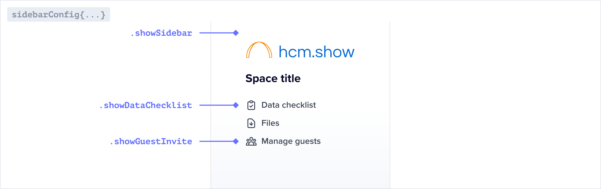

<Info>
  This configuration only impacts Guests and not Admins. [Learn more about user
  access](../developer-tools/security/roles-and-permissions).
</Info>

Flatfile allows you to update your sidebar to hide/show certain elements via the <Tooltip tip="A micro-application...">[Space](../concepts/spaces)</Tooltip> endpoint.

Simply update `metadata.sidebarConfig` when calling `spaces.update()`.

---

### Building a guest sidebar

Learn how to create a sidebar configuration, and update a sidebar configuration from an event listener.

<Snippet file="guides/guest_sidebar/block1.mdx" />

---

## Guest sidebar reference

### `metadata.sidebarConfig`

<ParamField path="showDataChecklist" type="boolean">
  The data checklist shows all of the data needed for uploading to the primary
  Workbook.{" "}
</ParamField>
<ParamField path="showSidebar" type="boolean">
  {" "}
  Determines if a guest can see the sidebar. If the sidebar is hidden and there are
  multiple Workbooks in your Space, please specify the desired Workbook ID as your
  defaultPage.{" "}
</ParamField>

## Example Project

Find the guest sidebar example in the Flatfile GitHub repository.

<CardGroup cols={2}>
  <Card
    title="typescript"
    icon="code-merge"
    href="https://github.com/FlatFilers/flatfile-docs-kitchen-sink/blob/main/typescript/guest-sidebar/index.ts"
  >
    Clone the guest sidebar example in Typescript
  </Card>
  <Card
    title="javascript"
    icon="js"
    href="https://github.com/FlatFilers/flatfile-docs-kitchen-sink/blob/main/javascript/guest-sidebars/index.js"
  >
    Clone the guest sidebar example in Javascript
  </Card>
</CardGroup>
