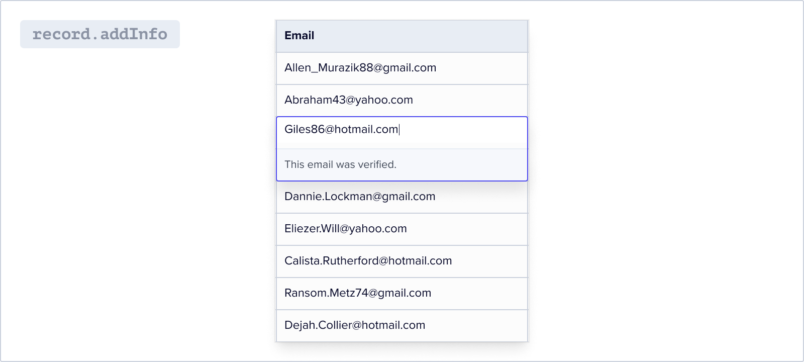
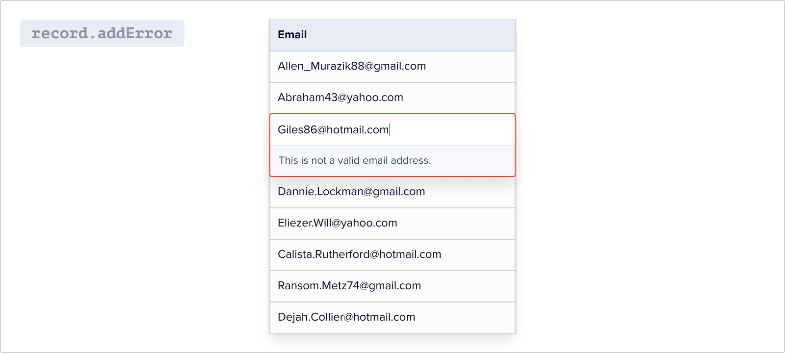
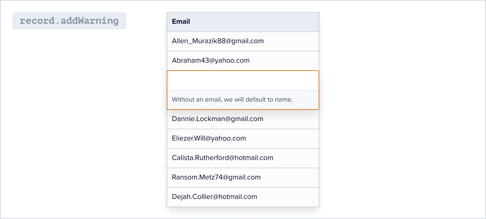

**Data Hooks&reg;** are concise functions that automatically **re-format**, **correct**, **validate**, and **enrich** data during the data import process. These hooks can be executed on a complete record, or row, of data using methods on the `FlatfileRecord` class.

Record-level hooks have access to all fields in a row and should be utilized for operations that require access to multiple fields or when creating a new field.

## Getting started

The `FlatfileRecord` class provides methods to manipulate and interact with a record in the Flatfile format, including setting values, retrieving values, adding information messages, performing computations, validating fields, and converting the record to JSON format.

Listen for updates to data records, and respond with three types of record hooks: `compute`, `computeIfPresent`, and `validate`. These hooks are available as methods on the `FlatfileRecord` class.

```js
import { recordHook, FlatfileRecord } from "@flatfile/plugin-record-hook";
```

<Info>
  In these examples, we'll reference the Workbook from the [Quickstart
  guide](/quickstart/meet-the-workbook#building-your-first-workbook).
</Info>

## Record Hooks

### `FlatfileRecord.compute`

Computes a new value for a field based on its original value or other field values on the record. Optionally pass an [info message](#flatfilerecord-addinfo) to surface to the user about the transformation. `compute` will run even when no value is set for the field (see [`computeIfPresent`](#flatfilerecord-computeifpresent)).

<h4>Syntax</h4>

```js
FlatfileRecord.compute(fieldName, transformation, message);
```

<ParamField path="fieldName" type="string">
  The name of the field to transform.
</ParamField>

<ParamField
  path="transformation"
  type="(value, record) => string | number | boolean | null"
>
  The transformation to perform on the field value. Receives the initial value
  of the field, as well as the entire record if you want to access other field
  values on the record.
</ParamField>

<ParamField path="message" type="string">
  (optional) a message to show on the cell after the transformation.
</ParamField>

<h4>Example</h4>

Generate email from first and last name:

<CodeGroup>
```js javascript
listener.use(
  recordHook('contacts', (record) => {
    record.compute(
      'email',
      (email, record) => `${record.get('firstName')}${record.get('lastName')}@gmail.com`,
      'Email was generated from first and last name.'
    );
    return record;
  })
);
```

```js typescript
listener.use(
  recordHook("contacts", (record: FlatfileRecord) => {
    record.compute(
      "email",
      (email, record) => {
        return `${record.get("firstName")}${record.get("lastName")}@gmail.com`;
      },
      // optional
      "Email was generated from first and last name."
    );
    return record;
  })
);
```

</CodeGroup>

### `FlatfileRecord.computeIfPresent`

Same as [`compute`](#flatfilerecord-compute), but only computes a new value if an initial value is provided (not null). Useful for computations that may throw an error on null values.

<h4>Syntax</h4>

```js
FlatfileRecord.computeIfPresent(fieldName, transformation, message);
```

<ParamField path="fieldName" type="string">
  The name of the field to transform.
</ParamField>

<ParamField
  path="transformation"
  type="(value, record) => string | number | boolean | null"
>
  The transformation to perform on the field value. Receives the initial value
  of the field, as well as the entire record if you want to access other field
  values on the record.
</ParamField>

<ParamField path="message" type="string">
  (optional) a message to show on the cell after the transformation.
</ParamField>

<h4>Example</h4>

Change email to lower case:

<CodeGroup>
```js javascript
listener.use(
  recordHook('contacts', (record) => {
    record.computeIfPresent(
      'email',
      (email: string) => email.toLowerCase(),
      // optional
      'Email was converted to lowercase.'
    );
    return record;
  })
);
```

```js typescript
listener.use(
  recordHook("contacts", (record: FlatfileRecord) => {
    record.computeIfPresent(
      "email",
      (email: string) => email.toLowerCase(),
      // optional
      "Email was converted to lowercase."
    );
    return record;
  })
);
```

</CodeGroup>

### `FlatfileRecord.validate`

Sets a field as invalid if its value does not meet a specified condition, and displays an [error message](#flatfilerecord-adderror) to the user.

<h4>Syntax</h4>

```js
validate(fieldName, validator, message);
```

<ParamField path="fieldName" type="string">
  The name of the field to validate.
</ParamField>

<ParamField path="validator" type="(value, record) => boolean">
  A function that determines whether a given field value is valid. Receives the
  intial value of the field, as well as the entire record if you want to access
  other field values on the record.
</ParamField>

<ParamField path="message" type="string">
  A message to show on the cell if the field is invalid.
</ParamField>

<h4>Example</h4>

<CodeGroup>
```js javascript
listener.use(
  recordHook('contacts', (record) => {
    record.validate(
      'lastName',
      (value: any) => !/\d/.test(value.toString()),
      'Last name cannot contain numbers'
    );
    return record;
  })
);
```

```js typescript
listener.use(
  recordHook("contacts", (record: FlatfileRecord) => {
    record.validate(
      "lastName",
      (value) => typeof value === "string" && !/\d/.test(value),
      "Last name cannot contain numbers"
    );
    return record;
  })
);
```

</CodeGroup>

## Messages

Attach comments, errors, and warnings to specific fields in each record. These messages provide contextual information or alerts to users who interact with the record, helping them understand any issues or actions required.

### `FlatfileRecord.addInfo()`



This method adds an information message to one or more fields in the record.

<h4>Syntax</h4>

```jsx
addInfo(fields, message);
```

<ParamField path="fields" type="string | string[]">
  Can be either a string representing a single field or an array of strings
  representing multiple fields
</ParamField>

<ParamField path="message" type="string">
  The content of the message
</ParamField>

<h4>Example</h4>
```jsx const email = record.get("email"); const validEmailAddress = /^[^\s@]+@[^\s@]+\.[^\s@]+$/;

if (email !== null && validEmailAddress.test(email)) {
record.addInfo("email", "This email was verified.");
}

````

### `FlatfileRecord.addError()`



This method adds an error message to one or more fields in the record.

<h4>Syntax</h4>

```jsx
addError(fields, message)
````

<ParamField path="fields" type="string | string[]">
  Can be either a string representing a single field or an array of strings
  representing multiple fields
</ParamField>

<ParamField path="message" type="string">
  The content of the message
</ParamField>

<h4>Example</h4>
```jsx const email = record.get("email"); const validEmailAddress = /^[^\s@]+@[^\s@]+\.[^\s@]+$/;

if (email !== null && !validEmailAddress.test(email)) {
record.addError("email", "This is not a valid email address.");
}

````

### `FlatfileRecord.addWarning()`



This method adds a warning message to one or more fields in the record.

<h4>Syntax</h4>

```jsx
FlatfileRecord.addWarning(fields, message)
````

<ParamField path="fields" type="string | string[]">
  Can be either a string representing a single field or an array of strings
  representing multiple fields
</ParamField>

<ParamField path="message" type="string">
  The content of the message
</ParamField>

<h4>Example</h4>
```jsx const email = record.get("email");

if (email === null) {
record.addWarning("email", "Without an email, we will default to name for unique id.");
}

````

## Accessing an API

Accessing an API within a `recordHook` allows for retrieving additional data or performing external operations to enrich or modify existing data. This approach integrates external data sources or services into the data manipulation workflow, enabling real-time or dynamic information to enhance the data. It is particularly useful when fetching related data, validating information, performing calculations, or any operation that relies on external input before modifying the data.

### Using `GET`

When a record is created or updated, you may need to fetch data from an API. Using a `GET` method does just that, then updates the record object with the retrieved data, and handles any errors that may occur during the process.

<h4>Example</h4>

In this example, an API call is made to retrieve beer data, which is then used to update the record object by setting the "assignedBeer" field with a random name from the beer data.

If an error occurs, we update the `status` field to "Failed" and add an error message. The modified record is then returned from the `recordHook`.

<CodeGroup>
```jsx javascript
listener.use(
  recordHook(
    "contacts",
    async (record, event) => {
      try {
        const { payload } = event.payload;

        const getResponse = await axios.get(
          "https://api.sampleapis.com/beers/ale"
        );
        record.set(
          "assignedBeer",
          getResponse.data[Math.floor(Math.random() * 20)].name
        );
        record.addInfo(
          "assignedBeer",
          "Got this from " + getResponse.config.url
        );
      } catch (error) {
        record.set("status", "Failed");
        record.addError("status", "Couldn't get assigned beer data from the api.");
      } finally {
        // Clean up or perform any necessary actions after the try/catch block
      }

      return record;
    }
  )
);
````

```jsx typescript
listener.use(
  recordHook(
    "contacts",
    async (record: FlatfileRecord, event: FlatfileEvent) => {
      try {
        const { payload } = event.payload;

        const getResponse = await axios.get(
          "https://api.sampleapis.com/beers/ale"
        );
        record.set(
          "assignedBeer",
          getResponse.data[Math.floor(Math.random() * 20)].name
        );
        record.addInfo(
          "assignedBeer",
          "Got this from " + getResponse.config.url
        );
      } catch (error) {
        record.set("status", "Failed");
        record.addError(
          "status",
          "Couldn't get assigned beer data from the api."
        );
      } finally {
        // Clean up or perform any necessary actions after the try/catch block
      }

      return record;
    }
  )
);
```

</CodeGroup>

### Using `POST`

When a record is created or updated, you may need to send data to an API. Sends the payload data from an Event to a webhook receiver URL using a `POST` request, then update the record object based on the success or failure of the request. Last, add messages to the fields accordingly.

<h4>Example</h4>

In this example, we are making a `POST` request to a webhook endpoint using axios. We pass the payload, method, and record as the request body and handle the response.

If the request is successful, we update the `status` field of the record to "Success" and add a comment. If an error occurs, we update the `status` field to "Failed" and add an error message. The modified record is then returned from the `recordHook`.

<CodeGroup>
```jsx javascript
listener.use(
  recordHook(
    "contacts",
    async (record, event) => {
      try {
        const { payload } = event.payload;

        const webhookReceiver =
          process.env.WEBHOOK_SITE_URL ||
          "https://webhook.site/c83648d4-bf0c-4bb1-acb7-9c170dad4388";

        const postResponse = await axios.post(
          webhookReceiver,
          {
            ...payload,
            method: "axios",
            record,
          },
          {
            headers: {
              "Content-Type": "application/json",
            },
          }
        );
        record.set("status", "Success");
        record.addComment(
          "status",
          "Record data sent to " + postResponse.config.url
        );
      } catch (error) {
        record.set("status", "Failed");
        record.addError("status", "Couldn't send record to the destination.");
      } finally {
        // Clean up or perform any necessary actions after the try/catch block
      }

      return record;
    }

)
);

````

```jsx typescript
listener.use(
  recordHook(
    "contacts",
    async (record: FlatfileRecord, event: FlatfileEvent) => {
      try {
        const { payload } = event.payload;

        const webhookReceiver =
          process.env.WEBHOOK_SITE_URL ||
          "https://webhook.site/c83648d4-bf0c-4bb1-acb7-9c170dad4388";

        const postResponse = await axios.post(
          webhookReceiver,
          {
            ...payload,
            method: "axios",
            record,
          },
          {
            headers: {
              "Content-Type": "application/json",
            },
          }
        );
        record.set("status", "Success");
        record.addComment(
          "status",
          "Record data sent to " + postResponse.config.url
        );
      } catch (error) {
        record.set("status", "Failed");
        record.addError("status", "Couldn't send record to the destination.");
      } finally {
        // Clean up or perform any necessary actions after the try/catch block
      }

      return record;
    }
  )
)
    ```
</CodeGroup>


## getLinks

The `getLinks` method is a feature of the FlatfileRecord class. When a field in your record is of the Reference Field type and links to another record, getLinks can fetch those linked fields for you.

### Usage

When processing a record, you may find references to a related record. To retrieve the fields from the related record, use the `getLinks` method. Provide the field key of the Reference Field type, the part of the record that holds the reference to the other records, like this:

```javascript
const relatedRecords = record.getLinks('referenceFieldKey');
````

The getLinks method will then return an array containing all fields from the linked record associated with the provided 'referenceFieldKey'. If there is not a linked record associated with this field, an empty array will be returned.

### Benefits

Using `getLinks` provides access to all related information. It's particularly useful when you want to perform operations similar to VLOOKUPs in spreadsheets, or when you need to compare data across referenced fields.

For instance, you could use `getLinks` to fetch all the fields related to a particular record and enrich your data, or compare the related records for validation.

With `getLinks`, processing related datasets becomes much more manageable in Flatfile. This method provides you with an effective way to navigate, enrich, and validate your data.
