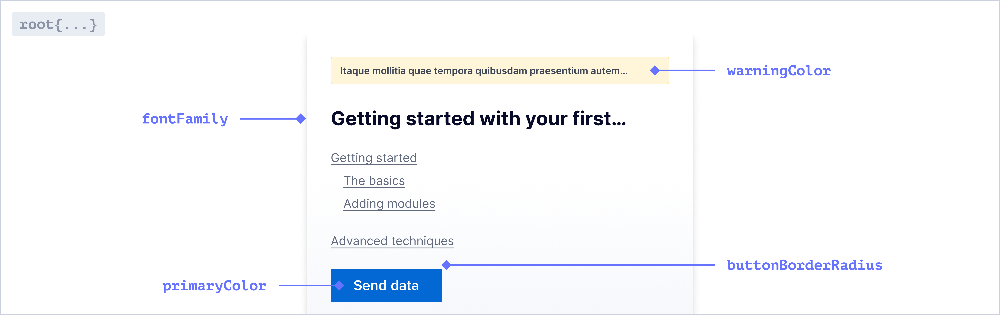
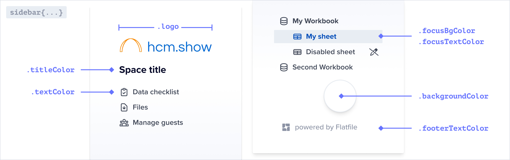

Flatfile supports modifying most UI elements including colors, fonts, borders, padding, and
more via the <Tooltip tip="Learn more about Spaces">[Space](../concepts/spaces)</Tooltip> endpoint.

1. Start by simply updating `theme.root.primaryColor` and `theme.sidebar.logo` when calling `spaces.update()`.
2. If needed, you can customize the theme further with additional css variables.

---

### Building a theme

Learn how to create a Space with a theme, and update a theme from an event listener.

<CodeGroup>

```ts api.js
const updateSpace = await api.spaces.update(spaceId, {
    environmentId: environmentId,
     metadata: {
      theme: {
        root: {
          primaryColor: "red",
        },
        sidebar: {
          logo: "https://image.png",
        },
        //See reference for all possible variables
      }
    }
  }
});
```

```ts listener.js
//listen for an event, and update your theme as a result

listener.on('space:created', (event) => {
  const updateSpace = await flatfile.spaces.update(spaceId, {});
})
```
</CodeGroup>

---

## Theme reference

### `theme.root`


<ParamField path="fontFamily" type="string">The font family used throughout the application.</ParamField>
<ParamField path="primaryColor" type="string">The primary color used throughout the application.</ParamField>
<ParamField path="dangerColor" type="string">The color used for error messages.</ParamField>
<ParamField path="warningColor" type="string">The color used for warning messages.</ParamField>
<ParamField path="actionColor" type="string">The color used for the primary action.</ParamField>

### `theme.sidebar`


<ParamField path="logo" type="string">The logo displayed in the sidebar.</ParamField>
<ParamField path="textColor" type="string">The color of the text in the sidebar.</ParamField>
<ParamField path="titleColor" type="string">The color of the title in the sidebar.</ParamField>
<ParamField path="focusBgColor" type="string">The background color of the sidebar when it is focused.</ParamField>
<ParamField path="focusTextColor" type="string">The text color of a navigation link when it is focused.</ParamField>
<ParamField path="activeTextColor" type="string">The text color of a navigation link when it is the active page.</ParamField>
<ParamField path="backgroundColor" type="string">The background color of the sidebar.</ParamField>
<ParamField path="footerTextColor" type="string">The text color of the footer in the sidebar.</ParamField>
<ParamField path="textUltralightColor" type="string">The color of the icons in the sidebar.</ParamField>
<ParamField path="borderColor" type="string">The color of horizontal lines between sections in the navigation.</ParamField>

### `theme.document`


<ParamField path="borderColor" type="string">The color of horizontal rules in Documents.</ParamField>

### `theme.table`


<ParamField path="fontFamily" type="string">The font family used throughout the table.</ParamField>

#### `theme.table.inputs`


<ParamField path="inputs.radio.color" type="string">The color of the radio buttons in the table.</ParamField>
<ParamField path="inputs.checkbox.color" type="string">The color of the checkboxes in the table.</ParamField>

#### `theme.table.filters`


<ParamField path="filters.color" type="string">The color of the filter buttons in the table.</ParamField>
<ParamField path="filters.active.backgroundColor" type="string">The background color of the active filter buttons in the table.</ParamField>
<ParamField path="filters.error.activeBackgroundColor" type="string">The background color of the active filter buttons in the table when there is an error.</ParamField>

#### `theme.table.column`


<ParamField path="column.header.fontSize" type="string">The font size of the column headers in the table.</ParamField>
<ParamField path="column.header.backgroundColor" type="string">The background color of the column headers in the table.</ParamField>
<ParamField path="column.header.color" type="string">The color of the column headers in the table.</ParamField>
<ParamField path="column.header.dragHandle.idle" type="string">The color of the drag handle when it is idle.</ParamField>
<ParamField path="column.header.dragHandle.dragging" type="string">The color of the drag handle when it is being dragged.</ParamField>

#### `theme.table.indexColumn`


<ParamField path="indexColumn.backgroundColor" type="string">The background color of the first column in the table.</ParamField>
<ParamField path="indexColumn.selected.color" type="string">The color of the selected first column in the table.</ParamField>
<ParamField path="indexColumn.selected.backgroundColor" type="string">The background color of the first column in the table when selected.</ParamField>

#### `theme.table.cell`


<ParamField path="cell.selected.backgroundColor" type="string">The background color of the selected cells in the table.</ParamField>
<ParamField path="cell.active.borderColor" type="string">The border color of the active cells in the table.</ParamField>
<ParamField path="cell.active.spinnerColor" type="string">The spinner color of the active cells in the table.</ParamField>

#### `theme.table.boolean`


<ParamField path="boolean.toggleChecked" type="string">The color of a toggle when it is checked.</ParamField>
