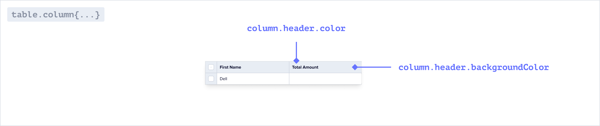
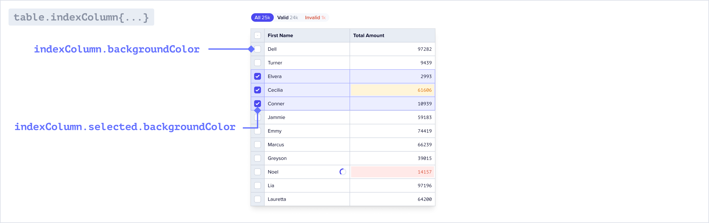

Flatfile supports modifying most UI elements including colors, fonts, borders, padding, and
more via the <Tooltip tip="A micro-application...">[Space](../concepts/spaces)</Tooltip> endpoint.

1. Start by simply updating `theme.root.primaryColor` and `theme.sidebar.logo` when calling `spaces.update()`.
2. If needed, you can customize the theme further with additional css variables.

---

### Building a theme

Learn how to create a Space with a theme, and update a theme from an Event listener.

<CodeGroup>

```js
const updateSpace = await api.spaces.update(spaceId, {
  environmentId,
  metadata: {
    theme: {
      root: {
        primaryColor: "red",
      },
      sidebar: {
        logo: "https://image.png",
      },
      // See reference for all possible variables
    }
  }
});
```

```js listener.js
//listen for an event, and update your theme as a result

listener.on('space:created', async (event) => {
  const updateSpace = await flatfile.spaces.update(spaceId, {});
});
```

```js listener.ts
//listen for an event, and update your theme as a result

listener.on('space:created', async (event: FlatfileEvent) => {
  const updateSpace = await flatfile.spaces.update(spaceId, {});
});
```
</CodeGroup>

---

## Theme reference

### `theme.root`


<Tip>
The sidebar, table and document will automatically inherit theming from your root variables! 
</Tip>

<ParamField path="fontFamily" type="string">The font family used throughout the application.</ParamField>
<ParamField path="buttonBorderRadius" type="string">The border radius for all buttons.</ParamField>
<ParamField path="primaryColor" type="string">The primary color used throughout the application.</ParamField>
<ParamField path="dangerColor" type="string">The color used for error messages.</ParamField>
<ParamField path="warningColor" type="string">The color used for warning messages.</ParamField>
<ParamField path="actionColor" type="string">The color used for the primary Action.</ParamField>
<ParamField path="successColor" type="string">The color used for successful Actions.</ParamField>

### `theme.sidebar`

<Info>
  You can override the default colors of the sidebar below. If these are not set they will inherit from your root colors.
</Info>

<ParamField path="logo" type="string">The img path for the logo displayed in the sidebar.</ParamField>
<ParamField path="textColor" type="string">The color of the text in the sidebar.</ParamField>
<ParamField path="titleColor" type="string">The color of the title in the sidebar.</ParamField>
<ParamField path="focusBgColor" type="string">The background color of the sidebar when it is focused.</ParamField>
<ParamField path="focusTextColor" type="string">The text color of a navigation link when it is focused.</ParamField>
<ParamField path="activeTextColor" type="string">The text color of a navigation link when it is the active page.</ParamField>
<ParamField path="backgroundColor" type="string">The background color of the sidebar.</ParamField>
<ParamField path="footerTextColor" type="string">The text color of the footer in the sidebar.</ParamField>
<ParamField path="textUltralightColor" type="string">The color of the icons in the sidebar.</ParamField>
<ParamField path="borderColor" type="string">The color of horizontal lines between sections in the navigation.</ParamField>

### `theme.document`


<ParamField path="borderColor" type="string">The color of horizontal rules in Documents.</ParamField>

### `theme.table`

<Info>
  You can override the default colors of the table below. If these are not set they will inherit from your root colors.
</Info>

<ParamField path="fontFamily" type="string">The font family used throughout the table.</ParamField>

##### `theme.table.column`


<ParamField path="column.header.backgroundColor" type="string">The background color of the column headers in the table.</ParamField>
<ParamField path="column.header.color" type="string">The text color of the column headers in the table.</ParamField>

##### `theme.table.indexColumn`


<ParamField path="indexColumn.backgroundColor" type="string">The background color of the first column in the table.</ParamField>
<ParamField path="indexColumn.color" type="string">The text color of the first column in the table.</ParamField>
<ParamField path="indexColumn.selected.color" type="string">The text color of the selected first column in the table.</ParamField>
<ParamField path="indexColumn.selected.backgroundColor" type="string">The background color of the first column in the table when selected.</ParamField>

##### `theme.table.inputs`


<ParamField path="inputs.checkbox.color" type="string">The color of the checkboxes in the table.</ParamField>


