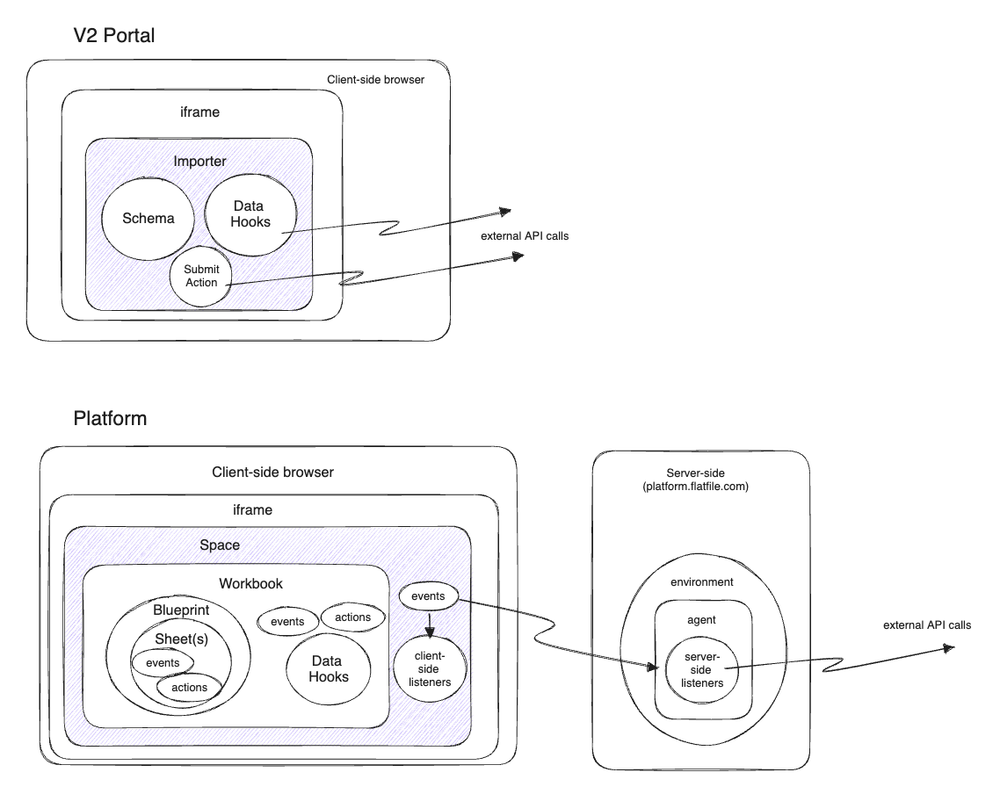

When converting from Portal 2.0 to Platform, there are quite a few similarities that are almost 1-to-1, and there are also some things that have either gone away, moved, or completely changed. This guide is meant to help you quickly discover all the similarities and differences between the two implementations and get converted with ease.

## New Concepts

Here is a good visual of the differences between the two products. One thing to note is while there are quite a few more and new concepts for Platform than Portal, you will not necessarily need to utilize all the new things to move your existing importer to the new Platform. Let's dive in and talk about the basics of what you'll need.

## Converting your schema and fields
For Platform, we highly recommend you familiarize yourself with the [concept of a Workbook](/quickstart/meet-the-workbook). For the purposes of the upgrade, you can think of a Workbook as where the import data will live. Unlike with Portal, where all of the editing and normalization logic happens within the browser, in Platform, operations are performed server side and the data will be stored along the way within one or more Workbooks. The Workbooks will have one or more Sheets within them that are similar to a Portal schema. Outside of some basic naming and settings, the sheet has a fields array that is very similar to Portal.

Two final notes about some additional terminology you will see used through the documentation. First we have Environments. In Portal, setting `devMode: true`  flagged imports as “dev” imports, but in Platform, there are true Environments. You can have many custom Environments, but upon signup, you will have a Development, Production and Example Environment configured already. And all of the other entities (like a Workbook and Sheet) will live in those Environments. Finally, we have the concept of a Blueprint. In Portal, if you accepted different types of data from the same end users and then combined the data at a later point, you had to setup multiple Portal instances and serve up the proper instance for a particular file. With Blueprints, you have a collection of Sheets (which we said above is similar to your defined schemas from Portal) so that you can have all of your data structures in place inside of one Workbook and can collect all that data in one place and aggregate it there instead of handling many uploads from different schemas on your own.

For purposes of getting you started and testing, we will use the API and a simple cURL request at the end of this to set up a Workbook that closely matches your current Portal implementation. We will also only be doing a 1-to-1 type of walkthrough, but remember that it is possible to bring all your different schema types into one single Blueprint for use in a Workbook.

Let’s start by creating a Workbook and continue adding on piece-by-piece. The workbook has 3 essential pieces: `name`, `environmentId` [get this from your login here](https://platform.flatfile.com), and `sheets` properties.
```json
{
    "name": "Portal to Platform upgrade",
    "environmentId": "YOUR_ENVIRONMENT_ID_HERE",
    "sheets": []
}
```
Let’s dive a bit deeper into Sheets as this is where most of your upgrade will happen.  Sheets will have a lot of similar properties to that of the Portal schema. It will have a `name` (similar to the `type` property from a Portal schema) and `fields` (almost identical to your Portal `fields` array).
```json
{
  "name": "Portal to Platform upgrade",
  "environmentId": "YOUR_ENVIRONMENT_ID_HERE",
  "sheets": [
    {
        "name": "Contacts",
        "slug": "contacts",
        "fields": []
    }
  ]
}
```
For the `fields` array, there are some very similar aspects such as `key`, `label`, and `description` which are all 1-to-1 conversions from Portal. For the `fields` in this example, we are upgrading from one of our Demos from Portal that you can find in this [Codesandbox](https://codesandbox.io/s/sales-demo-v5-ef7kj?file=/src/schemas.js) if you wish you follow along.
```json
{
    "sheets": [
      {
        "name": "Contacts",
        "slug": "contacts",
        "fields": [
            {
              "key": "firstName",
              "label": "First Name"
            },
            {
              "key": "lastName",
              "label": "Last Name"
            },
            {
              "key": "email",
              "label": "Email Address",
              "description": "Please please enter your email"
            },
            {
              "key": "phone",
              "label": "Phone number"
            },
            {
              "key": "date",
              "label": "Date"
            },
            {
              "key": "country",
              "label": "Country"
            },
            {
              "key": "zipCode",
              "label": "Zip Code"
            },
            {
              "key": "subscriber",
              "label": "Subscriber"
            },
            {
              "key": "type",
              "label": "Deal Status"
            }
          ]
        }
    ]
}
```
Let’s expand on this by talking about the Portal and Platform `type` property for fields. When this field is omitted, both Portal and Platform will default to a `string` type. The Portal `type: "checkbox"` is now `"type": "boolean"` while the `type: "select"` is now `"type": "enum"` . It’s also important to note that while there were only 3 types in Portal, Platform has expanded with types for `number`, `date` , and `reference`. You can learn more about these new field types in our [documentation](/blueprint/field-types). Below is also a quick reference table showing all the new types and how they were handled in Portal.

| Portal Type | Platform Type |
| ----------- | ------------- |
| String      | String       |
| String   | Date        |
| String   | Number        |
| Select   | Enum        |
| Checkbox   | Boolean        |
| N/A   | Reference        |

Before adding onto the example, note that when providing you select/enum options there is still an `options` array that is shaped exactly the same as before, however, one thing to note is that this options array has been moved into a new field that is `config` for Platform.  This `config` property also comes into play if you want to have your checkbox/boolean fields behave the same as in Portal. In Portal, it would only allow truthy/falsy values and convert them into booleans. `null` was handled as a false value in Portal. In Platform, the default is to pass through `null` values and `null`. If you want to handle these as `false` , like in Portal, use the `config` object with the `allow_indeterminate` set to `false`.
```json
{
  "fields": [
    {
      "key": "date",
      "type": "date",
      "label": "Date"
    },
    {
      "key": "subscriber",
      "type": "boolean",
      "label": "Subscriber",
      "config": {
        "allow_indeterminate": false
      }
    },
    {
      "key": "type",
      "type": "enum",
      "label": "Deal Status",
      "config": {
        "options":[
          { "label": "New", "value": "new" },
          { "label": "Interested", "value": "interested" },
          { "label": "Meeting", "value": "meeting" },
          { "label": "Opportunity", "value": "opportunity" },
          { "label": "Not a fit", "value": "unqualified" }
        ]
      }
    }
  ]
}
```
The final aspect of converting your Portal fields into Platform fields will be to handle the `validators` from Portal. While Portal offered many different kinds of validators, only two have been converted in the fields themselves, and those are `required` and `unique`. All other validations may still be handled, but would be handled in code instead of a setting.

The `validators` property will now be called `constraints` which is still an array of objects. The object for each validator has traded in the `validates` property for `type` property, but the `unique` and `required` values remain the same.
```json
{
  "fields": [
    {
        "key": "firstName",
        "type": "string",
        "label": "First Name",
        "constraints": [
          { "type": "required" }
        ]
    },
    {
        "key": "email",
        "type": "string",
        "label": "Email Address",
        "description": "Please please enter your email",
        "constraints": [
          { "type": "unique" },
          { "type": "required" }
        ]
    }
  ]
}
```
We have now learned all the aspects of converting your Portal schema to the Platform.

Below, we will take all the aspects of what gets converted above and put it into a full request that works when you put in your secret key and your environment Id from your [Platform login](https://platform.flatfile.com).
```bash
curl --request POST \
  --url https://platform.flatfile.com/api/v1/workbooks \
  --header 'Authorization: Bearer YOUR_SECRET_KEY' \
  --header 'Content-Type: application/json' \
  --data '{
  "name": "Portal to Platform upgrade",
  "environmentId": "YOUR_ENVIRONMENT_ID",
  "sheets": [
    {
      "name": "Contact",
      "slug": "contacts",
      "fields": [
        {
          "key": "firstName",
          "type": "string",
          "label": "First Name",
          "constraints": [
            { "type": "required" }
          ]
        },
        {
          "key": "lastName",
          "type": "string",
          "label": "Last Name"
        },
        {
          "key": "email",
          "type": "string",
          "label": "Email Address",
          "description": "Please please enter your email",
          "constraints": [
            { "type": "unique" }
          ]
        },
        {
          "key": "phone",
          "type": "string",
          "label": "Phone number"
        },
        {
          "key": "date",
          "type": "date",
          "label": "Date"
        },
        {
          "key": "country",
          "type": "string",
          "label": "Country"
        },
        {
          "key": "zipCode",
          "type": "string",
          "label": "Zip Code"
        },
        {
          "key": "subscriber",
          "type": "boolean",
          "label": "Subscriber",
          "config": {
            "allow_indeterminate": false
          }
        },
        {
          "key": "type",
          "type": "enum",
          "label": "Deal Status",
          "config": {
            "options":[
              { "label": "New", "value": "new" },
              { "label": "Interested", "value": "interested" },
              { "label": "Meeting", "value": "meeting" },
              { "label": "Opportunity", "value": "opportunity" },
              { "label": "Not a fit", "value": "unqualified" }
            ]
          }
        }
      ]
    }
  ]
}'
```
