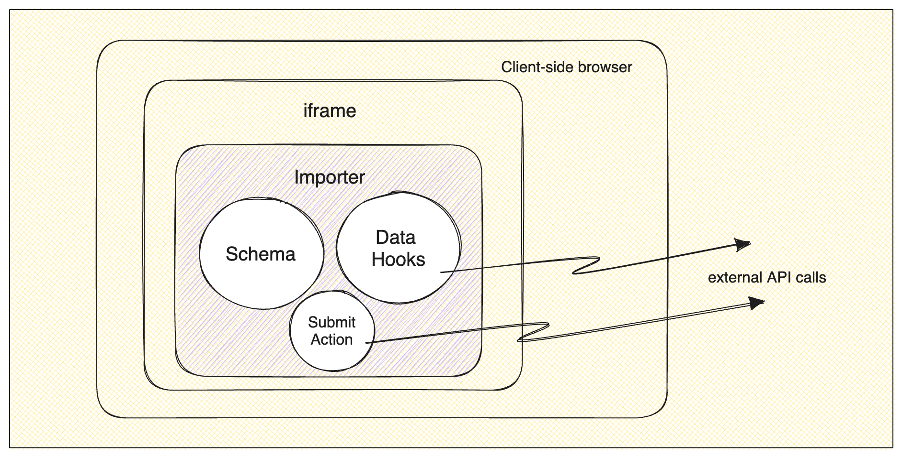
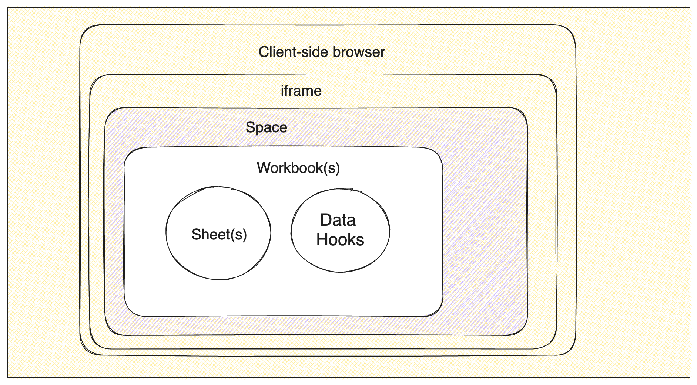
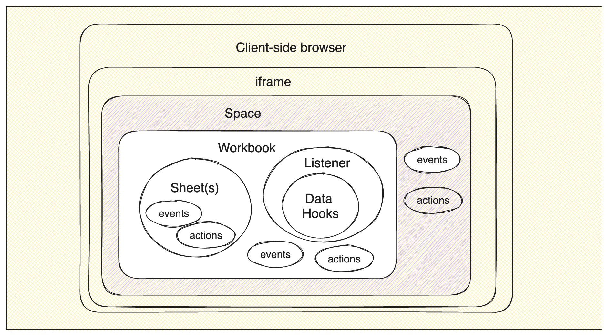

## Overview

As you transition from Portal 2.0 to Platform, you'll come across many familiar elements that resemble what you've known. However, there might be instances where certain components are no longer present, have been rearranged, or sport a fresh appearance. To ensure a seamless transition, this guide is designed to simplify the process for you. It will highlight both the similarities and differences between the two versions, enabling you to switch over effortlessly.

## A comparison

Explore this illustrative diagram that lays out the distinctions between the two products. While Platform introduces a range of additional and novel concepts compared to Portal, rest assured, you're not obligated to embrace every new element to transition your existing importer to Platform. Flexibility remains key in making the switch.

### Review V2 Portal


### Meet the Platform


## New Concepts

### Core Architecture

#### Meet the Workbook

For Platform, it's a good idea to get to know the [concept of a Workbook](/quickstart/meet-the-workbook). When you're upgrading, you can think of a Workbook as the place where your import data hangs out.

Unlike Portal, where all the editing and fixing of data happens right in the browser, Platform does these actions on the server side. The data gets saved in one or more Workbooks as you go along.

Inside these Workbooks, you'll find one or more Sheets, kind of like how Portal has its schemas. Other than some basic names and settings, the sheet has something called a "fields array," which is pretty similar to what you know from Portal.

#### Meet the Space

More info here.
1. New element in the hierarchy
2. Sheets are like the old schemas
3. Workbooks can contain multiple sheets
4. Space can contain multiple workbooks
5. Space can be embedded like V2
6. Can initialize a new space when user initializes it
7. Can also re-use an existing space (simple database idea)

#### Understanding Environments

In Portal, setting `devMode: true` flagged imports as “dev” imports, but in Platform, there are true Environments.

You can have many custom Environments, but upon signup, you will have a Development, Production and Example Environment configured already.

All of the other entities (like a Workbook and Sheet) will live in those Environments.

### Configuring your schema

#### Meet the Blueprint

Back in Portal, when you received diverse data from the same users and wished to merge it afterward, you had to establish distinct Portal configurations and display the appropriate one for each file. However, leveraging Blueprints offers a more streamlined approach. You can employ a collection of Sheets (akin to the schemas you constructed in Portal) within a Workbook. This simplifies the process of centralizing all your data structures and collating the information cohesively. The added advantage is that you're no longer burdened with managing multiple uploads from various schemas.

### Event-driven Architecture

#### Understanding Events, listeners and data hooks
1. describe how whole system generates events.
2. Events can be user triggered or system triggered
3. actions are user triggered events
4. show a list of events
5. actions and events can be at all levels of the hierarchy

#### Using Listeners
1. Talk about how listeners are used to act on events

#### Leveraging Hooks

1. Introduce Hooks Guide

### Full Platform diagram



## Begin the migration

To facilitate your initiation and for testing, we'll leverage the API alongside a straightforward cURL request towards the end. This process will aid in crafting a Workbook that closely mirrors your Portal setup. We'll follow a step-by-step approach resembling a 1-to-1 transition. Do keep in mind, though, that you have the flexibility to consolidate various schema types into a single Blueprint within the Workbook.

TODO: How to do migration
    1. convert schemas to sheets
        1. validations need to move the data hooks
        2. wording changes
    2. convert field hooks and record hooks to data hooks inside a listener
        1. Syntax differences
        2. mention that field hooks can be replaced by bulk record hook.

### 1. Create a Workbook

To get started, let's begin by creating a Workbook and then progressively enhancing it. The workbook consists of three crucial components: the `name`, the `environmentId` (which you can locate in your [login here](https://platform.flatfile.com)), and the `sheets` properties.

```json
{
  "name": "Portal to Platform upgrade",
  "environmentId": "YOUR_ENVIRONMENT_ID_HERE",
  "sheets": []
}
```

### 2. Create Sheet(s)

Let's take a closer look at Sheets, as this is where the bulk of your upgrade work will occur. Sheets will share many properties with those found in the Portal schema. You'll encounter a `name` property (akin to the `type` property in a Portal schema) and `fields` (which closely resembles your Portal `fields` array).

```json
{
  "name": "Portal to Platform upgrade",
  "environmentId": "YOUR_ENVIRONMENT_ID_HERE",
  "sheets": [
    {
      "name": "Contacts",
      "slug": "contacts",
      "fields": []
    }
  ]
}
```

### 3. Create Fields

When it comes to the `fields` array, you'll find quite a few familiar elements like `key`, `label`, and `description`, which all transition directly from Portal. In this scenario, we're upgrading from one of our Demos in Portal, and you can track the process in this [Codesandbox](https://codesandbox.io/s/sales-demo-v5-ef7kj?file=/src/schemas.js) if you'd like to follow along.

```json
{
  "sheets": [
    {
      "name": "Contacts",
      "slug": "contacts",
      "fields": [
        {
          "key": "firstName",
          "label": "First Name"
        },
        {
          "key": "lastName",
          "label": "Last Name"
        },
        {
          "key": "email",
          "label": "Email Address",
          "description": "Please please enter your email"
        },
        {
          "key": "phone",
          "label": "Phone number"
        },
        {
          "key": "date",
          "label": "Date"
        },
        {
          "key": "country",
          "label": "Country"
        },
        {
          "key": "zipCode",
          "label": "Zip Code"
        },
        {
          "key": "subscriber",
          "label": "Subscriber"
        },
        {
          "key": "type",
          "label": "Deal Status"
        }
      ]
    }
  ]
}
```

#### About field Types

Let's delve deeper into the Portal and Platform `type` property for fields. When you don't specify this field, both Portal and Platform will assume a default `string` type. In Portal, the `type: "checkbox"` is now `"type": "boolean"`, and the `type: "select"` is now `"type": "enum"` in Platform.

Furthermore, keep in mind that while Portal only had three types, Platform has broadened its range to include `number`, `date`, and `reference` types. To get more details about these new field types, you can check out our [documentation](/blueprint/field-types). Also, we've prepared a handy reference table below, outlining all the new types and how they were handled in Portal.

| Portal Type | Platform Type |
| ----------- | ------------- |
| String      | String        |
| String      | Date          |
| String      | Number        |
| Select      | Enum          |
| Checkbox    | Boolean       |
| N/A         | Reference     |

Before adding onto the example, note that when providing you select/enum options there is still an `options` array that is shaped exactly the same as before, however, one thing to note is that this options array has been moved into a new field that is `config` for Platform. This `config` property also comes into play if you want to have your checkbox/boolean fields behave the same as in Portal. In Portal, it would only allow truthy/falsy values and convert them into booleans. `null` was handled as a false value in Portal. In Platform, the default is to pass through `null` values and `null`. If you want to handle these as `false` , like in Portal, use the `config` object with the `allow_indeterminate` set to `false`.

```json
{
  "fields": [
    {
      "key": "date",
      "type": "date",
      "label": "Date"
    },
    {
      "key": "subscriber",
      "type": "boolean",
      "label": "Subscriber",
      "config": {
        "allow_indeterminate": false
      }
    },
    {
      "key": "type",
      "type": "enum",
      "label": "Deal Status",
      "config": {
        "options": [
          { "label": "New", "value": "new" },
          { "label": "Interested", "value": "interested" },
          { "label": "Meeting", "value": "meeting" },
          { "label": "Opportunity", "value": "opportunity" },
          { "label": "Not a fit", "value": "unqualified" }
        ]
      }
    }
  ]
}
```

#### Setup validations

The final aspect of converting your Portal fields into Platform fields will be to handle the `validators` from Portal. While Portal offered many different kinds of validators, only two have been converted in the fields themselves, and those are `required` and `unique`. All other validations may still be handled, but would be handled in code instead of a setting.

The `validators` property will now be called `constraints` which is still an array of objects. The object for each validator has traded in the `validates` property for `type` property, but the `unique` and `required` values remain the same.

```json
{
  "fields": [
    {
      "key": "firstName",
      "type": "string",
      "label": "First Name",
      "constraints": [{ "type": "required" }]
    },
    {
      "key": "email",
      "type": "string",
      "label": "Email Address",
      "description": "Please please enter your email",
      "constraints": [{ "type": "unique" }, { "type": "required" }]
    }
  ]
}
```

### 4. Send API Request

We have now learned all the aspects of converting your Portal schema to the Platform.

Below, we will take all the aspects of what gets converted above and put it into a full request that works.

<Note>
  {" "}
  You'll need your your Secret Key and your Environment Id from your [Dashboard](https://platform.flatfile.com).
</Note>

```bash
curl --request POST \
  --url https://platform.flatfile.com/api/v1/workbooks \
  --header 'Authorization: Bearer YOUR_SECRET_KEY' \
  --header 'Content-Type: application/json' \
  --data '{
  "name": "Portal to Platform upgrade",
  "environmentId": "YOUR_ENVIRONMENT_ID",
  "sheets": [
    {
      "name": "Contact",
      "slug": "contacts",
      "fields": [
        {
          "key": "firstName",
          "type": "string",
          "label": "First Name",
          "constraints": [
            { "type": "required" }
          ]
        },
        {
          "key": "lastName",
          "type": "string",
          "label": "Last Name"
        },
        {
          "key": "email",
          "type": "string",
          "label": "Email Address",
          "description": "Please please enter your email",
          "constraints": [
            { "type": "unique" }
          ]
        },
        {
          "key": "phone",
          "type": "string",
          "label": "Phone number"
        },
        {
          "key": "date",
          "type": "date",
          "label": "Date"
        },
        {
          "key": "country",
          "type": "string",
          "label": "Country"
        },
        {
          "key": "zipCode",
          "type": "string",
          "label": "Zip Code"
        },
        {
          "key": "subscriber",
          "type": "boolean",
          "label": "Subscriber",
          "config": {
            "allow_indeterminate": false
          }
        },
        {
          "key": "type",
          "type": "enum",
          "label": "Deal Status",
          "config": {
            "options":[
              { "label": "New", "value": "new" },
              { "label": "Interested", "value": "interested" },
              { "label": "Meeting", "value": "meeting" },
              { "label": "Opportunity", "value": "opportunity" },
              { "label": "Not a fit", "value": "unqualified" }
            ]
          }
        }
      ]
    }
  ]
}'
```
## Embed your space

The final piece to utilizing the newly created Space is embedding it in your application. There is a [full embed guide](/guides/use-cases/embedding/javascript/guide) for this, but we will cover the bare minimum here.

You'll need to install the Flatfile JavaScript package.

<CodeGroup>

    ```npm npm
    npm install @flatfile/javascript@latest
    ```

    ```yarn yarn
    yarn add @flatfile/javascript@latest
    ```

</CodeGroup>

You'll then need to attach the `openFlatfile` method to your button. It should look something like this:

```html public/index.html
<button onclick="openFlatfile('pk_1234')">
    Create new Space
</button>
```

Then in your JavaScript file, you'll need to initialize Flatfile. Note that when attaching the instance to the specific workspace, you will need to head back into your Platform dashboard and get the Space Id and

```js src/client.js
import { initializeFlatfile } from "@flatfile/javascript";

//create a new space in modal
window.openFlatfile = (publishableKey) => {
  const flatfileOptions = {
    publishableKey,
    space: {
        id: 'YOUR_SPACE_ID',
        accessToken: 'YOUR_PRIVATE_KEY'
    }
    // Additional props...
  };

  initializeFlatfile(flatfileOptions);
};
```

Once this is done, you'll see the space you've created open when clicking the button inside your application. 🎉

## Make it more valuable

While this guide is meant to help you understand how your current v2 implementation will look and feel in the new Platform, there are many more new features and items to make what you were doing in Portal more useful. We recommend you check out these resources to help you expand on what you've just created here.

-
