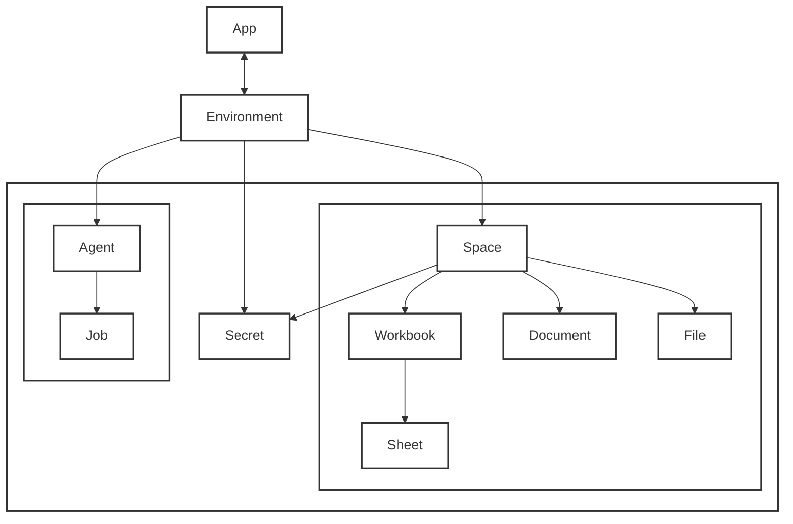

Our platform follows a hierarchical structure designed to provide secure, organized access to various resources and automation capabilities. This document outlines the core components and their relationships.

### App

Apps are a concept for organizing Spaces. They exist across environments, supporting a a development pipeline moving from development, to staging to production.

### Environment
An Environment serves as a container that encompasses three main component groups:

- **Spaces**: Micro-applications that handle content and data storage
- **Agents**: Listeners securely deployed on the Flatfile Cloud that manage automation and job execution
- **Secrets**: Provide secure credential management

### Spaces
A space is a micro-applications, each with their own database, filestore, and auth.

- **Files**: Basic file storage
- **Documents**: Structured document storage
- **Workbooks**: Contain one or more Sheets
- **Sheets**: Individual data sheets within Workbooks

### Agents
Agents are functions customized by you to listen for events and execute jobs. Manage agents with our [CLI](/documentation/core-libraries/cli) and deploy them to the Flatfile Cloud for secure handling of your jobs and events.

- **Agents**: Main automation workers
- **Jobs**: Individual tasks executed by Agents
