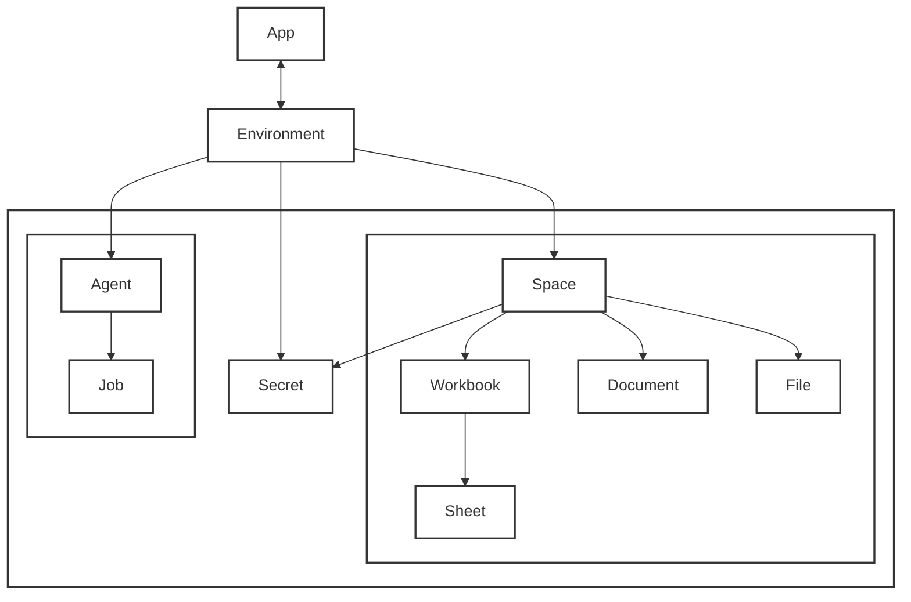

Our platform follows a hierarchical structure designed to provide secure, organized access to various resources and automation capabilities. This document outlines the core components and their relationships.

 

Learn more about Flatfile by understanding our core elements.

<CardGroup cols={3}>
  <Card title="Apps" icon="grid" href='/learning-center/architecture/apps'>
    Manage and coordinate data import workflows across environments.
  </Card>
  <Card title="Environments" icon="seedling"  href='/learning-center/architecture/environments'>
    Secure, isolated contexts for data import workflows.
  </Card>
  <Card title="Spaces" icon="planet-ringed"  href='/learning-center/architecture/spaces'>
    Micro-applications for content and data storage.
  </Card>
  <Card title="Workbooks" icon="books"  href='/learning-center/architecture/workbooks'>
    Containers data Sheets with defined schemas.
  </Card>
  <Card title="Agents" icon="server"  href='/learning-center/concepts/listeners'>
    Event-driven functions for automating workflows.
  </Card>
  <Card title="Jobs" icon="truck"  href='/learning-center/concepts/jobs'>
    Discrete tasks executed by Agents in response to events.
  </Card>
</CardGroup>

