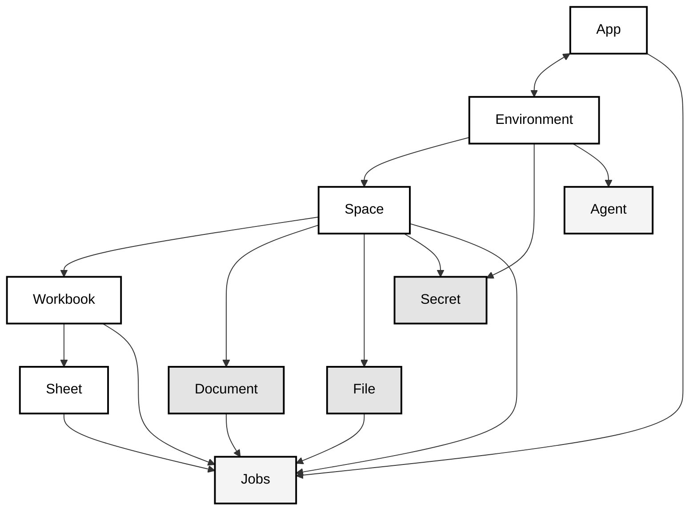

Whether you're handling customer data imports, migrating between systems, or building data transformation workflows, Flatfile provides the tools and flexibility to make data exchange seamless and reliable.

Flatfile is a powerful data exchange platform that simplifies the complex process of importing, validating, and transforming data. Built for developers, it provides a flexible and robust infrastructure to handle data onboarding workflows at scale.

## Core Features

- **Workbook-Based Architecture**: Organize your data imports into workbooks containing multiple sheets, providing a familiar spreadsheet-like interface for end users while maintaining powerful programmatic control.

- **Validation & Transformation**: Define custom constraints and transformations to ensure data quality and consistency before it reaches your systems.

- **Real-Time Collaboration**: Enable multiple users to work simultaneously on data imports with built-in collaboration features and role-based access control.

- **Extensible API**: Access all platform functionality through a comprehensive REST API, with official SDKs available for multiple languages.
