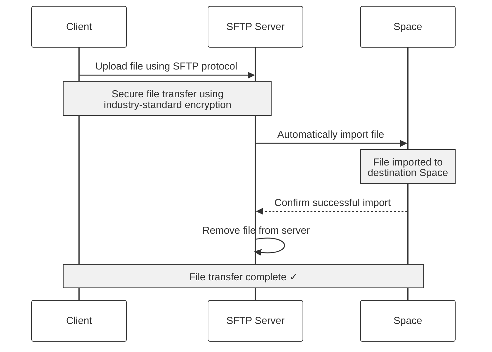
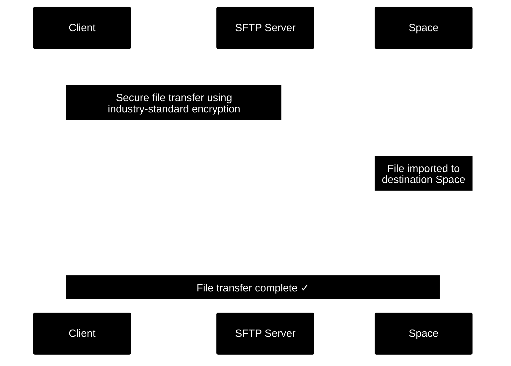

<Snippet file="shared/projects_only.mdx" />

## SFTP Process

Flatfile's SFTP upload process allows you to transfer files directly into your Flatfile space using the industry-standard SFTP protocol. SFTP uploads are ideal for automated processes or handling very large files.

When you upload a file to Flatfile using SFTP, our system initiates a secure, automated workflow. The file is first transferred to our SFTP server using industry-standard encryption protocols, then seamlessly moved into your destination Space, and finally removed from the SFTP server once the transfer is confirmed successful.

<br/>
<div class="dark:hidden">

</div>
<div class="hidden dark:block">

</div>
<br/>

## Obtaining Credentials

Uploading files via SFTP requires credentials. You can obtain these credentials from the Files tab in your destination Space or from the API.

<Warning>
   Each space has its own unique set of credentials that cannot be shared or used with other spaces.
   Keep these credentials secure and never share them in public forums or repositories.
</Warning>

### From Your Files Page

1. In the destination Space, navigate to the Files tab.

2. Click <b>Get SFTP Credentials</b>.


<Info>
   If <b>Get SFTP Credentials</b> is not visible, please reach out to Support to enable Projects. 
</Info>

3. Save your credentials to a secure location.

### From the API

1. Obtain your Secret Key from the [API Keys](https://platform.flatfile.com/dashboard/keys-and-secrets) page.
2. Obtain your Space ID from the Spaces list or the url of your Space.
3. Make an authenticated request to the sftp-credentials endpoint.

<CodeGroup>
```terminal request
curl -G https://api.x.flatfile.com/v1/auth/sftp-credentials \
   -H "Authorization: Bearer sk_123" \
   -d spaceId="us_sp_123"
```

```terminal response
{
  "data": {
    "username": <us_sp_123>,
    "password": <secret_sftp_password>,
    "host": "sftp.flatfile.com",
    "port": "22"
  }
}
```

</CodeGroup>
<br/>
4. Save your credentials to a secure location.


## SFTP Connection

The command line provides a direct way to facilitate SFTP transfers, though other free and open-source SFTP clients are available.

<Expandable title="Reference: Basic SFTP Commands">
   <ParamField path="sftp" type="<username>@<hostname>">
      Connect to the SFTP server <br/>
      Example: sftp us_sp_123@sftp.flatfile.com
   </ParamField>
   <ParamField path="put" type="<file>">
      Upload a file <br/>
      Example: put myfile.csv
   </ParamField>
   <ParamField path="exit">
      Close the SFTP connection <br/>
      Example: exit
   </ParamField>
</Expandable>

### Uploading Files

1. Navigate to the directory containing the file you want to upload.

2. From that directory, connect to the SFTP server.

<Note>
   On your first connection you will be prompted to verify the host key.
</Note>

<CodeGroup>
```bash connect
sftp us_sp_123@sftp.flatfile.com
```   

```bash verify host key
sftp us_sp_123@sftp.flatfile.com
The authenticity of host 'sftp.flatfile.com' can't be verified...
Are you sure you want to continue connecting (yes/no)?
```   
</CodeGroup>

3. When prompted, enter your password.


```bash password
us_sp_123@sftp.flatfile.com's password:
```   

4. Upload a file.

```bash upload
sftp> put myfile.csv
```

As the file uploads, your terminal will display the progress of the upload.

<Note>
   Flatfile accepts files up to 100 MB. If you need to upload larger files, please reach out to Support.
</Note>

5. Close the connection.

```bash exit
sftp> exit
```

### Troubleshooting

If you encounter issues while connecting to the SFTP Server, here are some common error messages and their solutions.

| Error Message| Solution                                                                                    |
|-------------------------------|----------------------------------------------------------------------------|
| `Connection refused`          | Check your firewall settings and ensure port 22 is open.                   |
| `Authentication failed`       | Verify your credentials haven't expired, refetch credentials if necessary. |
| `Permission denied`           | Confirm you're using the correct credentials for the destination Space.    |
| `Host key verification failed`| Confirm the host key when prompted to verify.                              |

<Tip>
   For operational efficiency, this process can be automated through scripting to minimize manual intervention.
</Tip>
