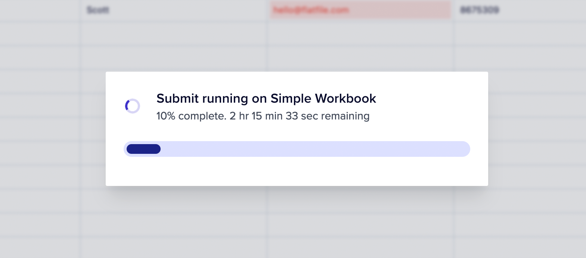

In Flatfile, a Job represents a large unit of work performed asynchronously on a resource
such as a file, <Tooltip tip="Analogous to a database...">[Workbook](../apps/workbooks)</Tooltip>,
or <Tooltip tip="A collection of fields...">[Sheet](../blueprint/overview#terms)</Tooltip>.
The Jobs workflow provides visibility into the status and progress of your Jobs,
allowing you to monitor and troubleshoot the data processing pipeline.

## Types of Jobs

Jobs can be triggered in a number of ways, most commonly in response to user activity.
Jobs are then managed via [Listeners](/orchestration/listeners), which receive [Events](/orchestration/events) published by Flatfile in response to activity.

There are three types of Jobs on the Flatfile Platform:

<CardGroup cols={3}>
  <Card
    title="Action Jobs"
    icon="bolt"
    href="/orchestration/jobs#action-based-jobs"
  >
    Attached to custom actions
  </Card>
  <Card title="Custom Jobs" icon="code" href="/orchestration/jobs#custom-jobs">
    Created dynamically in your listener
  </Card>
  <Card title="System Jobs" icon="gears" href="/orchestration/jobs#system-jobs">
    Flatfile system jobs
  </Card>
</CardGroup>

### Action Based Jobs

Actions are developer-defined operations that can be mounted on a number of domains (including Sheets, Workbooks, Documents, and Files).
Mounting an Action means attaching a custom operation to that domain.
That operation can then be triggered by a user event (clicking a button or selecting a menu item).

<Note>
  When an Action is triggered a `job:ready` Event for a Job named
  `[domain]:[operation]` is published. Your [Listener](/orchestration/listeners)
  can then be configured to respond to that Action via it's Event.
</Note>

To run an Action based job, two configurations are necessary.

First, create an [Action](/orchestration/actions) on a domain. Here's an example of a Workbook containing an Action:

```jsx javascript
api.workbook.create({
  name: "October Report Workbook",
  actions: [
    {
      label: "Export Data",
      description: "Send data to destination system",
      operation: "export",
      type: "file",
    },
  ],
});
```

Then, create a [Listener](/orchestration/listeners) to respond to the Action:

```jsx javascript
listener.on(
  "job:ready",
  { job: "workbook:export" },
  ({ context: { jobId } }, payload) => {
    const { jobId } = event.context;

    try {
        await api.jobs.ack(jobId, {
          info: "Starting submit job...",
          progress: 10,
        });

        // Custom code here

        await api.jobs.complete(jobId, {
          outcome: {
            message: "Submit Job was completed succesfully.",
          },
        });

    } catch (error) {
        await api.jobs.fail(jobId, {
          outcome: {
            message: "This Job failed.",
          },
        });
    }
  }
);
```

Note that the Listener is listening for the `job:ready` event, for the `workbook:export` Job, which was defined in our Workbook.

### Custom Jobs

Another trigger option is to create a Custom Job via SDK/API. In the SDK, Jobs are created by calling the `api.jobs.create()` method.

Creating a custom Job in your Listener enables any Event to trigger a Job.

Here's an example of creating a custom Job in a Listener:

```jsx javascript
listener.on(
  "commit:created",
  { sheet: "contacts" },
  async ({ context: { workbookId, sheetId } }) => {
    const { data } = await api.jobs.create({
      type: "workbook",
      operation: "myCustomOperation",
      trigger: "immediate",
      source: workbookId,
      config: {
        sheet: sheetId,
        filter: "all",
      },
    });
  }
);
```

Note that the trigger for this Listener is set to immediate, which means that the Job will be created and executed immediately upon the Event firing.

Therefore, we should have our Listener ready to respond to this Job:

```jsx javascript
listener.on(
  "job:ready",
  { job: "workbook:myCustomOperation" },
  async ({ context: { jobId, workbookId }, payload }) => {
    try {
      await api.jobs.ack(jobId, {
        info: "Starting my custom operation.",
        progress: 10,
      });

      // Custom code here.

      await api.jobs.complete(jobId, {
        outcome: {
          message: "Sucessfully completed my custom operation.",
        },
      });
    } catch {
      await api.jobs.fail(jobId, {
        outcome: {
          message: "Custom operation failed.",
        },
      });
    }
  }
);
```

<Warning>
  Please note that Flatfile does not support Job plans for custom Actions.
</Warning>

### System Jobs

Internally, Flatfile uses Jobs to power many of the features of the Flatfile Platform, such as extraction, record mutation, and AI Assist.
Here are some examples of Jobs that the Flatfile Platform creates and manages on your behalf:

| Job Name        | Description                                                   |
| --------------- | ------------------------------------------------------------- |
| `Extract`       | Extracts data from the specified source.                      |
| `Map`           | Maps data from it's ingress format to Blueprint fields.       |
| `DeleteRecords` | Deletes records from a dataset based on specified criteria.   |
| `Export`        | Exports data to a specified format or destination.            |
| `MutateRecords` | Alters records in a dataset according to defined rules.       |
| `Configure`     | Sets up or modifies the configuration of a Space.             |
| `AiAssist`      | Utilizes AI to assist with tasks such as data categorization. |
| `FindReplace`   | Searches for specific values and replaces them.               |

<Note>
  The`space:configure` Job is the only system-level Job published for developer
  consumption. This is a special Job that allows developers to configure their
  Spaces dynamically. See our [Space
  Configuration](/guides/dynamic-configurations) documentation for more
  information.
</Note>

## The Anatomy of a Job

### Lifecycle Events

Jobs fire the following Events during their lifecycle. In chronological order, the Job Events are:

| Event                           | Description                                                                                                                                                                        |
| ------------------------------- | ---------------------------------------------------------------------------------------------------------------------------------------------------------------------------------- |
| `job:created`                   | Fires when a Job is created, but before it does anything.                                                                                                                          |
| `job:ready`                     | Fires when a Job is ready to move into the execution stage, but before it does anything.                                                                                           |
| `job:updated`                   | Fires when there is an update to a Job while it is executing.                                                                                                                      |
| `job:completed` OR `job:failed` | `job:completed` fires when a Job is completed successfully, `job:failed` fires if a Job is completed but fails. One of these events will fire upon Job completion, but never both. |
| `job:outcome-acknowledged`      | Fires when a user acknowledges the completion of a Job through a UI popup.                                                                                                         |

You can listen on any of these events in your [Listener](/orchestration/listeners), but the most common event to listen for is `job:ready`.
For more on managing your Job see [Working with Jobs](#working-with-jobs).

### Required Parameters

<ParamField path="type" type="string" required>
  Workbook, File, Sheet, Space
</ParamField>

<ParamField path="operation" type="string" required>
  `export`, `extract`, `map`, `delete`, etc
</ParamField>

<ParamField path="source" type="string" required>
  The id of the data source (FileId, WorkbookId, or SheetId)
</ParamField>

### Optional Parameters

<ParamField path="trigger" type="string" optional>
  `manual` or `immediate`
</ParamField>

<ParamField path="destination" type="string" optional>
  The id of the data target (if any)
</ParamField>

<ParamField path="status" type="string" optional>
  `created`, `planning`, `scheduled`, `ready`, `executing`, `complete`,
  `failed`, `cancelled`
</ParamField>

<ParamField path="progress" type="number" optional>
  A numerical or percentage value indicating the completion status of the Job.
</ParamField>

<ParamField path="estimatedCompletionAt" type="date" optional>
  An estimated completion time. The UI will display the estimated processing
  time in the foreground Job overlay.
</ParamField>

<ParamField path="formAction" type="object" optional>

|               |                                                                                   |
| ------------- | --------------------------------------------------------------------------------- |
| `label`       | A user-friendly name for the action.                                              |
| `description` | A string describing the action.                                                   |
| `tooltip`     | Additional info on hover.                                                         |
| `schedule`    | `weekly`, `daily`, `hourly`                                                       |
| `operation`   | The operation to perform.                                                         |
| `mode`        | `foreground, background, toolbarBlocking`                                         |
| `primary`     | Whether this action is considered the primary or default action.                  |
| `confirm`     | Whether user confirmation is required before the action is executed.              |
| `icon`        | Icon representative of the action.                                                |
| `inputForm`   | `{ type: simple, fields: { key, label, description, type, *config, constraints }` |
| `*config`     | `{ options: { value, label, description, color, icon, meta } }`                   |

</ParamField>

<ParamField path="input" type="string" optional>
  Input parameters for the Job type.
</ParamField>

<ParamField path="subject" type="object" optional>

|          |                                                            |
| -------- | ---------------------------------------------------------- |
| resource | Identifier for the subject resource.                       |
| type     | resource, collection                                       |
| query    | The query used to locate or identify the subject resource. |
| params   | Parameters that detail or modify the subject query.        |

</ParamField>

<ParamField path="outcome" type="object" optional>

|             |                                                         |
| ----------- | ------------------------------------------------------- |
| heading     | The heading text summarizing the outcome of the action. |
| acknowledge | Indicates if the outcome requires user acknowledgment.  |
| message     | Detailed message describing the outcome.                |
| buttonText  | Label for the button to acknowledge the outcome.        |
| next        | `{ id, url, download, wait, snapshot, retry }`          |

</ParamField>

<ParamField path="info" type="string" optional>
  Additional information regarding the Job's current status.
</ParamField>

<ParamField path="managed" type="string" optional>
  Indicates whether the Job is managed by the Flatfile platform or not.
</ParamField>

<ParamField path="mode" type="string" optional>
  `foreground`, `background`, `toolbarBlocking`
</ParamField>

Please see our [API Reference](https://reference.flatfile.com/api-reference/jobs/) for details on all possible values.

## Working with Jobs

Jobs can be managed via SDK/API. For a complete list of ways to interact with Jobs please see our [API Reference](https://reference.flatfile.com) . Commonly, Jobs are acknowledged, progressed, and then completed, or failed. Here's look at those steps.

<Note>
  You can also use the [JobHandler Plugin](/plugins/core/job-handler) which
  simplifies the handling of Flatfile Jobs. This plugin works by listening to
  the `job:ready` event and executing the handler callback. There is an optional
  tick function which updates the Job's progress.
</Note>

### Jobs.Ack

First, acknowledge a Job. This will update the Job's status to `executing`.

```jsx javascript
await api.jobs.ack(jobId, {
  info: "Starting submit job...",
  progress: 10,
});
```

### Jobs.Update

Once a Job is acknowledged, you can begin running your custom operation. Jobs were designed to handle large procesing loads, but you can easily update your user by updating the Job with a progress value.

```jsx javascript
await api.jobs.update(jobId, {
  progress: 50,
  estimatedCompletionAt: new Date("Tue Aug 23 2023 16:19:42 GMT-0700"),
});
```

`Progress` is a numerical or percentage value indicating the completion status of the work.
You may also provide an `estimatedCompletionAt` value which will display your estimate of the remaining processing time in the foreground Job overlay.
Additionally, the Jobs Panel will share visibility into the estimated remaining time for acknowledged jobs.



Finally, when your Job is complete, update the Job's status to `complete`. This status update includes an optional outcome message which will be displayed to the user.
Use this to provide detail on the outcome of the Job.

### Jobs.Complete

Once a job is complete, you can display an alert to the end user using `outcome`.

```jsx javascript
await api.jobs.complete(jobId, {
  outcome: {
    message: `Operation was completed succesfully. ${myData.length} records were processed.`,
  },
});
```

#### Next Links

Optionally, you can add a button to the outcome dialog to control the next step in the workflow once job has finished.

##### Internal Link

Add a button to the dialog that will redirect the user somewhere within a Space using `next > Id`. In this code below, we will create a button that says "See all downloads" with this url: `https://spaces.flatfile.com/space/us_sp_1234/files?mode=export`

```jsx javascript
await api.jobs.complete(jobId, {
  outcome: {
    message: `Operation was completed succesfully. ${myData.length} records were processed.`,
    //Reference: https://spaces.flatfile.com/space/{$id}/{path}?{$query}
    next: {
      type: "id",
      id: "dev_sp_1234",
      path: "files",
      query: "mode=export",
      label: "See all downloads",
    },
  },
});
```

##### External Url

Add a button to the dialog that will redirect the user to an external link using `next > Url`. In this code below, we will create a button that says "Go to Google". It will open in a new tab.

```jsx javascript
await api.jobs.complete(jobId, {
  outcome: {
    message: `Operation was completed succesfully. ${myData.length} records were processed.`,
    next: {
      type: "url",
      url: "http://www.google.com",
      label: "Go to Google",
    },
  },
});
```

##### Download

Add a button to the dialog that will redirect the user to an external link using `next > Url`. In this code below, we will create a button that says "Download this file".

```jsx javascript
await api.jobs.complete(jobId, {
  outcome: {
    message: `Operation was completed succesfully. ${myData.length} records were processed.`,
    next: {
      type: "download",
      fileName: "DownloadedFromFlatfile.csv",
      url: "source_of_file.csv",
      label: "Download this file",
    },
  },
});
```

##### Retry

Often in the event of a failure, you may want to add a button to the dialog that will retry the Job using `next > Retry`. In this code below, we will create a button that says "Retry".

```jsx javascript
await api.jobs.complete(jobId, {
  outcome: {
    message: `Operation was not completed succesfully. No records were processed.`,
    next: {
      type: "retry",
      label: "Try again",
    },
  },
});
```
