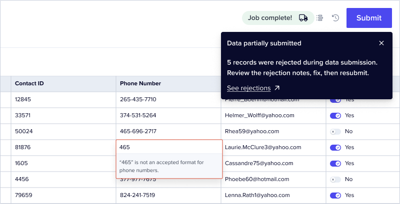

<CardGroup cols={1}>
  <Card title="@flatfile/util-response-rejection" icon="download">
    <br />
    The `@flatfile/util-response-rejection` utility is built to handle response rejections
    from an external source. It is designed to be used as a rejection response handler
    in an egress listener.
  </Card>
</CardGroup>



## Usage

The purpose of `@flatfile/util-response-rejection` utility is to handle cases where some Records
were rejected during an egress process. The `responseRejectionHandler` function is designed to
consume a set of sheets containing rejected Records, and then process the rejected Records by
marking the offending Record fields with the returned rejection message indicating why they were
rejected. If the response value of `deleteSubmitted` is `true`, the successfully submitted values
will be deleted from the Sheet. If `deleteSubmitted` is false or not provided, a `Submission Status`
field is added to the Sheet and each Record is set to either "Submitted" or "Rejected". In the end,
it returns a total count of all rejected Records across all sheets that can be used in a Job
completion message.

```bash install
npm i @flatfile/util-response-rejection
```

```ts import
import {
  responseRejectionHandler,
  RejectionResponse,
} from "@flatfile/util-response-rejection";
```

### **Response Rejection Handler Function**

- The `responseRejectionHandler` function is the main entry point of the utility. It takes one parameter:
  - `responseRejection`: An object containing the rejection data. This object's structure is defined by the `RejectionResponse` interface.
- The `responseRejectionHandler` function returns a `Promise` that resolves to a `number` representing the total number of rejected Records across all sheets.

```ts
listener.on(
  "job:ready",
  { job: "workbook:submitActionFg" },
  async ({ context: { jobId } }) => {
    // ...
    const response = await axios.post("https://webhook.site/...", data, {
      headers: {
        "Content-Type": "application/json",
      },
    });

    const rejections: RejectionResponse = response.data.rejections;
    if (rejections) {
      const totalRejectedRecords = await responseRejectionHandler(rejections);
    }
    // ...
  }
);
```

### **RejectionResponse Interface**

The `RejectionResponse` interface defines the structure of the `responseRejection` parameter object that is passed into the `responseRejectionHandler` function. This `RejectionResponse`'s structure is as follows:

```ts
{ // RejectionResponse interface
  id: string; // The Workbook ID
  message: "Success! All records are valid.", // Optional
  deleteSubmitted: true, // Optional
  sheets: [
    { // SheetRejections interface
      id: string; // The Sheet ID
      rejectedRecords: [
        { // RecordRejections interface
          id: string; // The Record ID
          values: [
            {
              field: string; // The field key
              message: string;
            }
          ];
        }
        // other rejected records...
      ];
    }
    // other sheets...
  ];
}
```

The `message` property is optional. If provided, this message will be displayed to the user. This message should be set for either a successful submission or a rejection submission.
The `deleteSubmitted` property is optional. If true, the successfully submitted values will be deleted from the Sheet. If false or not provided, a `Submission Status` field is added to the Sheet and each Record is set to either "Submitted" or "Rejected".

### **Helper Functions**

- The code includes a helper functions to assist in the Flatfile Sheet update process:
  - `updateSheet`: Updates a Flatfile Sheet by adding the returned rejection messages as error messages on the Records.

### **Type Definitions**

- The code defines three interfaces: `RejectionResponse`, `SheetRejections` and `RecordRejections`. These interfaces represent the structure expected by the `responseRejectionHandler()`.

## See the code

<CardGroup cols={2}>
  <Card
    title="@flatfile/util-response-rejection"
    href="https://github.com/FlatFilers/flatfile-plugins/tree/main/utils/response-rejection"
    icon="github"
  ></Card>
</CardGroup>
