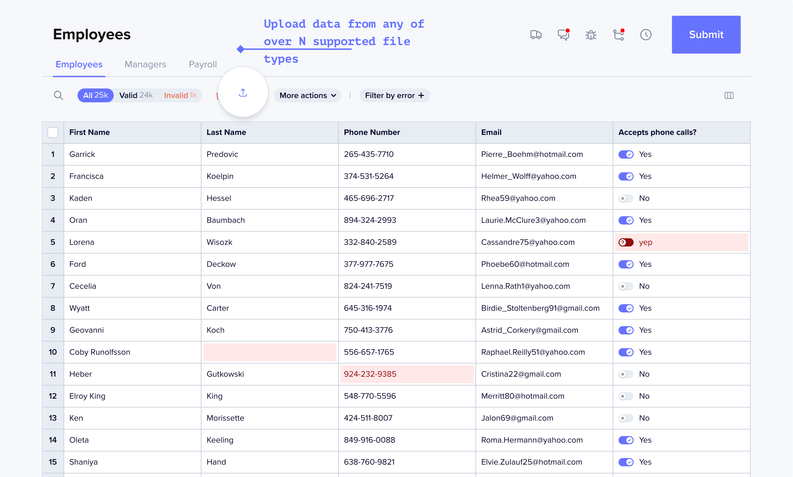

A workbook in Flatfile replaces the spreadsheet template you may share 
with people today when requesting data during the data collection phase 
of customer onboarding or other business processes. Unlike a spreadsheet, 
it's designed to allow your team and users to validate, correct, and import data.


In the next 15 minutes, you’ll design and configure a workbook 
for your business. Once you’re finished you’ll be able to embed it in your application 
as an import flow, or deploy a data collection portal.

---

### Using Workbooks

The Workbook brings together automation and humans to get data into its final shape. 



With Workbooks, you can:
1. Accept data from any of over N supported file types. (And you can write your own file extractors if that's not enough.)
2. Automatically apply any validation rules a developer has previously defined.
3. Provide end users the ability to add, remove, review, filter, and correct any data imported into a Workbook.
4. Define [in code] at least one primary action that submits the reviewed data to a destination API, database, or workflow step of your choosing.


### Using Schemas

To post to our API, your schema will need to match Flatfile's <Tooltip tip="Learn more about Blueprint">[Blueprint](../blueprint/overview)</Tooltip>, a powerful DDL with a focus on validation and data preparation.  

If you have an existing schema, you can choose from many different open-source [blueprint converter plugins](https://plugins.flatfile.com) like:

<CardGroup cols={4}>
  <Card color="#CB3837" title="@flatfile/plugin-json-schema" icon="npm" href="https://plugins.flatfie.com">
  </Card>
  <Card color="#CB3837" title="@flatfile/plugin-sql-ddl" icon="npm" href="https://plugins.flatfie.com">
  </Card>
  <Card color="#CB3837" title="@flatfile/plugin-openapi" icon="npm" href="https://plugins.flatfie.com">
  </Card>
  <Card color="#CB3837" title="@flatfile/plugin-graphql" icon="npm" href="https://plugins.flatfie.com">
  </Card>
</CardGroup>

## Building your first Workbook

For this tutorial, we're going to use a simple schema 
that's already using Flatfile's <Tooltip tip="Learn more about Blueprint">[Blueprint](../blueprint/overview)</Tooltip>. 

<Warning>
To continue, you'll need your [publishable key](../security/authentication). [Sign up](https://platform.flatfile.com/account/sign-up) and get your keys if you haven't yet.
</Warning>

#### Create workbook 

1. Paste this cURL request to your terminal now to create a simple workbook.
2. Login and see the workbook you created in your [Dashboard](https://platform.flatfile.com).

```shell Shell / cURL
curl --request POST \
  --url https://platform.flatfile.com/api/v1/workbooks \
  --header 'Accept: application/json' \
  --header 'Authorization: Bearer <publishable key>' \
  --header 'Content-Type: application/json' \
  --data '{
  "name": "My Workbook",
  "spaceId": "us_sp_DrdXetPN",
  "environmentId": "us_env_hVXkXs0b",
  "sheets": [
    {
      "name": "My Sheet 1",
      "slug": "mysheet1",
      "fields": [
        {
          "key": "full_name",
          "type": "string",
          "label": "Full Name",
        },
        {
          "key": "first_name",
          "type": "string",
          "label": "First Name",
        },
        {
          "key": "last_name",
          "type": "string",
          "label": "Last Name",
        }
      ],
      "actions": [
        {
            "slug": "generateJSON",
            "label": "Generate JSON",
            "description": "Generate a JSON file based off of the Data in this Sheet",
            "primary": true
        },
      ]
    }
  ],
}'
```

## Recap & Next Steps

You should now have a general idea of the power of workbooks & how to use schemas in Flatfile.

<Warning>
To continue, you'll need your [publishable key](../security/authentication). [Sign up](https://platform.flatfile.com/account/sign-up) and get your keys if you haven't yet.
</Warning>

In the next step, you will quickly [Create a sample workbook](/create-workbook) by running a cURL request from your terminal.
